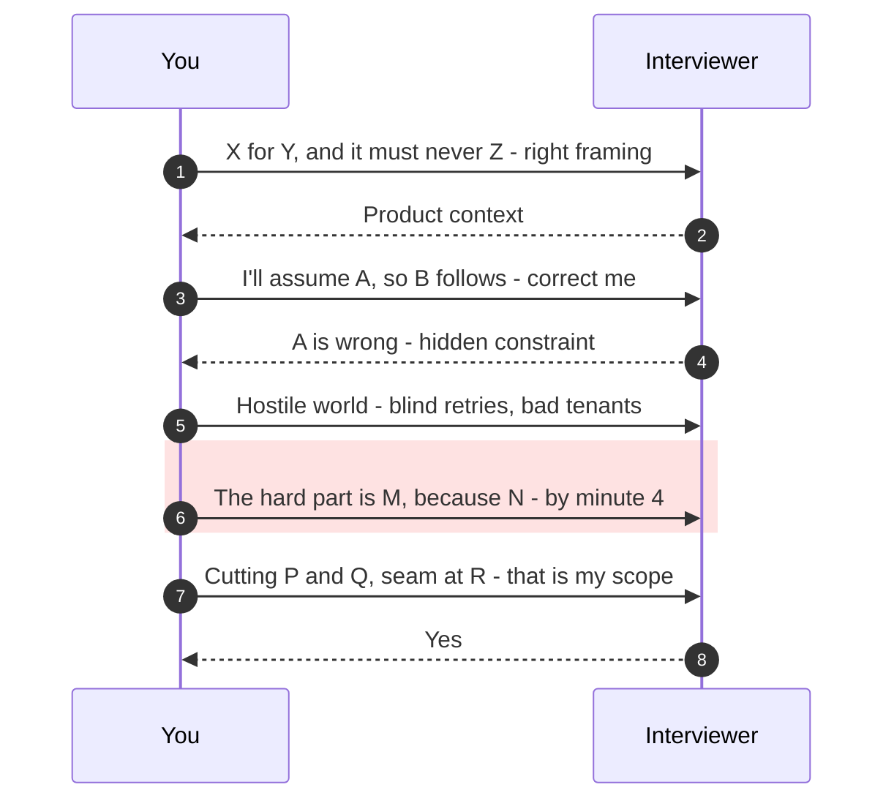

# Scoping Drills: The First 10 Minutes

**One line:** drill the opening of a design round against an interviewer who holds a hidden card. Propose and confirm instead of asking. At Stripe: name the invariant and the crux by minute 4, close scope by minute 5, then sketch the API and a skeleton until minute 10.

Two drills only. (1) Hidden-card sprints. (2) Propose and confirm. Built 2026-10-09 for the Stripe Staff round on 2026-10-19 and 2026-10-20. Method context: [`method.md`](../hld/method.md) §1 and [`method-detailed.md`](../hld/method-detailed.md) §1.

**How to practise:** open the voice agent and say "run a scoping sprint from `scoping-drills/cards.md`". The agent reads the hidden card. You never open that file.

| File | Who reads it |
|---|---|
| `README.md` (this file) | You and the agent. Rules, script, numbers, scorecard, log, prompt list, speed reps |
| [`cards.md`](cards.md) | **The agent only.** 48 hidden cards + run instructions |

---

## 1. Why this drill

The gap is not knowledge. It is the first 10 minutes. The same misses repeat across rounds.

| Pattern | Where it showed up |
|---|---|
| Numbers negotiated out loud | Uber: "a billion users... maybe 100M", latency 400 then 200 then 300 ms |
| Numbers above the company's real scale | Voice mocks (desktop assessment) |
| Loaded words never defined | Book seller: "best" and "async" |
| The crux scoped out | Job scheduler cut the scheduler. Dropbox cut conflicts and edits |
| Crux surfaced late | Uber: found during the HLD, framing graded 2.5 |
| Nothing cut, or cuts with no hook | VM QoS: nothing cut. News Feed: nothing cut. Docs: no hooks |
| Template before requirements | The Stripe Staff reject feedback in [`company-questions.md`](../hld/company-questions.md) §3: "force-fit a template from somewhere else" |

**Why 5 minutes at Stripe.** One firsthand 2025 report describes about 10 minutes of initial design, then 40 to 45 minutes of "what happens if" probes on failure and abuse. So a 10-minute requirements phase eats the whole design slot. Scope must close by minute 5, and it should already state the hostile-world assumptions the probes will test. Hello Interview also budgets about 5 minutes. A 15-minute requirements phase has been marked down elsewhere.

A full 60-minute mock gives one scoping rep. A 10-minute sprint gives four or five per sitting.

---

## 2. Drill 1: hidden-card sprint

```mermaid
%% One Stripe-mode sprint: scope closes at minute 5, skeleton until minute 10, then the reveal
flowchart LR
  P["Vague one-line prompt"]:::client -->|"read once"| R["Restate + what must never happen"]:::service
  R -->|"assumptions"| PC["Propose and confirm"]:::critical
  PC -->|"correction"| H["Hidden card held by interviewer"]:::store
  H -->|"constraint revealed"| PC
  PC -->|"by minute 4"| X["Name the crux"]:::decision
  X -->|"verb test"| CUT["Cuts + hostile world"]:::service
  CUT -->|"minute 5, buy-in"| SK["API + skeleton"]:::service
  SK -->|"minute 10"| S["Reveal card + score"]:::store
  classDef client   fill:#dbeafe,stroke:#2563eb,stroke-width:2px,color:#111
  classDef service  fill:#dcfce7,stroke:#16a34a,stroke-width:2px,color:#111
  classDef store    fill:#ede9fe,stroke:#7c3aed,stroke-width:2px,color:#111
  classDef critical fill:#fee2e2,stroke:#dc2626,stroke-width:4px,color:#111
  classDef decision fill:#fce7f3,stroke:#db2777,stroke-width:2px,color:#111
```

- **The prompt** is as vague as a real opener. One line.
- **The card** holds: the product context, 3 hidden constraints, and the crux. A constraint comes out only when you propose something that contradicts it, or ask the one right open question.
- **Two modes:**

  | Mode | Cards | Scope closed by | Then |
  |---|---|---|---|
  | Stripe | Rows 1 to 29 in §9 | Minute 5 | API + skeleton until minute 10 |
  | Ambiguity | Rows 30 to 48 | Minute 8 | A quick API sketch until minute 10 |

- **Skeleton rule:** every box traces back to a requirement you stated. No load balancer, cache or queue without a reason.
- **Minute 8:** the agent fires one "what happens if..." probe, Stripe style.
- **Red node:** propose-and-confirm is where past rounds broke. It is the step to watch in every rep.

---

## 3. Drill 2: propose and confirm

**Rule:** state an assumption, attach its consequence, invite correction. Ask an open question only when you cannot assume the answer.

| Propose (state it, attach the consequence) | Ask (one open question, at most) |
|---|---|
| What must never happen (the invariant) | Product intent: who uses it, what hurts today |
| Scale, as a range tied to the company | A legal, money, or regulatory constraint you cannot guess |
| Read:write ratio, peak:avg | Whether a stale or wrong value is a correctness bug or a UX bug |
| Latency target on the hot path | |
| Consistency per operation | |
| Failure default on the hot path | |
| Hostile world: blind retries, misbehaving tenants, attacker input | |
| Meaning of a loaded word ("best", "real-time", "async") | |

- **At Stripe, take the scale you're given.** Interviewers there state scale up front. What they hold back is the hostile world, so propose it yourself.
- **Silence is not confirmation.** Some interviewers will not correct a wrong assumption. They grade it. So write every assumption on the board, labelled `assumed` or `confirmed`.
- **"You decide"** is a judgement test. Pick the option where the hard part lives, say why, and park the other as a hook. Never hand back a menu.

---

## 4. The opening script

Say it, don't read it. Stripe mode below. In ambiguity mode, the same steps can stretch to minute 8.

| Time | Step | Phrasing |
|---|---|---|
| 0:00 | Restate + invariant | "We're building X for Y, and the one thing it must never do is Z. Is that the right framing?" |
| 0:30 | Fork, if two readings exist | "This reads as A or B. I'll take A because the hard part lives there. Say if you meant B." |
| 0:45 | Users + 3 operations | "I'll assume the users are C and D. Core operations: E, F, G." |
| 1:30 | Hot path + failure default | "The hot path is H. It must cost under I. If a dependency is down, I default to J." |
| 2:00 | Hostile world | "I'll assume clients retry blindly, some tenants are slow or malicious, and input is attacker-controlled. I'll design for isolation from the start." |
| 2:30 | Scale, once | "I'll assume ~2k writes/s at peak, 10x headroom, so a few shards, not a planet. Bigger number in mind?" |
| 3:00 | Consistency per operation | "Create can lag. A rollback must land within L seconds." |
| 3:30 | **Crux** | "The hard part is M, because N. I'll design around it." |
| 4:00 | Cuts with hooks | "I'm parking P and Q. Seam at R for each." |
| 4:30 | Close with buy-in | "That's my scope: 3 operations, crux M, 3 non-functional requirements, P and Q parked. I'll sketch the API next." |
| 5:00 | API + skeleton | Every box traces to a line on the board. |
| any | Define loaded words | "I'll take 'best' to mean S. Correct me now." |

**The board at minute 5:**
- One-line problem statement, including what must never happen.
- Users and 3 operations, each with its hard constraint.
- 2 to 3 non-functional numbers, each labelled `assumed` or `confirmed`, each with what it forces.
- The failure default for the hot path, and at least 2 hostile-world assumptions.
- The crux, with the reason.
- Out-of-scope list, one hook per item.

---

## 5. Finding the crux, and the cut test

**Four questions in the first 3 minutes.** The crux is usually where two overlap.
1. Which operation sits on someone else's request path? (latency, availability)
2. Which operation has two writers, or a read-modify-write? (contention)
3. Which operation fans out? (one write becomes N)
4. What is expensive to get wrong? (money, an outage, a leak)

**The verb test before every cut:** does the prompt's verb depend on this item? If yes, it is the crux. Keep it.

| Prompt | Wrong cut (the crux) | Right cuts |
|---|---|---|
| Job scheduler | The scheduler / triggering | Payload format, UI |
| File sync | Conflicts and edits | Previews, share links |
| Feature flags | The evaluate path when the control plane is down | Admin UI, A/B analytics |
| Webhooks | Retries to a dead endpoint | Endpoint management UI, event filtering |

---

## 6. Phrase bank

**Core moves:**
- "I'll assume X. Correct me if it's off by 10x."
- "That forces Y, so Z is out."
- "The hard part is X, because Y. I'll design around it, so shout if you see a different crux."
- "I'm parking X for this round. I'll leave a seam at Y."
- "I'll take 'Z' to mean W. Tell me if that's wrong."
- "Is a stale value here a correctness bug or a UX bug?"

**Questions that move a decision.** Ask them of yourself, then say the answer as a proposal.

| Ask yourself | Propose it as | It decides |
|---|---|---|
| What must never happen? | "I'm treating double-charging as non-negotiable." | Consistency, idempotency, locking |
| What staleness is OK on the main path? | "Reads can be ~5 s stale. Writes are durable once acked." | Sync vs async, cache vs source of truth |
| Where is the skew? | "A few huge merchants and a holiday peak." | Partitioning, hot spots |
| What is the reliability target? | "Four nines for reporting, five for the payment path." | Multi-region, fail-open vs fail-closed |
| How could a confused integrator misuse it? | "Integrators will send bad input and old API versions." | API contract, validation, versioning |
| Can one tenant hurt the others? | "One slow merchant must not slow the rest." | Per-tenant isolation, queues, circuit breakers |
| What if a retry arrives, or we crash after a side effect? | "Clients retry blindly, and we can crash right after calling the bank." | Durable idempotency, state machine, reconciliation |
| Is any input attacker-controlled? | "Some callers are malicious." | Sandboxing, enumeration and abuse limits |
| Does the consumer care about duplicates? | "The merchant may ship twice on a duplicate event." | Event IDs, a dedup contract |

The first four apply to any prompt. The last five are the Stripe hostile-world set.

---

## 7. Stripe numbers to propose

Propose these, with the year. Do not invent a billion of anything. Stripe's real payment rate is ~1k/s, not 100k/s.

| Number | Value | Year | Source |
|---|---|---|---|
| Total payment volume | $1.9T, up 34% | 2025 | [Stripe 2025 update](https://stripe.com/newsroom/news/stripe-2025-update) |
| Businesses on Stripe | about 5M | 2025 | same |
| Average payments/s | **~1,000/s** at a ~$60 ticket (range 860 to 2,000) | 2025, derived | $1.9T / $60 / 31.5M s |
| Peak payments/s, Black Friday / Cyber Monday | **~2,500/s** (152k/min) | 2025 | [BFCM 2025](https://stripe.com/newsroom/news/bfcm2025) |
| Peak vs yearly average | **~2.5x**, not the generic 10x | 2025, derived | 2,530 / 1,000 |
| API requests, peak | 27,395/s | 2023 | [BFCM 2023](https://stripe.com/newsroom/news/bfcm2023) |
| API requests, average | ~5,800/s (500M+/day) | undated | [stripe.com](https://stripe.com/) |
| Ledger events | 5B/day, ~58k/s | 2024 | [Ledger post](https://stripe.dev/blog/ledger-stripe-system-for-tracking-and-validating-money-movement) |
| Fraud scoring (Radar) | under 100 ms, 1,000+ features | 2023 | [Radar post](https://stripe.dev/blog/how-we-built-it-stripe-radar) |
| Uptime | 99.999% (2023), 99.9999% during BFCM (2024, 2025) | 2023 to 2025 | BFCM releases |
| Per-account API limit | 100 req/s live, 25/s per endpoint | 2026 | [Rate limits](https://docs.stripe.com/rate-limits) |
| Webhook retries | up to 3 days, exponential backoff | 2026 | [Webhooks](https://docs.stripe.com/webhooks) |
| Billing | 200M active subscriptions, 300k+ companies | 2024 | [Stripe 2024 update](https://stripe.com/newsroom/news/stripe-2024-update) |
| Idempotency keys | kept at least 24 h, up to 255 chars | 2026 | [Idempotent requests](https://docs.stripe.com/api/idempotent_requests) |

**What the numbers force:**
- 2.5k payments/s peak fits one well-run primary. The argument for sharding at Stripe is the **ledger** (58k events/s), not the payment write path.
- Per-account limits are 100 req/s, but the platform runs 27k req/s. A rate limiter is many small buckets, not one hot counter.
- Feature-flag checks: ~10k req/s x ~20 checks each = ~200k checks/s. That rules out a network call per check. Evaluate in-process.
- Pick the smallest scale that makes the crux real. Derive only the number that picks a branch, then say "therefore".

Not to quote as fact: a Stripe engineer count, webhook events/day, Visa "65k TPS", a Fortune 500 share. None has a primary source.

---

## 8. Scorecard

Score each rep. Pass or fail per check.

| # | Check | Pass bar |
|---|---|---|
| 1 | Crux + invariant | "Must never happen" is in the opening sentence. Crux named by minute 4 (Stripe) or 6 (ambiguity), with a reason |
| 2 | Hidden constraints | Found at least 2 of 3, by a corrected proposal or the one open question |
| 3 | Cuts | At least 3, each with a hook, and none fails the verb test |
| 4 | Non-functional requirements | 2 to 3, each with a number and the decision it forces |
| 5 | Numbers | 3 or fewer, stated once, realistic for that company, each with a "therefore" |
| 6 | Questions | At most one open question, never two in a row. Every loaded word defined |
| 7 | Time | Scope closed with buy-in by minute 5 (Stripe) or 8 (ambiguity) |
| 8 | Hostile world | At least 2 stated during scoping: blind retries, a misbehaving tenant, attacker input, a duplicate-sensitive consumer |
| 9 | Skeleton | Every box traces to a stated requirement. No unexplained load balancer, cache or queue |

### Log

Column 1 records the minute the crux was named. "Props : open" is the number of proposals vs open questions.

| Date | ID | 1 Crux (min) | 2 Hidden | 3 Cuts | 4 NFRs | 5 Numbers | 6 Questions | 7 Time | 8 Hostile | 9 Skeleton | Score /9 | Props : open | Weakest |
|---|---|---|---|---|---|---|---|---|---|---|---|---|---|

---

## 9. Prompt pool

The opening lines only. That is all a real interviewer gives you, so reading this list is fine. The hidden cards are in [`cards.md`](cards.md). Don't open it. The agent runs them in this order: Stripe mode first.

| # | ID | The interviewer says | Origin | Mode |
|---|---|---|---|---|
| 1 | R1 | "Here is a simplified Stripe. Design a new service that lets merchants authorize a card now and capture later." | Reported shape, Stripe onsite | Stripe |
| 2 | D3 | "Design an e-commerce system." | Reported, Stripe 2025 | Stripe |
| 3 | C5 | "Design a hosted checkout page that merchants redirect customers to." | Stripe-style | Stripe |
| 4 | C1 | "Design the system that pays merchants their balance." | Stripe-style | Stripe |
| 5 | R8 | "Design a key component of our payments system." | Reported, Stripe 2024 | Stripe |
| 6 | D1 | "Redesign our internal authorization system across services." | Reported, Stripe guide | Stripe |
| 7 | C4 | "Design API keys for a payments platform." | Stripe-style | Stripe |
| 8 | C2 | "Design refunds." | Stripe-style | Stripe |
| 9 | R7 | "Our payments API runs in one US region. Take it global." | Reported shape, Stripe Staff 2026 | Stripe |
| 10 | D2 | "Design a URL shortener." | Reported, Stripe 2025 | Stripe |
| 11 | C6 | "Design how our public API changes over time without breaking integrations." | Stripe-style | Stripe |
| 12 | C3 | "Design dispute handling for merchants." | Stripe-style | Stripe |
| 13 | C7 | "Design usage-based billing." | Stripe-style | Stripe |
| 14 | C8 | "Design how we handle failed subscription payments." | Stripe-style | Stripe |
| 15 | C9 | "Design saving customers' cards so they can pay again later." | Stripe-style | Stripe |
| 16 | C14 | "Add local payment methods from around the world to our payments API." | Stripe-style | Stripe |
| 17 | C15 | "Let marketplaces split a customer's payment between the platform and its sellers." | Stripe-style | Stripe |
| 18 | C17 | "Design how we calculate the fees we charge merchants." | Stripe-style | Stripe |
| 19 | C13 | "Design in-person card payments for merchants' card readers in stores." | Stripe-style | Stripe |
| 20 | C19 | "Let customers upgrade or downgrade their subscription mid-cycle." | Stripe-style | Stripe |
| 21 | C16 | "Design how platforms onboard and verify their sellers so the sellers can get paid." | Stripe-style | Stripe |
| 22 | C18 | "Calculate sales tax for merchants at checkout." | Stripe-style | Stripe |
| 23 | C20 | "Let merchants accept bank transfers from their business customers." | Stripe-style | Stripe |
| 24 | C21 | "Design loans for merchants that are repaid automatically from their sales." | Stripe-style | Stripe |
| 25 | C22 | "Let developers see and search every API request their account made." | Stripe-style | Stripe |
| 26 | C10 | "Design a test environment where developers can try our API without moving real money." | Stripe-style | Stripe |
| 27 | C11 | "Design reports that let merchants reconcile their payouts with their bank statement." | Stripe-style | Stripe |
| 28 | C12 | "Let merchants show prices in the customer's local currency." | Stripe-style | Stripe |
| 29 | R6 | "Design an ads aggregation system." | Reported title, Stripe | Stripe |
| 30 | R2 | "Design a payment service provider." | Reported, Adyen | Ambiguity |
| 31 | R3 | "Design an online bank account opening workflow." | Reported, Coinbase 2025 | Ambiguity |
| 32 | R4 | "Design an embeddable pay-by-bank widget for merchant websites." | Reported, Plaid 2026 | Ambiguity |
| 33 | R5 | "Design a service to create, update, execute and cancel future-dated payments." | Reported, Coinbase 2025 | Ambiguity |
| 34 | R9 | "Design mobile check deposit." | Reported, Chime 2025 | Ambiguity |
| 35 | R10 | "Design an end-to-end banking system." | Reported, Block 2026 | Ambiguity |
| 36 | R11 | "Design pagination for an API over a large dataset." | Reported, Coinbase 2026 | Ambiguity |
| 37 | D4 | "Design a mobile feature that needs a little bit of server support." | Reported, Google Staff | Ambiguity |
| 38 | D5 | "Design a blob storage system for a lunar base." | Reported, Coinbase 2025 | Ambiguity |
| 39 | D6 | "Design message and thread deletion for a group chat service." | Reported, Databricks 2026 | Ambiguity |
| 40 | D7 | "Design a real-time asset price service." | Reported, Coinbase 2026 | Ambiguity |
| 41 | D8 | "Design a package-tracking widget for an email inbox." | Reported, Rippling 2026 | Ambiguity |
| 42 | R12 | "Design an end-to-end pipeline for user picture uploads." | Reported, Coinbase 2025 | Ambiguity |
| 43 | G1 | "Design a code deployment system." | General Staff | Ambiguity |
| 44 | G2 | "Design a distributed tracing system." | General Staff | Ambiguity |
| 45 | G3 | "Design a web crawler." | General Staff | Ambiguity |
| 46 | G4 | "Design a calendar with meeting invites." | General Staff | Ambiguity |
| 47 | G5 | "Design an online coding judge." | General Staff | Ambiguity |
| 48 | G6 | "Design a leaderboard for a mobile game." | General Staff | Ambiguity |

48 cards. The 29 Stripe-mode cards come first, so 3 sprints a day covers them before the round. Every problem you have already studied in `hld/` was left out, so none of these has a solution you've seen.

---

## 10. Speed reps (studied problems)

Five minutes, scope only, no skeleton. Optional warm-up, one per sitting. Score only checks 1, 5 and 8 (crux, numbers, hostile world). The agent uses the folder's `README.md` and `solution.md` §1 as the card.

| Prompt | Reported | Card |
|---|---|---|
| "Design a system to deliver webhook notifications to customers." | Stripe Staff 2023, Senior 2025 | [`hld/webhook-delivery/`](../hld/webhook-delivery/) (README only, not solved yet) |
| "Design a durable ledger." | Stripe Staff 2022 | [`hld/payments-ledger/`](../hld/payments-ledger/) |
| "Design a rate limiter." | Stripe | [`hld/network-throttling/`](../hld/network-throttling/) |
| "Design a metrics service." | Stripe | [`hld/health-monitoring/`](../hld/health-monitoring/) |
| "Design a fraud detection system." | Stripe | [`hld/payments-risk-decisioning/`](../hld/payments-risk-decisioning/) |
| "Design a distributed file system." (no requirements given) | Databricks Staff 2026 | [`hld/distributed-file-system/`](../hld/distributed-file-system/) |
| "Design a service that finds the lowest price for a book across hundreds of bookstores." | Databricks 2026 | [`hld/book-seller-broker/`](../hld/book-seller-broker/). Your mock left "best" undefined |

Log speed reps with the ID `S-<folder>`.

---

## 11. Trade-offs of this drill

| Choice | Gave up | Why |
|---|---|---|
| Scope plus a skeleton, no deep dive | Practice on the 40 minutes of probes that follow | Five reps in the time of one mock. The minute-8 probe gives a taste. The deep dives are drilled in each `hld/` set |
| 5-minute scope at Stripe | Room to discover requirements slowly | One firsthand Stripe report and Hello Interview both point near 5 minutes. A 15-minute requirements phase has been marked down |
| Propose over ask | Some interviewers grade the questions themselves | Stripe-style feedback rewards a position. Keep exactly one open question for product intent |
| 28 of 48 cards constructed | Real interviewer-held context | Most reported Stripe prompts match problems you already studied, and public reports rarely say what the interviewer held back. The constructed cards follow Stripe's public product behaviour |
| Voice reps, no shared board | The interviewer cannot see your board | Say each board item out loud as you write it in your notes. The agent scores what it hears |

---

## Sources

- About 10 minutes of initial design, then 40 to 45 minutes of failure and abuse probes, in a 2025 Stripe round: [Medium, firsthand](https://medium.com/@emilyhustlenyc/every-question-i-was-asked-in-stripes-system-design-interview-f6f19c2e62d6). Found by the desktop research. Not opened here (paywalled).
- Stripe probe topics (versioning, partial failure, integrator misuse, where it breaks first): [Aced Stripe guide](https://www.aced.io/blog/stripe-system-design-interview).
- Marked down for 15 minutes of requirements: [Blind](https://www.teamblind.com/post/bizarre-on-site-rejection-dd-i4hmwuuq). Rejected for not clarifying at Google Staff: [LeetCode](https://leetcode.com/discuss/post/1173438/google-staff-engineer-bangalore-reject-b-h1co/).
- "Uncover hidden constraints" as a Staff competency, and over-scaled designs as a Staff failure: [IGotAnOffer](https://igotanoffer.com/en/advice/staff-system-design-interview).
- Propose a scope, let the interviewer adjust it: [AlgoMaster answering framework](https://algomaster.io/learn/system-design-interviews/answering-framework). "Propose solutions" instead of asking: [Formation](https://formation.dev/blog/how-to-pass-system-design-interviews-drive-the-design).
- Staff candidates find and earmark the hard part early: [Hello Interview, staff-level system design](https://www.hellointerview.com/blog/staff-level-system-design).
- Requirements in about 5 minutes: [Hello Interview delivery framework](https://hellointerview.com/learn/system-design/in-a-hurry/delivery).
- "A stronger candidate takes a position": [Formation](https://formation.dev/blog/signal-seniority-system-design-interview).
- "Close the scoping phase with explicit in-scope and out-of-scope statements": [PracHub staff guide](https://prachub.com/resources/staff-system-design-interview-guide-scope-ambiguity-platforms-and-technical-strategy).
- Stripe template feedback: [PracHub Stripe Staff report](https://prachub.com/interview-experiences/stripe-staff-software-engineer-interview-experience-feature-flag-design-and-an-ai-coding-round-rejected).
