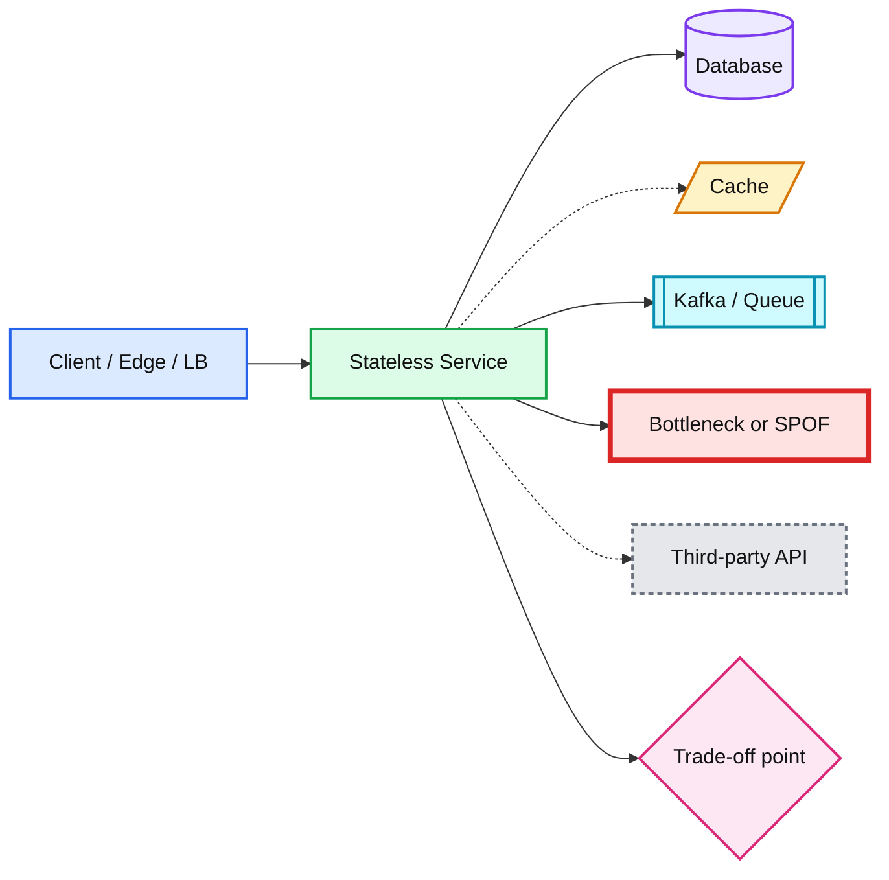

# Canonical Color Legend

Paste this block at the bottom of every `flowchart`. Then assign nodes with
`class NodeA,NodeB service`.

```
classDef client   fill:#dbeafe,stroke:#2563eb,stroke-width:2px,color:#111
classDef service  fill:#dcfce7,stroke:#16a34a,stroke-width:2px,color:#111
classDef store    fill:#ede9fe,stroke:#7c3aed,stroke-width:2px,color:#111
classDef cache    fill:#fef3c7,stroke:#d97706,stroke-width:2px,color:#111
classDef queue    fill:#cffafe,stroke:#0891b2,stroke-width:2px,color:#111
classDef critical fill:#fee2e2,stroke:#dc2626,stroke-width:4px,color:#111
classDef external fill:#e5e7eb,stroke:#6b7280,stroke-width:2px,color:#111,stroke-dasharray:4 3
classDef decision fill:#fce7f3,stroke:#db2777,stroke-width:2px,color:#111
```

## Reference diagram



## Shape convention

| Shape | Syntax | Use for |
|---|---|---|
| Rectangle | `A[Name]` | Service, client |
| Cylinder | `A[(Name)]` | Database |
| Slanted | `A[/Name/]` | Cache |
| Subroutine | `A[[Name]]` | Queue / stream |
| Diamond | `A{Name}` | Decision / trade-off |
| Rounded | `A(Name)` | Grouping or logical concept |
