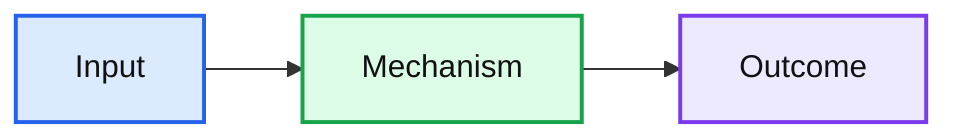

# Concept: <Name>

> One-liner: ...

## Mental model

## When to use it
- ...

## When NOT to use it
- ...

## Trade-offs
| Gain | Cost |
|---|---|
| ... | ... |

## Numbers worth memorizing
- ...

## Interview soundbite
> One or two sentences I can say out loud.
