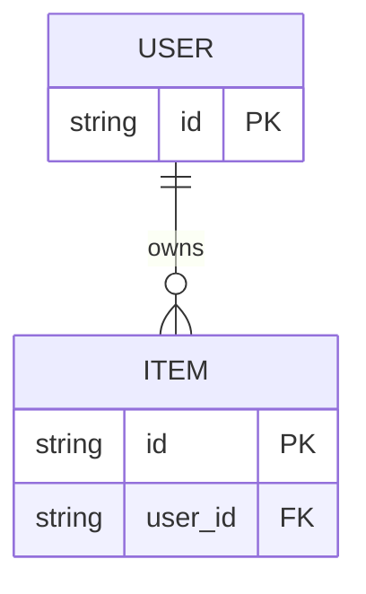
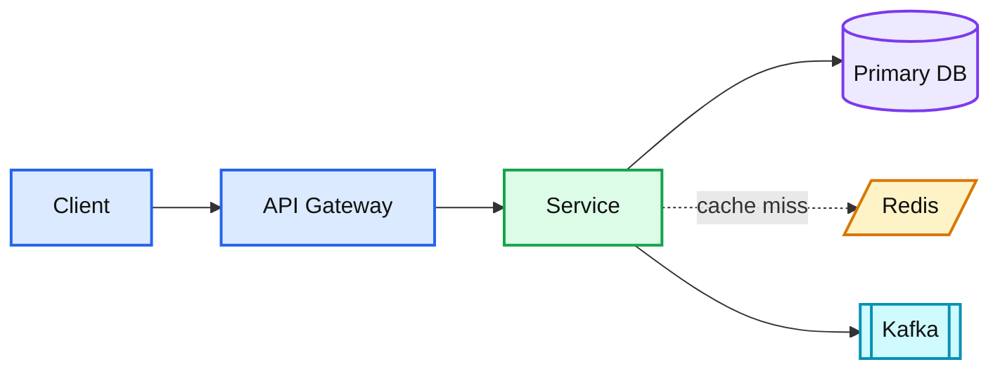
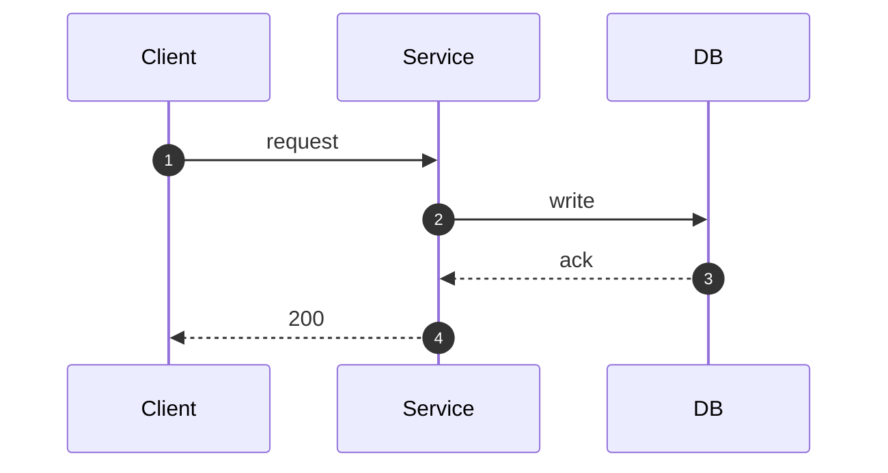

# HLD: <System Name>

> One-line answer: <what I would build, in a single sentence>

## 1. Requirements

**Functional**
- ...

**Non-functional**
| Dimension | Target |
|---|---|
| Scale | X DAU, Y QPS read / Z QPS write |
| Latency | p99 read < ..ms, write < ..ms |
| Availability | 99.9% / 99.99% |
| Consistency | strong / read-your-writes / eventual |
| Durability | ... |

**Out of scope:** ...

## 2. Back-of-envelope

```
DAU              = ...
Reads/user/day   = ...  -> read QPS  = ... (peak = 3x avg)
Writes/user/day  = ...  -> write QPS = ...
Row size         = ...  -> storage/yr = ...
Read:write ratio = ...  -> implication: ...
```

## 3. API

| Method | Path | Body / Params | Returns |
|---|---|---|---|
| POST | /v1/... | ... | ... |

## 4. Data model



Access patterns this model serves:
- ...

Partition key: `...` — chosen because ...

## 5. Architecture



## 6. Deep dive

### 6.1 <Component the interviewer will probe>

- ...

## 7. Bottlenecks and scaling

| # | Bottleneck | Symptom | Fix |
|---|---|---|---|
| 1 | ... | ... | ... |

## 8. Trade-offs

| Decision | Option A | Option B | Chose | Why |
|---|---|---|---|---|
| ... | ... | ... | ... | ... |

## 9. Staff-level notes
- **Failure modes / blast radius:** ...
- **Migration path from today:** ...
- **Operability:** SLO ..., alert on ..., dashboard shows ...
- **Cost:** ...
- **Team boundaries:** who owns what.

## 10. Follow-up questions to expect
- ...
