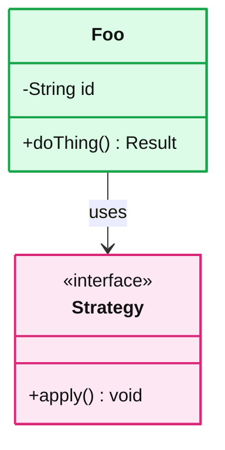
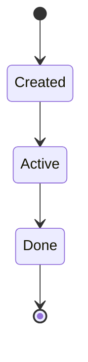

# LLD: <Problem Name>

> One-line answer: <core abstraction and the patterns used>

## 1. Requirements and scope
- In scope: ...
- Out of scope: ...
- Clarifying questions I would ask: ...

## 2. Core entities



## 3. Patterns used

| Pattern | Where | Why |
|---|---|---|
| Strategy | ... | swap algorithm without touching callers |

## 4. Lifecycle



## 5. Code

```java
public interface Foo { }
```

## 6. Concurrency
- Shared mutable state: ...
- Locking strategy: ...
- Why this is safe: ...

## 7. Extensibility seams
- "If asked to add X" -> ...
