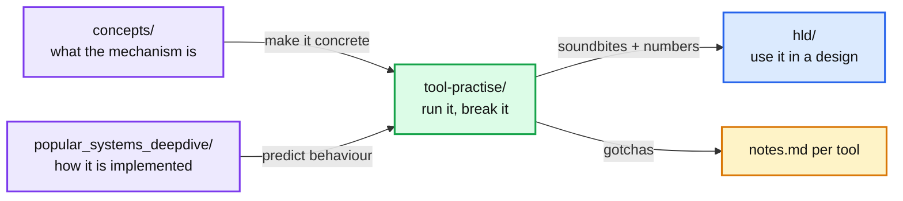

# Tool Practise

> One-line answer: a hands-on lab. One folder per open source tool. Run it locally with Docker, drive it from its CLI, break it, write down what happened.

Reading about a tool lives in `concepts/` and `popular_systems_deepdive/`. Running it lives here. See `tool-practise/CLAUDE.md` for the folder layout and exercise format.

---

## 1. Why this folder exists

Interviewers can tell the difference between "I read that Kafka has consumer groups" and "when I killed one consumer the partitions rebalanced in about 3 seconds and the lag spiked on the survivor". The second sentence only comes from having done it. Every exercise here ends with a "break it" step for that reason.



---

## 2. Tools

Status: `todo` | `in-progress` | `done`. Priority is by how often the tool shows up in Staff HLD rounds.

| # | Tool | Folder | Why practise it | Exercises | Status |
|---|---|---|---|---|---|
| 1 | Redis | [`redis/`](redis/) | Cache, rate limiter, leaderboard, distributed lock, pub/sub vs streams, failover. Guided session, about 2h15. | 6 | todo |
| 2 | Kafka | [`kafka/`](kafka/) | Partitions, consumer groups, offsets, rebalance, exactly-once. Core of every streaming design. | 5 | todo |
| 3 | PostgreSQL | `postgres/` | Isolation levels, indexes, EXPLAIN, WAL, replication lag. | - | todo |
| 4 | etcd | `etcd/` | Raft in practice: leases, watches, compare-and-swap, leader loss. | - | todo |
| 5 | Cassandra | `cassandra/` | Tunable consistency, partition keys, hinted handoff, read repair. | - | todo |
| 6 | RocksDB | `rocksdb/` | LSM tree, compaction, write amplification. Pairs with `concepts/lsm-tree.md`. | - | todo |
| 7 | Elasticsearch | `elasticsearch/` | Inverted index, shards and replicas, relevance scoring. | - | todo |
| 8 | Zookeeper | `zookeeper/` | Ephemeral nodes, watches, leader election. Compare with etcd. | - | todo |
| 9 | Nginx / Envoy | `envoy/` | Load balancing algorithms, health checks, circuit breaking, retries. | - | todo |
| 10 | Prometheus | `prometheus/` | Metrics, PromQL, alerting. Feeds the "what pages you at 3am" question. | - | todo |

Add a row when a new tool folder is created. Keep the table sorted by priority, not alphabetically.

---

## 3. Prerequisites

- Docker Desktop (or Colima) running.
- `docker compose` v2 (`docker compose version`).
- Python 3.11+ for `scripts/`.

Quick check:

```
$ docker compose version
$ python3 --version
```

---

## 4. Adding a new tool

1. `mkdir -p tool-practise/<slug>/exercises`
2. Write `README.md` (one-liner, start/stop, CLI cheat-sheet, exercise index).
3. Write the smallest `docker-compose.yml` that works. Pin the image tag.
4. Copy `templates/tool-exercise-template.md` to `exercises/01-hello.md`.
5. Add a row to the table in §2.
