# Kafka

> One-line answer: a partitioned, replicated, append-only log. Producers append, consumer groups read in parallel, offsets track progress.

**Concept links:** `popular_systems_deepdive/kafka/` (series baseline 4.3), `concepts/exactly-once.md`, `concepts/stream-processing.md`
**Version practised:** Apache Kafka 4.3.1 (KRaft, no Zookeeper). Debezium 3.3 for exercise 11.

## How this lab is organised

**One exercise per Kafka functionality.** Each exercise opens with a "Where this is used in hld/" table. It shows how different systems use the same feature in different ways, and where an HLD refuses it. Run the feature, then read the HLD lines it backs.

```mermaid
%% Exercise map. Each box is one Kafka functionality, grouped by the side of the log it lives on.
flowchart LR
    subgraph PROD[Producer side]
        E01[01 Partitioning by key]
        E04[04 acks and outages]
        E06[06 Idempotent producer]
        E07[07 Transactions]
    end
    subgraph LOG[The log]
        E05[05 Replication and ISR]
        E08[08 Retention and compaction]
        E09[09 Seek by time]
    end
    subgraph CONS[Consumer side]
        E02[02 Consumer groups]
        E03[03 Offsets and commit point]
        E10[10 Head-of-line and share groups]
    end
    E11[11 Connect and Debezium] -->|"produces into"| LOG
    PROD -->|"append"| LOG
    LOG -->|"fetch"| CONS

    class E01,E04,E06,E07 client
    class E05,E08,E09 store
    class E02,E03,E10 service
    class E11 external

    classDef client   fill:#dbeafe,stroke:#2563eb,stroke-width:2px,color:#111
    classDef service  fill:#dcfce7,stroke:#16a34a,stroke-width:2px,color:#111
    classDef store    fill:#ede9fe,stroke:#7c3aed,stroke-width:2px,color:#111
    classDef external fill:#e5e7eb,stroke:#6b7280,stroke-width:2px,color:#111,stroke-dasharray:4 3
```



## Exercises

| # | Functionality | Used in hld/ | Needs | Status |
|---|---|---|---|---|
| 01 | [Partitioning by key](exercises/01-topics-and-partitions.md) | Key choice in 10 systems. Refused layouts in driver-hot-clusters, order-execution, slack | broker | todo |
| 02 | [Consumer groups: share, fan out, broadcast](exercises/02-consumer-groups.md) | slack (share), cdc-pipeline (fan-out), news-aggregator (broadcast). Refused by distributed-denylist | broker | todo |
| 03 | [Offsets: where you commit](exercises/03-offsets-and-replay.md) | expense-rules, job-scheduler, payments, slack, ai-gateway, vm-network-qos | broker + client | todo |
| 04 | [Producer acks, batching, broker outage](exercises/04-acks-and-throughput.md) | employee-ops, ai-gateway, vm-network-qos, news-aggregator, cdc-pipeline | broker | todo |
| 05 | [Replication, ISR, min.insync.replicas](exercises/05-replication-broker-loss.md) | employee-ops, news-aggregator, job-scheduler, ai-gateway, slack, payments | 3-node cluster | todo |
| 06 | [Idempotent producer](exercises/06-idempotent-producer.md) | payments, employee-ops, ai-gateway, streaming-ingestion, news-aggregator | broker | todo |
| 07 | [Transactions and read_committed](exercises/07-transactions-read-committed.md) | cdc-pipeline (KIP-618 weighed), driver-hot-clusters. Alternatives in streaming-ingestion, employee-ops | broker + client | todo |
| 08 | [Retention, compaction, tombstones](exercises/08-retention-and-compaction.md) | Replay windows in 5 systems. Tombstones and offsets topic in cdc-pipeline | broker | todo |
| 09 | [Timestamps and seek by time](exercises/09-timestamps-and-seek-by-time.md) | employee-ops billing cut, streaming-ingestion backfill, driver-hot-clusters watermark | broker | todo |
| 10 | [Head-of-line blocking, share groups](exercises/10-head-of-line-and-share-groups.md) | Refused by job-scheduler, streetview, health-monitoring, order-execution. Accepted by slack | broker + client | todo |
| 11 | [Connect and Debezium: CDC and outbox](exercises/11-connect-debezium-cdc-outbox.md) | cdc-pipeline, streaming-ingestion, payments, job-scheduler, news-aggregator | broker + Postgres + Connect | todo |

## Reverse index: HLD to exercises

Before an HLD mock, run the exercises for the features it leans on.

| HLD | Exercises |
|---|---|
| [ai-gateway](../../hld/ai-gateway/) | 01, 03, 04, 05, 06, 10 |
| [cdc-pipeline](../../hld/cdc-pipeline/) | 01, 02, 04, 07, 08, 11 |
| [distributed-denylist](../../hld/distributed-denylist/) | 02 (refused) |
| [distributed-job-scheduler](../../hld/distributed-job-scheduler/) | 01, 03, 05, 10 (refused), 11 |
| [driver-hot-clusters](../../hld/driver-hot-clusters/) | 01, 03, 06, 07, 08, 09 |
| [employee-ops-bundle](../../hld/employee-ops-bundle/) | 01, 02, 04, 05, 06, 07, 08, 09 |
| [expense-rules-engine](../../hld/expense-rules-engine/) | 01, 03 |
| [health-monitoring](../../hld/health-monitoring/) | 10 (refused) |
| [news-aggregator](../../hld/news-aggregator/) | 01, 02, 03, 04, 05, 06, 08, 09, 11 |
| [order-execution](../../hld/order-execution/) | 01 (refused), 10 (refused) |
| [payments-ledger](../../hld/payments-ledger/) | 01, 03, 05, 06, 07 (refused), 11 |
| [slack-messaging](../../hld/slack-messaging/) | 01, 02, 03, 05, 08, 10 |
| [streaming-ingestion](../../hld/streaming-ingestion/) | 04, 06, 07, 09, 11 |
| [streetview-ingestion](../../hld/streetview-ingestion/) | 10 (refused) |
| [vm-network-qos](../../hld/vm-network-qos/) | 01, 03, 04 |

**Deliberately not covered:** MirrorMaker 2 (cross-region), quotas, tiered storage, Kafka Streams, schema registry. The HLDs mention them but none depends on them, and most do not fit a laptop. Schema registry is the next one to add, for cdc-pipeline §4.4.

## Start / stop

```
$ cd tool-practise/kafka
$ docker compose up -d                                              # single broker
$ docker compose --profile client up -d                             # + Python client for scripts/
$ docker compose -f docker-compose.cluster.yml up -d                # 3 nodes (exercise 05 only)
$ docker compose -f docker-compose.yml -f docker-compose.cdc.yml up -d   # + Postgres + Connect (exercise 11)
$ docker exec -it kafka bash                                        # CLI tools live in /opt/kafka/bin
$ docker exec kafka-client python <script>.py                       # scripts are mounted at /scripts
$ docker compose --profile client down -v                           # stop and wipe
```

Inside the container `B=localhost:19092` is the broker address. From another container on the network use `kafka:19092`. From the host use `localhost:9092`. Data lives in `/tmp/kafka-logs/<topic>-<partition>/`.

## CLI cheat-sheet

All scripts are in `/opt/kafka/bin/`. Kafka 4.3 renamed the per-tool property flags: `--command-property` for client config, `--reader-property` for producer input parsing, `--formatter-property` for consumer output. The old `--property`, `--producer-property` and `--consumer-property` still work but print deprecation warnings.

| Command | What it does |
|---|---|
| `kafka-topics.sh --bootstrap-server $B --create --topic t --partitions 3 --replication-factor 1` | create topic |
| `kafka-topics.sh --bootstrap-server $B --describe --topic t` | leader, ISR, ELR per partition |
| `kafka-console-producer.sh --bootstrap-server $B --topic t --reader-property parse.key=true --reader-property key.separator=:` | produce `key:value` lines |
| `kafka-console-consumer.sh --bootstrap-server $B --topic t --from-beginning --formatter-property print.partition=true --formatter-property print.offset=true` | consume with metadata |
| `kafka-console-consumer.sh ... --isolation-level read_committed` | hide aborted transactions |
| `kafka-consumer-groups.sh --bootstrap-server $B --describe --group g1 --members` | who owns which partition |
| `kafka-consumer-groups.sh --bootstrap-server $B --group g1 --topic t --reset-offsets --to-datetime 2026-10-04T09:00:00.000 --execute` | rewind a group to a time |
| `kafka-get-offsets.sh --bootstrap-server $B --topic t --time <ms \| -1 latest \| -2 earliest>` | time or log end/start to offset |
| `kafka-producer-perf-test.sh --topic t --num-records 100000 --record-size 100 --throughput -1 --command-property bootstrap.servers=$B acks=all` | throughput test |
| `kafka-dump-log.sh --files /tmp/kafka-logs/t-0/00000000000000000000.log --print-data-log` | raw batches: PID, sequence, markers |
| `kafka-configs.sh --bootstrap-server $B --alter --entity-type topics --entity-name t --add-config retention.ms=60000` | change a topic config |
| `kafka-transactions.sh --bootstrap-server $B list` | open and finished transactions |
| `kafka-console-share-consumer.sh --bootstrap-server $B --topic t --group sg` | read as a share group (queue semantics) |
| `kafka-share-groups.sh --bootstrap-server $B --describe --group sg` | share group start offset and lag |
| `kafka-metadata-quorum.sh --bootstrap-server $B describe --status` | KRaft controller leader and voters |

## Break-it ideas (beyond the exercises)

- Kill a consumer mid-batch with auto-commit on. Restart it. Count the duplicates.
- Produce 1M records with `compression.type=zstd` and compare `du -sh` of the partition directory with `none`.
- Run exercise 02 with 3 classic members, then migrate them one by one to `group.protocol=consumer`. Watch the group type change.
