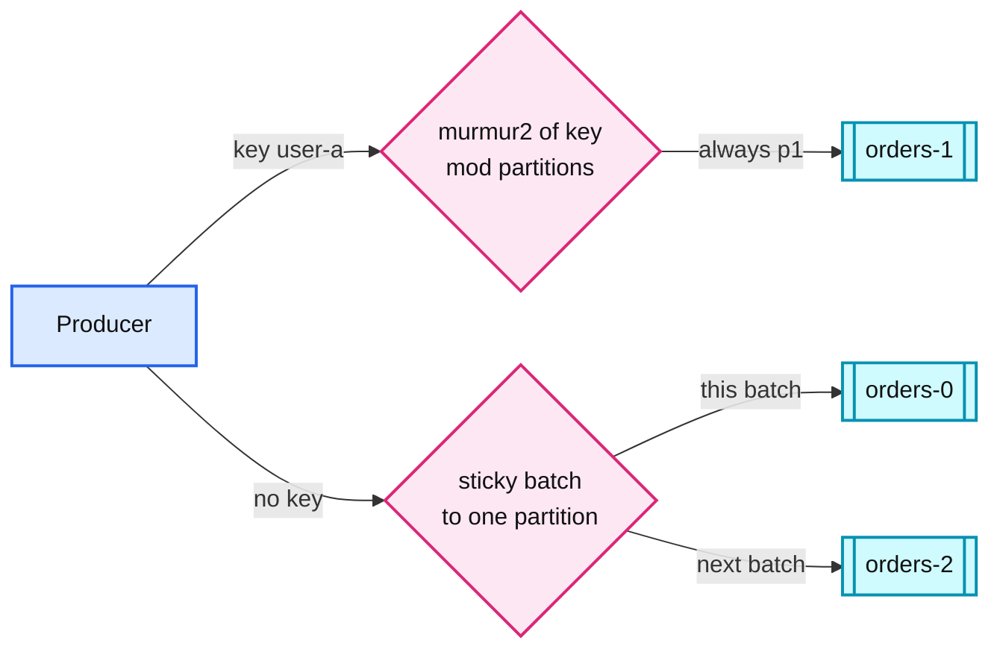

# 01. Partitioning by key

> Goal: after this I can explain how a key picks a partition, why ordering is only per partition, and why the key choice is the first Kafka decision in every HLD.

**Kafka functionality:** partitions, the default partitioner (`murmur2(key) % partitions`), sticky batching for null keys.
**Concept link:** `popular_systems_deepdive/kafka/kafka-01-log-storage.md`, `popular_systems_deepdive/kafka/kafka-04-producer.md` (§6.3 partitioner)
**Time:** ~30 min
**Status:** todo

## Where this is used in hld/

Same feature, different reason for the key each time. Read the "why" column out loud before you start.

| System | Topic and key | Why that key |
|---|---|---|
| [ai-gateway](../../../hld/ai-gateway/solution.md):245 | `usage.v1`, key `tenant_id`, 64 partitions | One tenant's usage stays ordered, so the Quota Service can rebuild a tenant from the Kafka tail after a restart |
| [driver-hot-clusters](../../../hld/driver-hot-clusters/solution.md):208 | `driver-locations`, key `driver_id` | Per-driver order for dedup and hysteresis. Flink is keyed the same way, so there is no network shuffle |
| [expense-rules-engine](../../../hld/expense-rules-engine/solution.md):963 | `card-events`, key `card_id` | Two events for one card are never applied at the same time. Note the limit: this is arrival order, not true order |
| [cdc-pipeline](../../../hld/cdc-pipeline/solution.md):92 | topic per table, key = primary key | Every change to one row lands in one partition, in commit order |
| [news-aggregator](../../../hld/news-aggregator/solution.md):980 | `raw-items`, `article-events`, key `publisher_id` | The normalizer needs "edit after create" for one publisher |
| [slack-messaging](../../../hld/slack-messaging/solution.md):593 | `mentions` and `push` by `user_id`, `index` by `channel_id` | One user's counter updates are ordered. Search indexes per channel |
| [employee-ops-bundle](../../../hld/employee-ops-bundle/solution.md):323 | `events.raw`, key `(tenant_id, device_id)` | Every retry of one event reaches the same dedup state in Flink |
| [payments-ledger](../../../hld/payments-ledger/solution.md):554 | outbox stream, key `payment_id` | A payment's events reach the webhook service in order |
| [vm-network-qos](../../../hld/vm-network-qos/solution.md):284 | `usage_sample`, key `vm_id` | Per-VM samples stay together for metering |
| [distributed-job-scheduler](../../../hld/distributed-job-scheduler/solution.md):662 | event triggers, key `job_id` | One job's upstream events are ordered |

**Where an HLD refuses a key or a partition layout:**

- [driver-hot-clusters §"why not partition by cell"](../../../hld/driver-hot-clusters/solution.md):500: a busy city cell becomes one hot partition, and per-driver order is lost. Partition by driver, re-key by cell only after a 5x reduction.
- [order-execution](../../../hld/order-execution/solution.md):472: "one partition per symbol as the sequencer" works for retail (ms latency) but not for a colo exchange (us budget).
- [slack-messaging](../../../hld/slack-messaging/solution.md):708: "one partition per channel" means 500 M partitions. Hashing channels onto fewer partitions serialises unrelated channels.



## Setup

```
$ cd tool-practise/kafka
$ docker compose up -d
$ docker exec -it kafka bash
$ cd /opt/kafka/bin && B=localhost:19092
```

## Steps

### 1. Create a topic with 3 partitions

Why: partitions are the unit of parallelism and of ordering.

```
$ ./kafka-topics.sh --bootstrap-server $B --create --topic orders --partitions 3 --replication-factor 1
$ ./kafka-topics.sh --bootstrap-server $B --describe --topic orders
```

### 2. Produce without keys

Why: no key means the sticky partitioner. A whole batch goes to one partition, the next batch to another. No ordering promise across messages.

```
$ ./kafka-console-producer.sh --bootstrap-server $B --topic orders
>order-1
>order-2
>order-3
>order-4
^C
```

### 3. Consume and print the partition each landed in

```
$ ./kafka-console-consumer.sh --bootstrap-server $B --topic orders --from-beginning \
    --formatter-property print.partition=true --formatter-property print.offset=true --timeout-ms 5000
```

Did all four land in one partition? That is the sticky batch, not round-robin.

### 4. Produce with keys

Why: same key, same partition, so per-key order is preserved.

```
$ ./kafka-console-producer.sh --bootstrap-server $B --topic orders \
    --reader-property parse.key=true --reader-property key.separator=:
>user-a:created
>user-b:created
>user-a:paid
>user-b:paid
>user-a:shipped
^C
$ ./kafka-console-consumer.sh --bootstrap-server $B --topic orders --from-beginning \
    --formatter-property print.partition=true --formatter-property print.key=true --timeout-ms 5000
```

Confirm all `user-a` events share one partition, in order.

### 5. Look at the raw log segment

Why: a partition is just a directory of files. Seeing it makes "append-only log" concrete.

```
$ ls /tmp/kafka-logs/orders-1/
$ ./kafka-dump-log.sh --files /tmp/kafka-logs/orders-1/00000000000000000000.log --print-data-log
```

Use the partition number you saw `user-a` land in.

## Break it

### A. Add partitions after keyed data exists

Produce ten keys, note their partitions, grow the topic, produce the same keys again.

```
$ for i in $(seq 0 9); do echo "k$i:before"; done | ./kafka-console-producer.sh --bootstrap-server $B \
    --topic orders --reader-property parse.key=true --reader-property key.separator=:
$ ./kafka-topics.sh --bootstrap-server $B --alter --topic orders --partitions 6
$ for i in $(seq 0 9); do echo "k$i:after"; done | ./kafka-console-producer.sh --bootstrap-server $B \
    --topic orders --reader-property parse.key=true --reader-property key.separator=:
$ ./kafka-console-consumer.sh --bootstrap-server $B --topic orders --from-beginning \
    --formatter-property print.partition=true --formatter-property print.key=true --timeout-ms 5000 | grep '^Partition.*k[0-9]'
```

Which keys moved partition? For those keys, can a consumer see `after` before `before`?

```
<paste>
```

### B. A hot key

The driver-hot-clusters "why not partition by cell" argument, measured. 900 of 1,000 records share one key.

```
$ for i in $(seq 1 1000); do if [ $((i % 10)) -ne 0 ]; then echo "cell-downtown:p$i"; else echo "cell-$i:p$i"; fi; done \
    | ./kafka-console-producer.sh --bootstrap-server $B --topic orders --reader-property parse.key=true --reader-property key.separator=:
$ ./kafka-get-offsets.sh --bootstrap-server $B --topic orders
```

How many records did the hottest partition get versus the others?

```
<paste>
```

## What I learned

- ...

## Interview soundbite

> ...

## Cleanup

```
$ docker compose down -v
```
