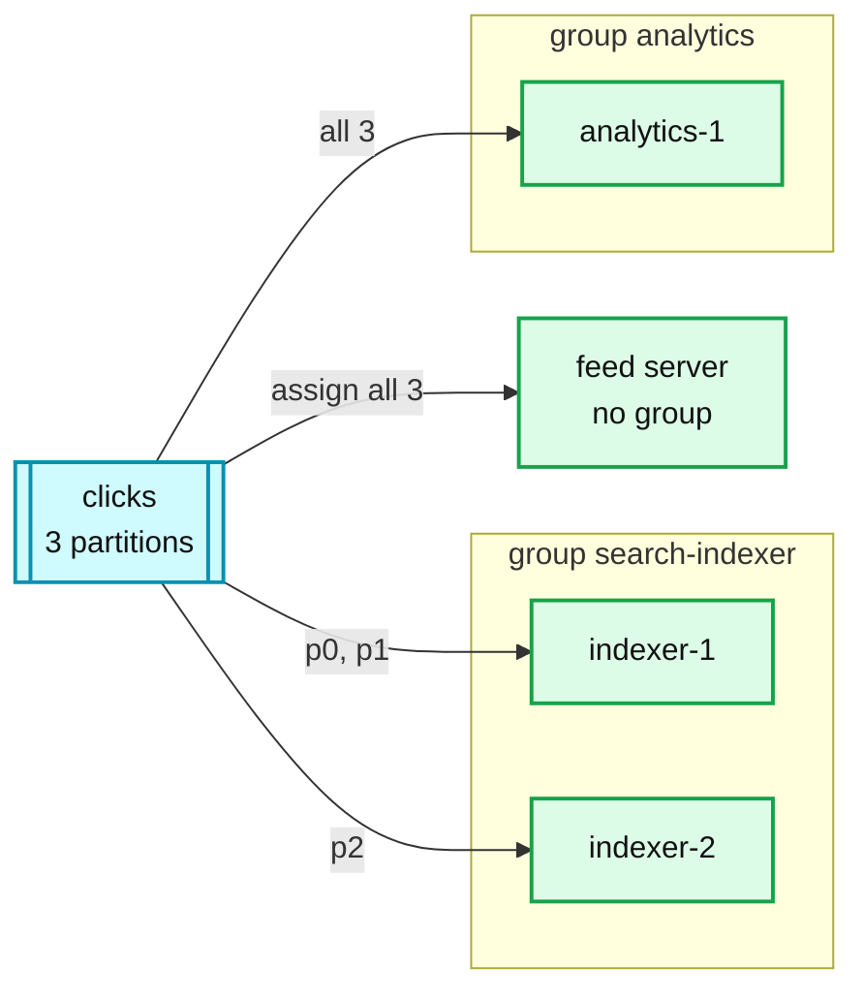

# 02. Consumer groups: share the work, fan out, or read everything

> Goal: after this I can pick between "one group shares the work", "one group per sink", and "no group, read every partition", and say how long a rebalance took.

**Kafka functionality:** consumer groups, partition assignment, rebalance (classic and KIP-848), manual assignment.
**Concept link:** `popular_systems_deepdive/kafka/kafka-05-consumer-rebalance.md`
**Time:** ~35 min
**Status:** todo

## Where this is used in hld/

Three different shapes built from one feature.

| Shape | System | How |
|---|---|---|
| **Work-sharing:** many consumers, one group | [slack-messaging](../../../hld/slack-messaging/solution.md):408 | Mention and push workers share `mentions` and `push`, draining at the provider's rate during an `@channel` storm |
| **Fan-out:** one group per sink | [cdc-pipeline](../../../hld/cdc-pipeline/solution.md):305 | Lake, search, cache and services each read the change topics on their own group. A slow sink only grows its own lag |
| **Fan-out** | [employee-ops-bundle](../../../hld/employee-ops-bundle/solution.md):326 | The archive sink and the Flink rollup both read `events.raw` independently |
| **Broadcast:** no group, manual assignment | [news-aggregator](../../../hld/news-aggregator/solution.md):980 | Every feed server reads every partition of `article-events`. No group, because a group per server would leave orphaned groups behind as servers autoscale. Offsets live in the corpus snapshot |

**Where an HLD refuses it:** [distributed-denylist](../../../hld/distributed-denylist/solution.md):447 rejects "make every host a consumer". One group's changes sit in one partition, so 200k consumers would all fetch from one broker (`200k x 640 KB/s = 128 GB/s`). It builds a distributor tree instead.



## Setup

Three terminals, all inside the broker container.

```
$ cd tool-practise/kafka
$ docker compose up -d
$ docker exec -it kafka bash
$ cd /opt/kafka/bin && B=localhost:19092
$ ./kafka-topics.sh --bootstrap-server $B --create --topic clicks --partitions 3 --replication-factor 1
$ for i in $(seq 1 30); do echo "u$i:click-$i"; done | ./kafka-console-producer.sh --bootstrap-server $B \
    --topic clicks --reader-property parse.key=true --reader-property key.separator=:
```

## Steps

### 1. Work-sharing: two consumers, one group

Why: a group splits partitions across its members. Each record goes to one member.

Terminal A and terminal B:

```
$ ./kafka-console-consumer.sh --bootstrap-server $B --topic clicks --group search-indexer --from-beginning
```

Terminal C:

```
$ ./kafka-consumer-groups.sh --bootstrap-server $B --describe --group search-indexer --members
$ ./kafka-consumer-groups.sh --bootstrap-server $B --describe --group search-indexer
```

How many partitions did each member get? Do the two terminals' record counts add up to 30?

### 2. Fan-out: a second group gets everything

Why: groups are independent cursors. This is the cdc-pipeline "one group per sink" shape.

```
$ ./kafka-console-consumer.sh --bootstrap-server $B --topic clicks --group analytics --from-beginning --timeout-ms 5000 | wc -l
```

### 3. The new rebalance protocol (KIP-848)

Why: in 4.x the broker computes assignments. The old protocol let one client stall the whole group.

Start a third member of `search-indexer` in terminal C with the new protocol:

```
$ ./kafka-console-consumer.sh --bootstrap-server $B --topic clicks --group search-indexer \
    --command-property group.protocol=consumer
```

From a fourth shell (`docker exec -it kafka bash`), describe the group again. A group can mix classic and new-protocol members during a migration.

### 4. More consumers than partitions

You now have 3 members on 3 partitions. Add a fourth `search-indexer` member. What does `--members` show for it?

## Break it

### A. Kill a member, time the rebalance

`Ctrl-C` terminal A (a clean leave). Run `--describe --members` every second until its partitions move. Then do it again with a hard kill, which has to wait for the session timeout:

```
$ pkill -9 -f "group search-indexer" -n
```

```
<paste: seconds until reassignment, clean leave vs hard kill>
```

### B. Orphaned groups from "no group" consumers

The news-aggregator reason for manual assignment, seen directly. Run a groupless consumer three times, then list groups:

```
$ for i in 1 2 3; do ./kafka-console-consumer.sh --bootstrap-server $B --topic clicks --from-beginning --timeout-ms 3000 > /dev/null; done
$ ./kafka-consumer-groups.sh --bootstrap-server $B --list
```

Each run left a `console-consumer-NNNNN` group behind. Picture an autoscaling feed fleet doing that every deploy.

```
<paste>
```

## What I learned

- ...

## Interview soundbite

> ...

## Cleanup

```
$ docker compose down -v
```
