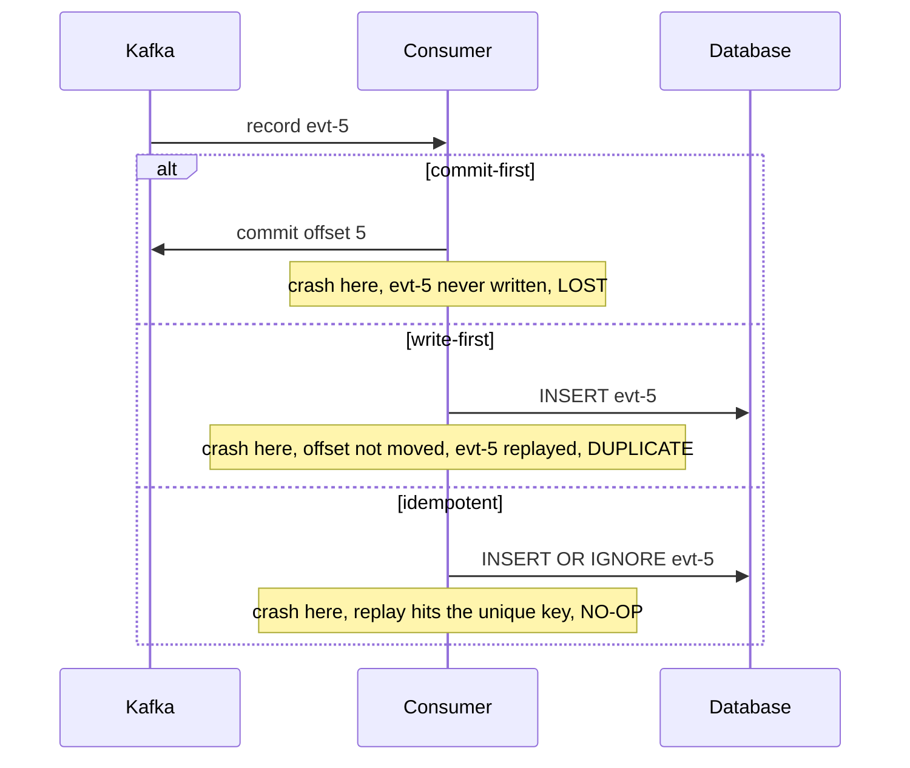

# 03. Offsets: where you commit decides what a crash costs

> Goal: after this I can show, with a crash, that commit-then-write loses a record, write-then-commit duplicates one, and write-then-commit with a unique key gives an exactly-once effect.

**Kafka functionality:** committed offsets, manual commit (`enable.auto.commit=false`), `--reset-offsets`, replay.
**Concept link:** `concepts/exactly-once.md`, `popular_systems_deepdive/kafka/kafka-05-consumer-rebalance.md`
**Time:** ~40 min
**Status:** todo

## Where this is used in hld/

Almost every sink in the HLDs is outside Kafka (Postgres, Delta, Redis, a TSDB), so this pattern, not Kafka transactions, is how they get exactly-once. Each picks a different dedup key.

| System | Side effect, then commit | Dedup key that absorbs the replay |
|---|---|---|
| [expense-rules-engine](../../../hld/expense-rules-engine/solution.md):963 | Apply the card event and record its processor id in one Postgres transaction, then commit the offset | Unique constraint on processor event id |
| [distributed-job-scheduler](../../../hld/distributed-job-scheduler/solution.md):662 | `INSERT run ON CONFLICT`, then commit | `(job_id, logical_date)` |
| [payments-ledger](../../../hld/payments-ledger/solution.md):630 | Sweeper and recon apply a state change | State machine `version`, conditional update |
| [slack-messaging](../../../hld/slack-messaging/solution.md):682 | Increment the mention counter | `(channel_id, seq)` |
| [ai-gateway](../../../hld/ai-gateway/solution.md):1236 | Stream job `MERGE`s into Delta | `(date, request_id)` |
| [vm-network-qos](../../../hld/vm-network-qos/solution.md):720 | TSDB upsert | `(vm, dir, ts_1s)` |

**Replay as a recovery tool:**

| System | What it replays |
|---|---|
| [driver-hot-clusters](../../../hld/driver-hot-clusters/solution.md):488 | Flink restarts from its checkpoint offsets and replays at ~10x |
| [ai-gateway](../../../hld/ai-gateway/solution.md):247 | Quota Service rebuilds spend from Delta plus the Kafka tail |
| [news-aggregator](../../../hld/news-aggregator/solution.md):632 | A new feed server loads a snapshot, then replays `article-events` from the offsets stored in it |



## Setup

```
$ cd tool-practise/kafka
$ docker compose --profile client up -d        # first start: ~20 s for pip install
$ docker exec kafka /opt/kafka/bin/kafka-topics.sh --bootstrap-server localhost:19092 \
    --create --topic events --partitions 1 --replication-factor 1
$ docker exec kafka bash -c 'for i in $(seq 1 10); do echo "evt-$i:amount=$i"; done | \
    /opt/kafka/bin/kafka-console-producer.sh --bootstrap-server localhost:19092 --topic events \
    --reader-property parse.key=true --reader-property key.separator=:'
```

Read [`scripts/sink_consumer.py`](../scripts/sink_consumer.py) first. It is ~100 lines. The `--mode` flag picks where the crash lands.

## Steps

### 1. Commit first, then write: at-most-once

```
$ docker exec kafka-client python sink_consumer.py --mode commit-first --crash-at 5
$ docker exec kafka-client python sink_consumer.py --mode commit-first
```

The restart prints `waiting for the group to hand us partitions...` for a few seconds. The crashed member still owns the partition until its 6 s session timeout runs out. Which offset did the restart begin at? Which event is missing?

### 2. Write first, then commit: at-least-once

```
$ docker exec kafka-client python sink_consumer.py --mode write-first --crash-at 5
$ docker exec kafka-client python sink_consumer.py --mode write-first
```

### 3. Write first with a unique key: exactly-once effect

```
$ docker exec kafka-client python sink_consumer.py --mode idempotent --crash-at 5
$ docker exec kafka-client python sink_consumer.py --mode idempotent
$ docker exec kafka-client python sink_consumer.py --report
```

On the reference run: `commit_first rows=9`, `write_first rows=11 duplicates=1`, `idempotent rows=10 duplicates=0`.

```
<paste your report>
```

### 4. Rewind a group by hand

Why: this is how an on-call engineer replays after a bad deploy.

```
$ docker exec -it kafka bash
$ cd /opt/kafka/bin && B=localhost:19092
$ ./kafka-consumer-groups.sh --bootstrap-server $B --describe --group sink-idempotent
$ ./kafka-consumer-groups.sh --bootstrap-server $B --group sink-idempotent --topic events --reset-offsets --shift-by -3 --dry-run
$ ./kafka-consumer-groups.sh --bootstrap-server $B --group sink-idempotent --topic events --reset-offsets --shift-by -3 --execute
$ exit
$ docker exec kafka-client python sink_consumer.py --mode idempotent
```

Three records replayed. Did the row count change?

## Break it

Reset a group while a member is still running. The script exits after 5 s idle, so hold the group open with a console consumer in one shell:

```
$ ./kafka-console-consumer.sh --bootstrap-server $B --topic events --group sink-idempotent
```

and reset from another:

```
$ ./kafka-consumer-groups.sh --bootstrap-server $B --group sink-idempotent --topic events --reset-offsets --to-earliest --execute
```

```
<paste the error>
```

Why does Kafka refuse? What would happen to the running member's in-memory position if it allowed it?

## What I learned

- ...

## Interview soundbite

> ...

## Cleanup

```
$ docker compose --profile client down -v
```
