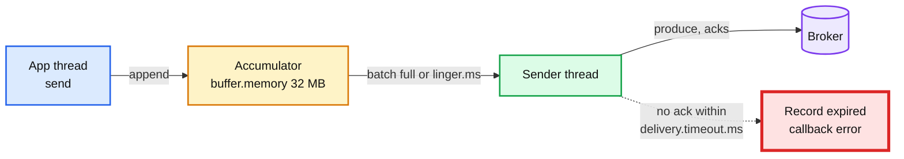

# 04. Producer acks, batching, and a broker outage

> Goal: after this I have measured records/sec for `acks=0`, `1` and `all`, and I have watched a producer drop records when the broker stays down longer than `delivery.timeout.ms`.

**Kafka functionality:** `acks`, `linger.ms`, `batch.size`, compression, `delivery.timeout.ms`, the producer buffer.
**Concept link:** `popular_systems_deepdive/kafka/kafka-04-producer.md` (§3.2 back-pressure, §9 delivery and retries)
**Time:** ~35 min
**Status:** todo

## Where this is used in hld/

The interesting part is not `acks`. It is **what the producer side does when Kafka is down**, and every HLD answers it differently.

| System | Ack contract | When Kafka is down |
|---|---|---|
| [employee-ops-bundle](../../../hld/employee-ops-bundle/solution.md):324 | Answer `200` to the SDK only after Kafka acks on 2 in-sync replicas | The SDK keeps the events and retries with jittered backoff. The phone is the buffer |
| [ai-gateway](../../../hld/ai-gateway/solution.md):1135 | Collector produces with `acks=all` | Collectors buffer 1 h on local disk. Counters are unaffected |
| [vm-network-qos](../../../hld/vm-network-qos/solution.md):408 | Agent emits a sample every 1 s | Samples buffer on the agent for 1 h, then drop. Billing reconciles from proxy counters |
| [news-aggregator](../../../hld/news-aggregator/solution.md):500 | Click events shipped every 100 ms by a background thread | The user never waits on Kafka. Losing some clicks is acceptable |
| [cdc-pipeline](../../../hld/cdc-pipeline/solution.md):395 | Debezium produces with `acks=all` | Debezium's queue fills, the reader stops, **the database slot pins WAL**. Kafka down becomes a database disk problem |
| [streaming-ingestion](../../../hld/streaming-ingestion/solution.md):54 | Sizing rule: ~5 to 10 MB/s per partition | Kafka is the availability story: producers can always write, the lake may lag |



## Setup

```
$ cd tool-practise/kafka
$ docker compose up -d
$ docker exec -it kafka bash
$ cd /opt/kafka/bin && B=localhost:19092
$ ./kafka-topics.sh --bootstrap-server $B --create --topic perf --partitions 3 --replication-factor 1
```

## Steps

### 1. acks=0, 1, all

Why: `acks` sets how many replicas must have the record before the producer hears "done".

```
$ for a in 0 1 all; do echo "acks=$a"; ./kafka-producer-perf-test.sh --topic perf --num-records 200000 \
    --record-size 100 --throughput -1 --command-property bootstrap.servers=$B acks=$a | tail -1; done
```

Reference run (one broker, laptop): ~318k, ~310k, ~264k records/s. On **one broker** `acks=all` is almost `acks=1`, because the ISR is just the leader. Rerun this in exercise 05 on three brokers to see the real gap.

```
<paste>
```

### 2. Batching: linger.ms

Why: waiting a few ms fills bigger batches. Fewer requests, higher throughput, a little latency.

```
$ for l in 0 20; do echo "linger=$l"; ./kafka-producer-perf-test.sh --topic perf --num-records 500000 \
    --record-size 100 --throughput -1 --command-property bootstrap.servers=$B acks=all linger.ms=$l batch.size=65536 | tail -1; done
```

### 3. Compression

```
$ for c in none lz4 zstd; do echo "compression=$c"; ./kafka-producer-perf-test.sh --topic perf --num-records 500000 \
    --record-size 100 --throughput -1 --command-property bootstrap.servers=$B acks=all linger.ms=20 compression.type=$c | tail -1; done
$ du -sh /tmp/kafka-logs/perf-*
```

## Break it

Stop the broker while a producer is sending, and keep it down longer than `delivery.timeout.ms`.

The producer must run **outside** the broker container, or stopping the broker kills it too. On the host, terminal A:

```
$ docker run --rm --network kafka_default apache/kafka:4.3.1 /opt/kafka/bin/kafka-producer-perf-test.sh \
    --topic perf --num-records 400 --record-size 100 --throughput 20 \
    --command-property bootstrap.servers=kafka:19092 acks=all delivery.timeout.ms=15000 request.timeout.ms=5000
```

Terminal B, a few seconds later:

```
$ docker stop kafka; sleep 25; docker start kafka
```

What happened (paste real output, do not guess):

```
<paste the TimeoutException lines and the final "N records sent" line>
```

Reference run: `TimeoutException: Expiring 1 record(s) for perf-0:15002 ms has passed since batch creation`, and 397 of 400 records sent. Those 3 records are gone unless the app keeps its own buffer, which is exactly what ai-gateway's 1 h disk buffer and employee-ops' "ack the SDK only after Kafka acks" are for.

## What I learned

- ...

## Interview soundbite

> ...

## Cleanup

```
$ docker compose down -v
```
