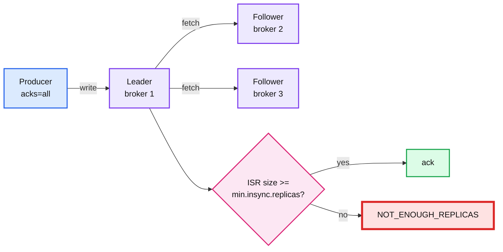

# 05. Replication, ISR and min.insync.replicas

> Goal: after this I have killed a partition leader, timed the new leader election, and seen `acks=all` refuse a write when the ISR is too small.

**Kafka functionality:** replication factor, ISR (in-sync replicas), `min.insync.replicas`, ELR (eligible leader replicas, KIP-966), leader election, KRaft controller quorum.
**Concept link:** `popular_systems_deepdive/kafka/kafka-02-replication-isr.md`, `popular_systems_deepdive/kafka/kafka-03-kraft-controller.md`, `concepts/replication-and-quorums.md`
**Time:** ~40 min
**Status:** todo

## Where this is used in hld/

The setting is nearly always the same (`RF 3`, `min.insync.replicas=2`, `acks=all`). What differs is **what the HLD says it protects**.

| System | Setting | What it protects |
|---|---|---|
| [employee-ops-bundle](../../../hld/employee-ops-bundle/solution.md):49 | Ack after 2 in-sync replicas **in different zones** | "Cannot be silently lost" for billable events. One zone loss loses nothing acked |
| [news-aggregator](../../../hld/news-aggregator/solution.md):733 | RF 3, min ISR 2 | A lost article event is a missing card on every feed server until the next snapshot rebuild |
| [distributed-job-scheduler](../../../hld/distributed-job-scheduler/solution.md):683 | `acks=all`, min ISR 2 | Do not lose an "upstream finished" event, or a downstream job never fires |
| [ai-gateway](../../../hld/ai-gateway/solution.md):1265 | 64 partitions, `acks=all`, min ISR 2 | The usage ledger that billing reads |
| [slack-messaging](../../../hld/slack-messaging/solution.md):613 | `acks=all`, min ISR 2, 3 d retention | Mentions and push are replayable for 3 days |
| [payments-ledger](../../../hld/payments-ledger/solution.md):586 | 12 brokers, RF 3 | Sizing: 200 MB/s of payment events, 3x headroom |



## Setup

This exercise uses its own 3-node compose file. Every node is both broker and controller.

```
$ cd tool-practise/kafka
$ docker compose down -v                                   # the single broker must not be running
$ docker compose -f docker-compose.cluster.yml up -d
$ docker exec -it kafka-2 bash
$ cd /opt/kafka/bin && B=kafka-2:19092
$ ./kafka-metadata-quorum.sh --bootstrap-server $B describe --status | grep -E "LeaderId|CurrentVoters"
$ ./kafka-topics.sh --bootstrap-server $B --create --topic ledger --partitions 3
$ ./kafka-topics.sh --bootstrap-server $B --describe --topic ledger
```

The cluster defaults are `default.replication.factor=3` and `min.insync.replicas=2`.

## Steps

### 1. Graceful stop of a leader

Why: a clean shutdown hands leadership over before the broker leaves.

Pick a partition led by broker 1. From the host:

```
$ docker stop kafka-1
```

Inside `kafka-2`, describe `ledger` straight away. Then `docker start kafka-1` and wait until the ISR shows all three again.

### 2. Hard kill of a leader, timed

Why: a crash gives no handover. The controller waits for the broker's session to time out.

```
$ docker kill kafka-1
$ for i in $(seq 1 30); do docker exec kafka-2 /opt/kafka/bin/kafka-topics.sh --bootstrap-server kafka-2:19092 \
    --describe --topic ledger | grep "Leader: 1" | wc -l; sleep 1; done
$ docker start kafka-1
```

Reference run: the leader moved about **12 s** after `docker kill`. Note the `Elr` column: the dead broker shows up as an eligible leader replica.

```
<paste: seconds until no partition is led by broker 1>
```

### 3. acks=all refuses a write when the ISR is too small

Why: `min.insync.replicas` only bites with `acks=all`. Use a topic that needs all 3, so one follower down is enough (and the controller quorum stays up).

```
$ ./kafka-topics.sh --bootstrap-server $B --create --topic strict --partitions 1 --config min.insync.replicas=3
$ ./kafka-topics.sh --bootstrap-server $B --describe --topic strict
```

Stop a broker that is a **follower** for `strict` (not the leader, not `kafka-2`), wait ~12 s, then:

```
$ echo all-fails | ./kafka-console-producer.sh --bootstrap-server $B --topic strict \
    --command-property acks=all --command-property delivery.timeout.ms=10000 --command-property request.timeout.ms=5000
$ echo acks1-ok | ./kafka-console-producer.sh --bootstrap-server $B --topic strict --command-property acks=1
$ ./kafka-get-offsets.sh --bootstrap-server $B --topic strict
$ ./kafka-console-consumer.sh --bootstrap-server $B --topic strict --partition 0 --offset earliest --timeout-ms 5000
```

Reference run: the `acks=all` write logged `NOT_ENOUGH_REPLICAS` 3 times, then gave up. The `acks=1` write printed **no error**. But `kafka-get-offsets.sh` still said `strict:0:0` and the consumer printed `Processed a total of 0 messages`.

That is not data loss. Since Kafka 4.0 (KIP-966, eligible leader replicas) the leader does not advance the high watermark while the ISR is smaller than `min.insync.replicas`. The record sits in the leader's log, invisible to consumers. Now bring the follower back and read again:

```
$ docker start kafka-<follower>                            # from the host; wait until Isr shows 3 brokers
$ ./kafka-get-offsets.sh --bootstrap-server $B --topic strict
$ ./kafka-console-consumer.sh --bootstrap-server $B --topic strict --partition 0 --offset earliest --timeout-ms 5000
```

Reference run: offset moved to `strict:0:1` and `acks1-ok` appeared. So `acks=1` got a success but no durability promise, and readers waited anyway. Which one would you want for a billing event?

### 4. Throughput with real replication

Rerun exercise 04 step 1 here:

```
$ ./kafka-topics.sh --bootstrap-server $B --create --topic perf --partitions 3
$ for a in 1 all; do echo "acks=$a"; ./kafka-producer-perf-test.sh --topic perf --num-records 200000 \
    --record-size 100 --throughput -1 --command-property bootstrap.servers=$B acks=$a | tail -1; done
```

## Break it

Kill **two** of the three nodes.

```
$ docker stop kafka-1 kafka-3
$ ./kafka-topics.sh --bootstrap-server $B --describe --topic ledger                 # straight away
$ sleep 30
$ ./kafka-topics.sh --bootstrap-server $B --describe --topic ledger                 # again
$ ./kafka-topics.sh --bootstrap-server $B --create --topic needs-controller --partitions 1 --replication-factor 1
$ ./kafka-metadata-quorum.sh --bootstrap-server $B describe --status
```

What happened (paste real output, do not guess):

```
<output>
```

Reference run: the first `describe` answered in 2 s from `kafka-2`'s cached metadata. Every partition showed `Leader: 2`, `Isr: 2`, `Elr: 1`. After 30 s the same `describe` timed out after ~60 s. `--create` and the quorum status timed out too. Each node is also a KRaft controller, so losing 2 of 3 loses the controller majority, and nothing that needs fresh metadata works. That is why production clusters run dedicated controllers.

## What I learned

- ...

## Interview soundbite

> ...

## Cleanup

```
$ docker compose -f docker-compose.cluster.yml down -v
```
