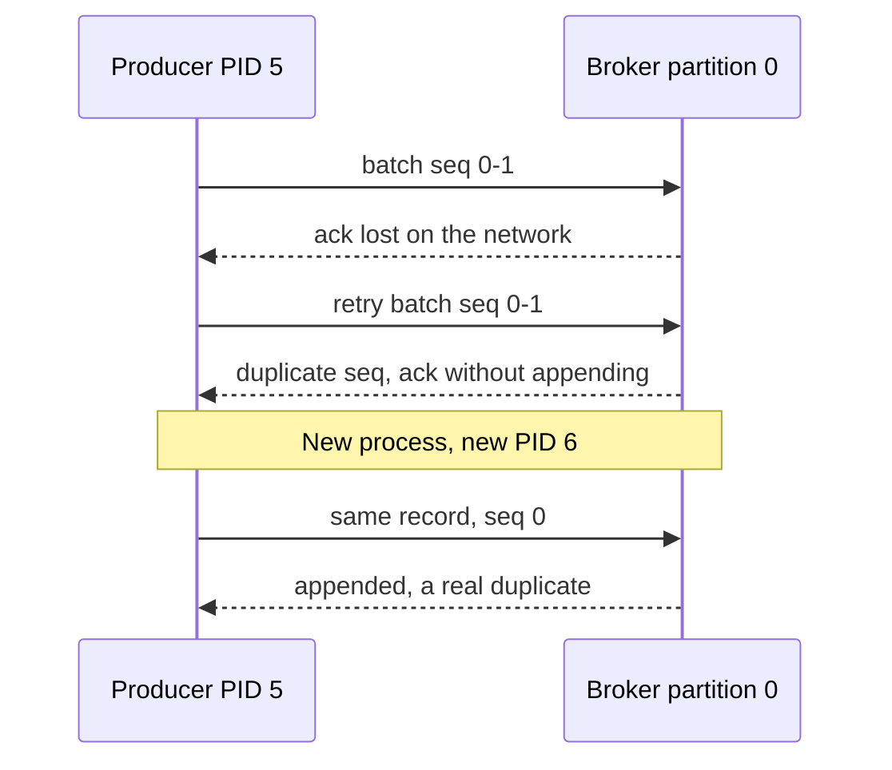

# 06. The idempotent producer

> Goal: after this I can point at the producer id and sequence number in a raw log batch, and explain why idempotence stops retry duplicates inside one producer session but not across sessions.

**Kafka functionality:** `enable.idempotence` (default since 3.0), producer id (PID), producer epoch, per-partition sequence numbers, `max.in.flight.requests.per.connection <= 5`.
**Concept link:** `popular_systems_deepdive/kafka/kafka-04-producer.md` (§4.1, §6.6), `concepts/exactly-once.md`
**Time:** ~20 min
**Status:** todo

## Where this is used in hld/

Every HLD turns it on. The useful part is that **each one also dedups downstream**, because idempotence has a session boundary.

| System | Producer | What still dedups across sessions |
|---|---|---|
| [payments-ledger](../../../hld/payments-ledger/solution.md):554 | Outbox relay. "A relay crash re-produces some rows" | Consumers dedup on `event_id` |
| [employee-ops-bundle](../../../hld/employee-ops-bundle/solution.md):325 | Ingest pod. "A pod that dies after Kafka acked but before it answered causes a duplicate" | Exact dedup per hour on `(tenant_id, event_id)` |
| [ai-gateway](../../../hld/ai-gateway/solution.md):1335 | Collector re-sending a batch | Ledger `MERGE` on `(date, request_id)` |
| [streaming-ingestion](../../../hld/streaming-ingestion/solution.md):187 | Every producer, `acks=all` | Delta `txn` marker with the offset range |
| [news-aggregator](../../../hld/news-aggregator/solution.md):980 | Outbox relay to `article-events` | Article id in the corpus |
| [driver-hot-clusters](../../../hld/driver-hot-clusters/solution.md):208 | Location gateway | Set semantics in the stream job |



## Setup

```
$ cd tool-practise/kafka
$ docker compose up -d
$ docker exec -it kafka bash
$ cd /opt/kafka/bin && B=localhost:19092
$ ./kafka-topics.sh --bootstrap-server $B --create --topic payments --partitions 1 --replication-factor 1
```

## Steps

### 1. Produce with idempotence on

```
$ printf "p1:authorized\np1:captured\n" | ./kafka-console-producer.sh --bootstrap-server $B --topic payments \
    --reader-property parse.key=true --reader-property key.separator=: \
    --command-property enable.idempotence=true --command-property acks=all
```

### 2. Produce with idempotence off

```
$ printf "p2:authorized\n" | ./kafka-console-producer.sh --bootstrap-server $B --topic payments \
    --reader-property parse.key=true --reader-property key.separator=: \
    --command-property enable.idempotence=false --command-property acks=1
```

### 3. Read the batch headers

Why: the PID and sequence are stored on every batch. That is all the broker needs to drop a retry.

```
$ ./kafka-dump-log.sh --files /tmp/kafka-logs/payments-0/00000000000000000000.log | grep baseOffset
```

Reference run: the first batch shows `baseSequence: 0 lastSequence: 1 producerId: 5`. The second shows `baseSequence: -1 producerId: -1`.

```
<paste>
```

### 4. The in-flight limit

Why: the broker tracks the last 5 batches per producer per partition. That is where the limit comes from.

```
$ echo x | ./kafka-console-producer.sh --bootstrap-server $B --topic payments \
    --command-property enable.idempotence=true --command-property max.in.flight.requests.per.connection=6
```

What happened?

```
<paste>
```

## Break it

An application-level retry. The relay "crashed" after sending and sends the same payment event again from a new process.

```
$ for run in 1 2; do echo "p3:refunded" | ./kafka-console-producer.sh --bootstrap-server $B --topic payments \
    --reader-property parse.key=true --reader-property key.separator=: --command-property enable.idempotence=true; done
$ ./kafka-dump-log.sh --files /tmp/kafka-logs/payments-0/00000000000000000000.log --print-data-log | tail -4
$ ./kafka-console-consumer.sh --bootstrap-server $B --topic payments --from-beginning --timeout-ms 4000 | grep -c refunded
```

How many `refunded` records are there? Do the two batches have the same `producerId`?

```
<paste>
```

This is why payments-ledger still dedups on `event_id`, and employee-ops still runs an hourly exact dedup.

## What I learned

- ...

## Interview soundbite

> ...

## Cleanup

```
$ docker compose down -v
```
