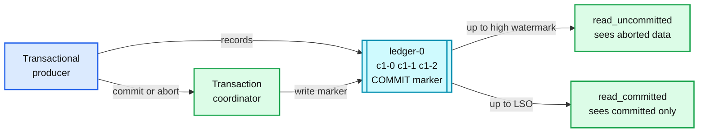

# 07. Transactions and read_committed

> Goal: after this I can show an aborted transaction that `read_uncommitted` sees and `read_committed` hides, find the commit markers in the log, and explain why one hung transaction blocks every reader of that partition.

**Kafka functionality:** `transactional.id`, `init/begin/commit/abort_transaction`, control records (commit/abort markers), LSO (last stable offset), `isolation.level`, zombie fencing by producer epoch, `kafka-transactions.sh`.
**Concept link:** `popular_systems_deepdive/kafka/kafka-04-producer.md` (§4.2, §6.8, §8), `concepts/exactly-once.md`
**Time:** ~35 min
**Status:** todo

## Where this is used in hld/

Kafka transactions give atomic writes **inside Kafka**: many partitions at once, or consume-transform-produce from Kafka to Kafka. Most HLD sinks live outside Kafka, so most HLDs **name it and then pick something else**. That choice is the interview answer.

| System | Uses Kafka transactions? | What it does instead, and why |
|---|---|---|
| [cdc-pipeline](../../../hld/cdc-pipeline/solution.md):292 | Considers KIP-618 (connector writes records and its offsets in one transaction) | "Removes duplicates inside Kafka. Does nothing for a write to Elasticsearch, Redis, a lake table." Uses a version per key at every sink instead |
| [driver-hot-clusters](../../../hld/driver-hot-clusters/solution.md):404 | Flink exactly-once state with checkpoints | The Redis sink is `SET`, not `INCR`, so a replay is harmless without a transactional sink |
| [streaming-ingestion](../../../hld/streaming-ingestion/solution.md):189 | No | Writes the offset range into the Delta commit (`txn` marker). Data and position commit atomically in the sink |
| [employee-ops-bundle](../../../hld/employee-ops-bundle/solution.md):326 | No | Archive sink commits Kafka offsets inside the table commit |
| [payments-ledger](../../../hld/payments-ledger/solution.md):655 | Refuses an event-sourced ledger on Kafka | "The balance check needs a linearizable read-modify-write. Kafka alone cannot refuse an overdraft" |



## Setup

```
$ cd tool-practise/kafka
$ docker compose --profile client up -d
$ docker exec kafka /opt/kafka/bin/kafka-topics.sh --bootstrap-server localhost:19092 \
    --create --topic ledger --partitions 1 --replication-factor 1
```

Read [`scripts/txn_producer.py`](../scripts/txn_producer.py). It writes 3 records in a transaction, then commits, aborts, or exits without either.

Shell for the CLI steps:

```
$ docker exec -it kafka bash
$ cd /opt/kafka/bin && B=localhost:19092
```

## Steps

### 1. One committed, one aborted transaction

From the host:

```
$ docker exec kafka-client python txn_producer.py commit c1
$ docker exec kafka-client python txn_producer.py abort a1
```

### 2. Read both ways

```
$ ./kafka-console-consumer.sh --bootstrap-server $B --topic ledger --from-beginning \
    --isolation-level read_uncommitted --formatter-property print.offset=true --timeout-ms 5000
$ ./kafka-console-consumer.sh --bootstrap-server $B --topic ledger --from-beginning \
    --isolation-level read_committed --formatter-property print.offset=true --timeout-ms 5000
```

Offset 3 is missing from both. Why?

### 3. Find the markers

```
$ ./kafka-dump-log.sh --files /tmp/kafka-logs/ledger-0/00000000000000000000.log --print-data-log | grep -E "isControl: true|endTxnMarker"
```

Reference run: `endTxnMarker: COMMIT` at offset 3 and `endTxnMarker: ABORT` at offset 7. A marker takes up an offset, so offsets in a transactional topic have gaps. Never compute "number of records" as `end - start` on one.

### 4. Inspect the coordinator's view

```
$ ./kafka-transactions.sh --bootstrap-server $B list
$ ./kafka-transactions.sh --bootstrap-server $B describe --transactional-id ledger-relay
```

Note `ProducerEpoch`. Every `init_transactions()` bumped it.

## Break it

### A. A hung transaction blocks the whole partition

The relay crashes mid-transaction. Then an unrelated, **non-transactional** record arrives behind it.

```
$ docker exec kafka-client python txn_producer.py hang h1
$ echo after-hang | ./kafka-console-producer.sh --bootstrap-server $B --topic ledger
$ ./kafka-transactions.sh --bootstrap-server $B list
$ ./kafka-console-consumer.sh --bootstrap-server $B --topic ledger --partition 0 --offset earliest \
    --isolation-level read_committed --timeout-ms 5000 | tail -2
$ ./kafka-console-consumer.sh --bootstrap-server $B --topic ledger --partition 0 --offset earliest \
    --isolation-level read_uncommitted --timeout-ms 5000 | tail -2
```

Does the `read_committed` reader see `after-hang`? Wait 60 s (`transaction.timeout.ms` in the script), run `list` again, then read again.

```
<paste: state before and after the timeout, and when after-hang became visible>
```

Reference run: `Ongoing`, then `CompleteAbort` after ~60 s, and only then did `after-hang` appear to `read_committed`.

### B. Fencing ends the hang early

Repeat A, but instead of waiting, start a new producer with the same `transactional.id`:

```
$ docker exec kafka-client python txn_producer.py hang h2
$ docker exec kafka-client python txn_producer.py commit c2
$ ./kafka-transactions.sh --bootstrap-server $B list
```

The new `init_transactions()` bumped the epoch and aborted `h2` at once. This is zombie fencing: a stable `transactional.id` per relay instance is what makes a restart safe.

## What I learned

- ...

## Interview soundbite

> ...

## Cleanup

```
$ docker compose --profile client down -v
```
