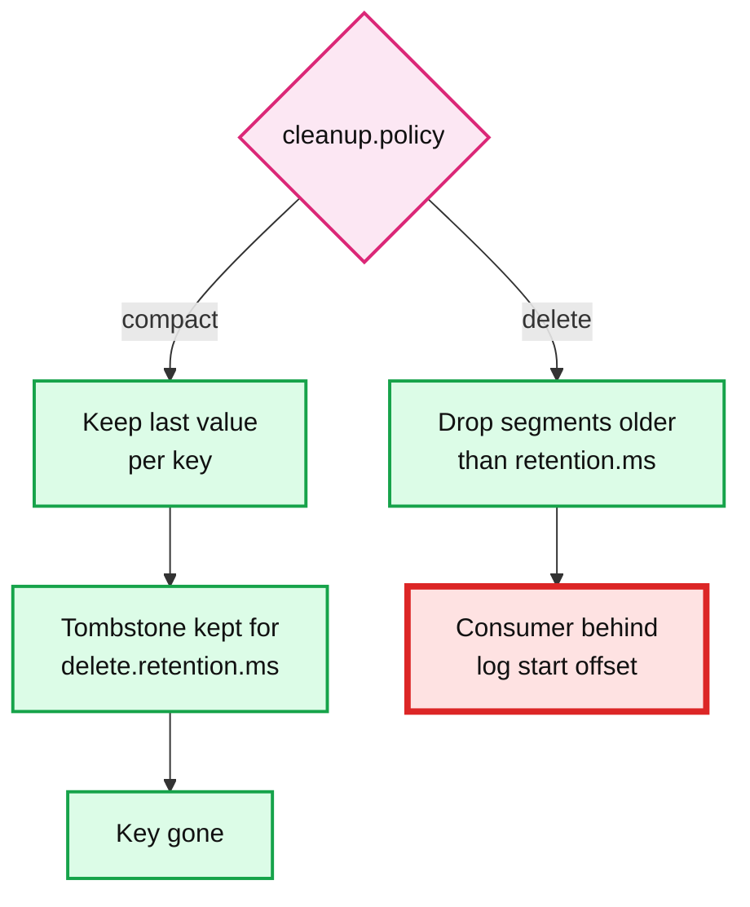

# 08. Retention, compaction and tombstones

> Goal: after this I can make a compacted topic keep only the latest value per key, delete a key with a tombstone, and show what happens to a consumer that falls behind time-based retention.

**Kafka functionality:** `cleanup.policy=delete|compact`, `retention.ms`, segments (`segment.ms`), the log cleaner, tombstones (null value), `delete.retention.ms`, `auto.offset.reset`.
**Concept link:** `popular_systems_deepdive/kafka/kafka-01-log-storage.md` (retention, compaction, tiered storage)
**Time:** ~35 min
**Status:** todo

## Where this is used in hld/

Two policies, two very different jobs.

**Retention as the replay window.** The number of days is a recovery promise, and each HLD sizes it from a different failure.

| System | Retention | The promise it backs |
|---|---|---|
| [news-aggregator](../../../hld/news-aggregator/solution.md):1020 | 7 d on `article-events` | Rebuild a corpus from any snapshot in the last week |
| [employee-ops-bundle](../../../hld/employee-ops-bundle/solution.md):424 | 7 d on `events.raw` | 7 days to re-archive a gap that the billing completeness check found |
| [cdc-pipeline](../../../hld/cdc-pipeline/solution.md):62 | 7 d, 24 h local plus tiered storage | Replay window for sinks. Sinks keep tombstones for the same 7 days |
| [driver-hot-clusters](../../../hld/driver-hot-clusters/solution.md):489 | 3 d | A 30-minute Flink outage catches up at 10x in ~3 min |
| [slack-messaging](../../../hld/slack-messaging/solution.md):613 | 3 d | Mentions and push are replayable for 3 days |

**Compaction as a key-value table.**

| System | Compacted topic | Why |
|---|---|---|
| [cdc-pipeline](../../../hld/cdc-pipeline/solution.md):92 | Change topics carry a tombstone after each delete | Compaction can drop the deleted key entirely. Sinks keep their own tombstones (`version`, `deleted=true`) |
| [cdc-pipeline](../../../hld/cdc-pipeline/solution.md):179 | Kafka Connect's offsets topic | "Where do I resume" is a key (connector, database) with only the latest value mattering. You will see it in exercise 11 |



## Setup

```
$ cd tool-practise/kafka
$ docker compose up -d
$ docker exec -it kafka bash
$ cd /opt/kafka/bin && B=localhost:19092
```

The compose file sets `log.retention.check.interval.ms=10000` so retention runs every 10 s instead of every 5 minutes.

## Steps

### 1. A compacted topic, made eager

Why: the cleaner never touches the active segment. Tiny `segment.ms` and a low dirty ratio make it run within seconds.

```
$ ./kafka-topics.sh --bootstrap-server $B --create --topic users-cdc --partitions 1 --replication-factor 1 \
    --config cleanup.policy=compact --config segment.ms=5000 \
    --config min.cleanable.dirty.ratio=0.01 --config delete.retention.ms=20000
```

### 2. Write versions and a tombstone

```
$ printf "u1|v1\nu2|v1\nu1|v2\nu3|v1\nu1|v3\nu2|NULL\n" | ./kafka-console-producer.sh --bootstrap-server $B \
    --topic users-cdc --reader-property parse.key=true --reader-property 'key.separator=|' --reader-property null.marker=NULL
$ ./kafka-console-consumer.sh --bootstrap-server $B --topic users-cdc --from-beginning \
    --formatter-property print.key=true --formatter-property print.offset=true \
    --formatter-property null.literal=TOMBSTONE --timeout-ms 4000
```

### 3. Let the cleaner run

Wait ~8 s, write one more record so the old segment rolls, wait ~25 s, read again.

```
$ echo "u4|v1" | ./kafka-console-producer.sh --bootstrap-server $B --topic users-cdc \
    --reader-property parse.key=true --reader-property 'key.separator=|'
$ ./kafka-console-consumer.sh --bootstrap-server $B --topic users-cdc --from-beginning \
    --formatter-property print.key=true --formatter-property print.offset=true \
    --formatter-property null.literal=TOMBSTONE --timeout-ms 4000
$ ls /tmp/kafka-logs/users-cdc-0/
```

Reference run: only offsets 3 (`u3`), 4 (`u1 v3`), 5 (`u2 TOMBSTONE`) and 6 (`u4`) remained. **Offsets did not change**. Compaction leaves gaps, it never renumbers.

### 4. Wait out delete.retention.ms

Wait a minute, then repeat step 3 with a new key (`u5|v1`) so another segment rolls and the cleaner runs again. Is the `u2` tombstone still there?

```
<paste>
```

A sink that was offline longer than `delete.retention.ms` never sees the tombstone, so it never deletes `u2`. That is why cdc-pipeline sinks keep their own tombstones for the whole replay window.

## Break it

A consumer falls behind time-based retention.

```
$ ./kafka-topics.sh --bootstrap-server $B --create --topic short-lived --partitions 1 --replication-factor 1 \
    --config retention.ms=10000 --config segment.ms=3000
$ for i in $(seq 1 5); do echo "old-$i"; done | ./kafka-console-producer.sh --bootstrap-server $B --topic short-lived
$ ./kafka-console-consumer.sh --bootstrap-server $B --topic short-lived --group slow-sink --from-beginning --max-messages 2
$ sleep 30; echo "new-1" | ./kafka-console-producer.sh --bootstrap-server $B --topic short-lived
$ ./kafka-get-offsets.sh --bootstrap-server $B --topic short-lived --time -2      # log start offset
$ ./kafka-consumer-groups.sh --bootstrap-server $B --describe --group slow-sink
```

The group's committed offset is now **below** the log start offset. First, ask Kafka to fail loudly:

```
$ ./kafka-console-consumer.sh --bootstrap-server $B --topic short-lived --group slow-sink \
    --command-property auto.offset.reset=none --timeout-ms 5000
```

Then let it reset silently, and describe the group again:

```
$ ./kafka-console-consumer.sh --bootstrap-server $B --topic short-lived --group slow-sink \
    --command-property auto.offset.reset=earliest --timeout-ms 5000
$ ./kafka-consumer-groups.sh --bootstrap-server $B --describe --group slow-sink
```

What happened (paste real output, do not guess):

```
<output>
```

Reference run: `OffsetOutOfRangeException: Fetch position FetchPosition{offset=2, ...} is out of range` with `none`. With a reset policy, the lag went to 0 and the 3 expired records were never counted anywhere. Which alert would have caught this before it happened?

## What I learned

- ...

## Interview soundbite

> ...

## Cleanup

```
$ docker compose down -v
```
