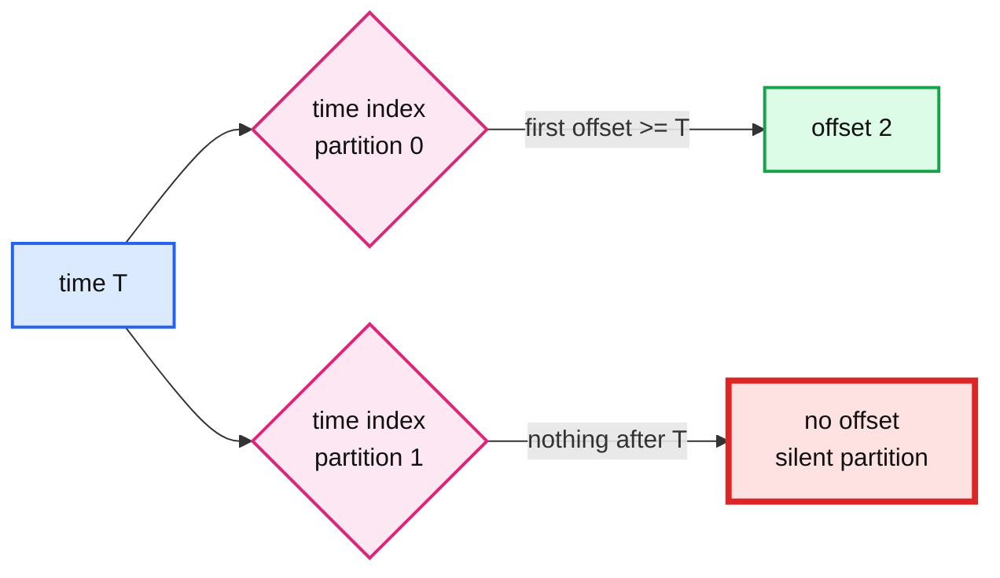

# 09. Timestamps and seeking by time

> Goal: after this I can turn a wall-clock time into an offset per partition, rewind a group to a time, and say when to trust `LogAppendTime` over `CreateTime`.

**Kafka functionality:** record timestamps (`message.timestamp.type=CreateTime|LogAppendTime`), the time index, `offsetsForTimes` (`kafka-get-offsets.sh --time`), `--reset-offsets --to-datetime`.
**Concept link:** `popular_systems_deepdive/kafka/kafka-01-log-storage.md` (indexes), `concepts/stream-processing.md` (event time vs processing time)
**Time:** ~25 min
**Status:** todo

## Where this is used in hld/

The time index answers "which offset was at time T". The HLDs ask that question for billing, backfill and watermarks, and they disagree on **whose clock** to trust.

| System | Clock | How it uses time |
|---|---|---|
| [employee-ops-bundle](../../../hld/employee-ops-bundle/solution.md):423 | `LogAppendTime` (broker clock) | The period cutter asks `offsetsForTimes(H)` per partition to cut an hourly billing range that never changes. "Bill by acceptance time, not event time": device clocks lie |
| [employee-ops-bundle](../../../hld/employee-ops-bundle/solution.md):423 | (same) | Ingest pods write a tick record to every partition every 10 s, **so no partition is ever silent at a boundary**. See Break it |
| [streaming-ingestion](../../../hld/streaming-ingestion/solution.md):315 | Broker time | A backfill of 06:00 to 12:00 resolves to offsets with `offsetsForTimes` per partition |
| [driver-hot-clusters](../../../hld/driver-hot-clusters/solution.md):444 | Event time from the device | Watermark = max `event_ts` per Kafka partition minus 10 s. Processing time would break counts during a 10x catch-up |
| [news-aggregator](../../../hld/news-aggregator/solution.md):632 | Neither | The snapshot stores **offsets**, not a time. Exact, no clock involved |



## Setup

```
$ cd tool-practise/kafka
$ docker compose up -d
$ docker exec -it kafka bash
$ cd /opt/kafka/bin && B=localhost:19092
$ ./kafka-topics.sh --bootstrap-server $B --create --topic events-raw --partitions 2 --replication-factor 1 \
    --config message.timestamp.type=LogAppendTime
```

## Steps

### 1. Two batches with a cut between them

```
$ for i in 1 2 3 4; do echo "d$i:batch1-$i"; done | ./kafka-console-producer.sh --bootstrap-server $B \
    --topic events-raw --reader-property parse.key=true --reader-property key.separator=:
$ sleep 3; T=$(date +%s%3N); TISO=$(date -u +%Y-%m-%dT%H:%M:%S.000); echo "cut T=$T ($TISO)"; sleep 2
$ for i in 1 2 3 4; do echo "d$i:batch2-$i"; done | ./kafka-console-producer.sh --bootstrap-server $B \
    --topic events-raw --reader-property parse.key=true --reader-property key.separator=:
```

### 2. Time to offset, per partition

Why: this is the employee-ops period cutter in one command.

```
$ ./kafka-get-offsets.sh --bootstrap-server $B --topic events-raw --time $T
$ ./kafka-get-offsets.sh --bootstrap-server $B --topic events-raw --time -1     # end offsets
```

The cut for "batch 2" is `[offset at T, end offset)` on each partition.

### 3. Rewind a group to a time

Why: "replay everything since the bad deploy at 09:36".

```
$ ./kafka-console-consumer.sh --bootstrap-server $B --topic events-raw --group billing --from-beginning --timeout-ms 4000 > /dev/null
$ ./kafka-consumer-groups.sh --bootstrap-server $B --group billing --topic events-raw --reset-offsets --to-datetime $TISO --dry-run
$ ./kafka-consumer-groups.sh --bootstrap-server $B --group billing --topic events-raw --reset-offsets --to-datetime $TISO --execute
$ ./kafka-console-consumer.sh --bootstrap-server $B --topic events-raw --group billing \
    --formatter-property print.timestamp=true --timeout-ms 4000
```

Reference run: only `batch2-*` came back, each tagged `LogAppendTime:`.

### 4. CreateTime vs LogAppendTime

```
$ ./kafka-topics.sh --bootstrap-server $B --describe --topic events-raw
$ ./kafka-configs.sh --bootstrap-server $B --describe --entity-type topics --entity-name events-raw
```

With `CreateTime` (the default) the timestamp is whatever the producer sent. A phone that was offline for two days sends two-day-old timestamps. Which systems above would break if `events-raw` used `CreateTime`?

## Break it

A silent partition at the cut. Write after `T2` to one partition only, then ask for offsets at `T2`.

```
$ T2=$(date +%s%3N); sleep 1
$ echo "d1:only-one-partition" | ./kafka-console-producer.sh --bootstrap-server $B --topic events-raw \
    --reader-property parse.key=true --reader-property key.separator=:
$ ./kafka-get-offsets.sh --bootstrap-server $B --topic events-raw --time $T2
```

What did the silent partition return? (paste real output, do not guess)

```
<output>
```

If the period cutter got this answer at an hour boundary, could it tell "no events this hour" from "the broker has not caught up yet"? That is the reason for the 10 s tick records in employee-ops.

## What I learned

- ...

## Interview soundbite

> ...

## Cleanup

```
$ docker compose down -v
```
