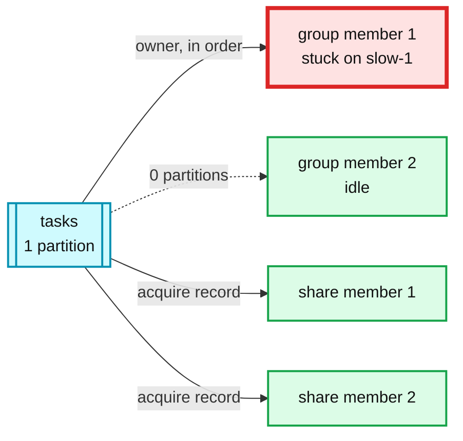

# 10. Head-of-line blocking, and share groups as the queue answer

> Goal: after this I can show one slow record stalling a whole partition, show that adding consumers does not help, and show a share group redelivering and then archiving a poison message.

**Kafka functionality:** partition-ordered consumption, consumer count capped by partition count, KIP-932 share groups (`kafka-console-share-consumer.sh`, acquisition locks, delivery count limit).
**Concept link:** `popular_systems_deepdive/kafka/kafka-05-consumer-rebalance.md` (share groups), `popular_systems_deepdive/kafka/kafka-00-overview.md` ("reading does not consume")
**Time:** ~35 min
**Status:** todo

## Where this is used in hld/

Mostly as a **refusal**. These are the "why not just use Kafka?" answers, and this exercise is the evidence behind them.

| System | Refuses | The limit it names |
|---|---|---|
| [distributed-job-scheduler](../../../hld/distributed-job-scheduler/solution.md):524 | Kafka as the ready queue | "No per-message ack, no visibility timeout, no conditional update, and a slow task at the head blocks the partition." Keeps Kafka for outbox and CDC only |
| [streetview-ingestion](../../../hld/streetview-ingestion/solution.md):513 | Kafka between pipeline stages | Stages run for hours and output GBs of files. A durable workflow plus manifests is simpler |
| [health-monitoring](../../../hld/health-monitoring/solution.md):560 | Kafka on the alert path | Consumer lag becomes alert lag |
| [order-execution](../../../hld/order-execution/solution.md):646 | Kafka single partition as the colo sequencer | ms-scale commit latency on the one ordered path |

And where the same limit is **accepted on purpose**:

| System | Accepts | Why it is fine there |
|---|---|---|
| [slack-messaging](../../../hld/slack-messaging/solution.md):408 | `@channel` storm queued on Kafka by `user_id` | Draining at the push provider's rate is the goal. Lag is "counters seconds to minutes behind", alerted at 5 min |
| [ai-gateway](../../../hld/ai-gateway/solution.md):249 | A hot tenant on one partition | Absorbed by quota leases, not by splitting the key |



## Setup

```
$ cd tool-practise/kafka
$ docker compose --profile client up -d
$ docker exec -it kafka bash
$ cd /opt/kafka/bin && B=localhost:19092
$ ./kafka-topics.sh --bootstrap-server $B --create --topic tasks --partitions 1 --replication-factor 1
```

Read [`scripts/slow_consumer.py`](../scripts/slow_consumer.py). A record starting with `slow` takes 20 s, the rest take 0 s.

## Steps

### 1. One slow record at the head

```
$ printf "slow-1\nquick-1\nquick-2\nquick-3\n" | ./kafka-console-producer.sh --bootstrap-server $B --topic tasks
```

From the host, terminal A:

```
$ docker exec kafka-client python slow_consumer.py
```

How long did `quick-1` wait? Reference run: all three quick tasks waited **20.6 s** behind `slow-1`.

### 2. Add a consumer. Does it help?

Produce the same four records again. Start `slow_consumer.py` in terminal A, and a second copy in terminal B 5 s later. Then:

```
$ ./kafka-consumer-groups.sh --bootstrap-server $B --describe --group task-runners --members
```

Reference run: the second member had `#PARTITIONS 0`. One partition, one owner. To scale a queue you need more partitions, and then one slow task still blocks everything behind it **in its own partition**.

### 3. A share group on the same single partition

Why: share groups (KIP-932, production-ready since 4.2) hand records to any member and track each record. Consumer count is no longer capped by partition count.

Start two share consumers **before** producing (a new share group starts at the latest offset):

```
$ ./kafka-console-share-consumer.sh --bootstrap-server $B --topic tasks --group task-pool     # terminal A
$ ./kafka-console-share-consumer.sh --bootstrap-server $B --topic tasks --group task-pool     # terminal B
$ for i in $(seq 1 20); do echo "task-$i"; done | ./kafka-console-producer.sh --bootstrap-server $B --topic tasks
$ ./kafka-share-groups.sh --bootstrap-server $B --describe --group task-pool
```

How did the 20 tasks split between A and B? (On the reference run one member took all 20 in one fetch. Small records come in big batches. Try 2,000 records and look again.)

```
<paste>
```

## Break it

A poison message. The consumer cannot process it and releases it every time.

```
$ echo poison | ./kafka-console-producer.sh --bootstrap-server $B --topic tasks
$ ./kafka-console-share-consumer.sh --bootstrap-server $B --topic tasks --group task-pool --release --timeout-ms 20000
$ ./kafka-share-groups.sh --bootstrap-server $B --describe --group task-pool
```

How many times was `poison` delivered before the share group gave up? What does `START-OFFSET` show afterwards?

```
<paste>
```

Reference run: delivered **5 times** (the default `group.share.delivery.count.limit`), then archived, and the start offset moved past it. This is the per-message ack and dead-letter behaviour the job scheduler said Kafka lacked. The Staff question: if most of your traffic needs this, do you want Kafka with a queue bolted on, or a queue?

## What I learned

- ...

## Interview soundbite

> ...

## Cleanup

```
$ docker compose --profile client down -v
```
