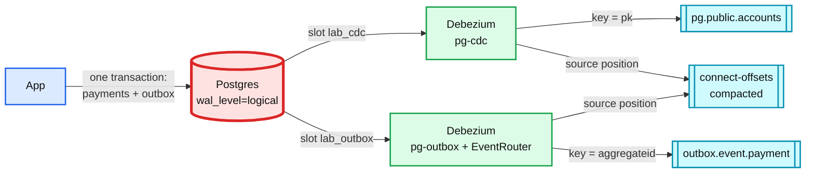

# 11. Kafka Connect and Debezium: CDC and the transactional outbox

> Goal: after this I can stream Postgres row changes into Kafka keyed by primary key, publish events through an outbox table, and show that a stopped connector makes Postgres keep WAL until a heartbeat lets the slot move.

**Kafka functionality:** Kafka Connect (source connectors, REST API, compacted offsets topic), Debezium Postgres connector, logical replication slots, the outbox event router SMT (single message transform), heartbeats.
**Concept link:** `popular_systems_deepdive/kafka/kafka-07-streams-connect.md`, `concepts/exactly-once.md`
**Time:** ~45 min
**Status:** todo

## Where this is used in hld/

One tool, two patterns. **CDC** captures every row change of a table. **Outbox** captures only the events the app chose to write, in the same transaction as its state change. Both kill the dual write.

| System | Pattern | How |
|---|---|---|
| [cdc-pipeline](../../../hld/cdc-pipeline/solution.md):204 | CDC | The whole design. One serial reader per database, key = primary key, offsets in Connect's offsets topic, LSN confirmed to Postgres only after Kafka acks |
| [cdc-pipeline](../../../hld/cdc-pipeline/solution.md):408 | CDC | Heartbeats on quiet databases so every slot confirms at least every 10 s |
| [streaming-ingestion](../../../hld/streaming-ingestion/solution.md):273 | CDC | A connector per source database feeds the lake's changelog and mirror tables |
| [payments-ledger](../../../hld/payments-ledger/solution.md):498 | Outbox | "Dual write loses or duplicates events on every crash. The outbox relay is 200 lines" |
| [distributed-job-scheduler](../../../hld/distributed-job-scheduler/solution.md):545 | Outbox and CDC | Kafka sits only behind the database, never between a fire and a run |
| [news-aggregator](../../../hld/news-aggregator/solution.md):363 | Outbox | Article DB outbox relay to `article-events`, keyed by `publisher_id` |



Postgres is red because a stuck slot fills **its** disk, not Kafka's. See Break it.

## Setup

```
$ cd tool-practise/kafka
$ docker compose -f docker-compose.yml -f docker-compose.cdc.yml up -d
$ until curl -sf localhost:8083/connector-plugins > /dev/null; do sleep 2; done; echo "connect up"   # ~20 to 40 s
$ docker exec -i kafka-pg psql -U postgres < scripts/cdc-schema.sql
$ curl -s localhost:8083/ ; echo
```

Shell for reading topics:

```
$ docker exec -it kafka bash
$ cd /opt/kafka/bin && B=localhost:19092
```

## Steps

### 1. Register the CDC connector

```
$ curl -s -X POST -H 'Content-Type: application/json' --data @scripts/connector-cdc.json localhost:8083/connectors
$ curl -s localhost:8083/connectors/pg-cdc/status ; echo      # repeat until the task says RUNNING
$ docker exec kafka-pg psql -U postgres -c "SELECT slot_name, active, confirmed_flush_lsn FROM pg_replication_slots;"
```

### 2. Insert, update, delete

```
$ docker exec kafka-pg psql -U postgres -c "INSERT INTO accounts VALUES (1, 'asha', 100), (2, 'ravi', 50);" \
    -c "UPDATE accounts SET balance = 70 WHERE id = 1;" -c "DELETE FROM accounts WHERE id = 2;"
```

```
$ ./kafka-console-consumer.sh --bootstrap-server $B --topic pg.public.accounts --from-beginning \
    --formatter-property print.key=true --formatter-property null.literal=TOMBSTONE --timeout-ms 5000
```

Find: the key is the primary key. The delete is followed by a `TOMBSTONE` for the same key (exercise 08). The update's `before` is `null`.

### 3. Get the before image

Why: Postgres only logs the old row's key by default. Search and audit sinks often need the old values.

```
$ docker exec kafka-pg psql -U postgres -c "ALTER TABLE accounts REPLICA IDENTITY FULL;" \
    -c "UPDATE accounts SET balance = 80 WHERE id = 1;"
```

Read the topic again. What does `before` hold now? What does `FULL` cost the database?

### 4. The outbox

```
$ curl -s -X POST -H 'Content-Type: application/json' --data @scripts/connector-outbox.json localhost:8083/connectors
$ docker exec kafka-pg psql -U postgres -c "BEGIN;
    INSERT INTO payments VALUES ('pay-9', 500, 'AUTHORIZED');
    INSERT INTO outbox (aggregatetype, aggregateid, type, payload)
      VALUES ('payment', 'pay-9', 'PaymentAuthorized', '{\"amount\":500}');
    COMMIT;"
$ ./kafka-console-consumer.sh --bootstrap-server $B --topic outbox.event.payment --from-beginning \
    --formatter-property print.key=true --formatter-property print.headers=true --timeout-ms 5000
```

Reference run: key `pay-9`, value `{"amount": 500}`, header `eventType:PaymentAuthorized`. The `payments` table itself is not captured. Only what the app chose to publish leaves the database.

### 5. Where Connect keeps its position

```
$ ./kafka-console-consumer.sh --bootstrap-server $B --topic connect-offsets --from-beginning \
    --formatter-property print.key=true --timeout-ms 5000
$ ./kafka-configs.sh --bootstrap-server $B --describe --entity-type topics --entity-name connect-offsets | grep cleanup
```

The key is `["pg-cdc",{"server":"pg"}]` and the value holds the LSN. A compacted topic keeps only the latest one.

If the consumer prints `Processed a total of 0 messages`, wait a few seconds and run it again. On one test run the first read came back empty and the second showed the records. `connect-offsets` has 25 partitions and Connect flushes its position every 5 s (`CONNECT_OFFSET_FLUSH_INTERVAL_MS`). Either can make a 5 s read come back empty.

## Break it

Stop Connect, keep writing, and watch Postgres.

```
$ docker stop kafka-connect
$ docker exec kafka-pg psql -U postgres -c "INSERT INTO accounts SELECT g, 'bulk', g FROM generate_series(100, 200099) g;"
$ docker exec kafka-pg psql -U postgres -c "SELECT slot_name, active,
    pg_size_pretty(pg_wal_lsn_diff(pg_current_wal_lsn(), restart_lsn)) AS retained FROM pg_replication_slots;"
$ docker start kafka-connect
```

Watch it catch up, then check the slots again:

```
$ ./kafka-get-offsets.sh --bootstrap-server $B --topic pg.public.accounts
$ docker exec kafka-pg psql -U postgres -c "SELECT slot_name,
    pg_size_pretty(pg_wal_lsn_diff(pg_current_wal_lsn(), confirmed_flush_lsn)) AS behind FROM pg_replication_slots;"
```

Reference run: 26 MB retained per slot while Connect was down. All 200,000 rows reached Kafka about 26 s after the restart. **Both slots still showed 27 MB behind afterwards**: Debezium only confirms an LSN when it gets a later event, and the tables had gone quiet. The outbox slot had never seen any of that traffic and pinned the same WAL.

Now add the cdc-pipeline fix, a heartbeat that writes to a tiny table every 10 s:

```
$ docker exec kafka-pg psql -U postgres -c "CREATE TABLE cdc_heartbeat (id int PRIMARY KEY, ts timestamptz);"
$ curl -s -X PUT -H 'Content-Type: application/json' --data @scripts/connector-cdc-heartbeat.json \
    localhost:8083/connectors/pg-cdc/config ; echo
```

Check the slots again after about a minute. The `PUT` restarts the connector task, so the first heartbeat lands later than 10 s. On a test run `behind` took ~60 s to drop. Repeat the `behind` query until `lab_cdc` falls below 1 MB.

```
<paste: behind per slot, before and after the heartbeat>
```

Reference run: `lab_cdc` dropped to 213 kB (127 kB on a second run). `lab_outbox`, with no heartbeat, stayed at 27 MB. Note that `retained` (from `restart_lsn`) for `lab_cdc` still read 27 MB on the second run. `confirmed_flush_lsn` had moved, `restart_lsn` had not yet. Watch both columns and see which one frees WAL. A quiet captured database pins its neighbours' WAL, and `max_slot_wal_keep_size` (256 MB here) is the cap that eventually invalidates the slot instead of filling the disk.

## What I learned

- ...

## Interview soundbite

> ...

## Cleanup

```
$ docker compose -f docker-compose.yml -f docker-compose.cdc.yml down -v
```
