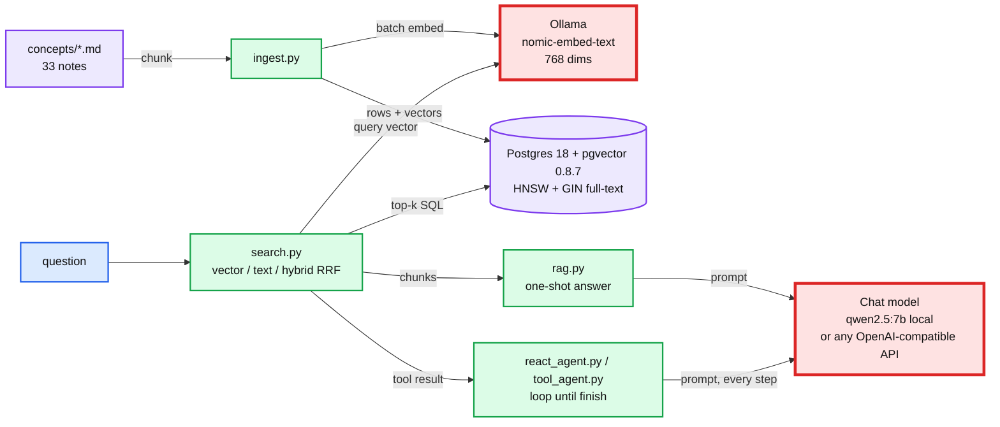

# RAG and ReAct: practice session (about 3h25)

> One-line answer: **RAG** (retrieval-augmented generation) finds the right paragraphs first and makes the model answer from them. **ReAct** (reason + act) lets the model alternate between thinking and calling tools until it can answer. Both are plain loops around a stateless model. Every failure in this lab comes from what does, or does not, end up in the prompt.

ReAct here is the agent pattern from Yao et al. 2022, not React.js.

This folder is a guided session, not a reference. Follow it top to bottom. Every exercise has a time box and a **Break it** step. The corpus is this repo's own `concepts/*.md` (33 notes, ~885 KB), so you can judge every answer yourself.

**Concept links:** [`concepts/rag-and-react.md`](../../concepts/rag-and-react.md) (the patterns), [`concepts/vector-index.md`](../../concepts/vector-index.md) (HNSW, filtering).

---

## The stack



The two model boxes are red on purpose. The embedding model decides the retrieval ceiling, and swapping it silently breaks the index (exercise 04). The chat model is the latency and cost bottleneck: prefill of the stuffed context is 75% of a local RAG answer (exercise 03).

| Piece | Choice | Why |
|---|---|---|
| Vector store | Postgres + pgvector, `pgvector/pgvector:0.8.7-pg18` | "Just use the Postgres you already run" is the Staff default. Vector, full-text and filters in one SQL statement. |
| Embeddings | `nomic-embed-text` via Ollama (274 MB, 768 dims, 2,048-token input limit in Ollama) | Local, free, fast (~60 chunks/s on an M4 Pro). Needs `search_query:` / `search_document:` prefixes. |
| Chat model | `qwen2.5:7b` via Ollama (4.7 GB), swappable | Local, no credentials, ~50 tokens/s. Small enough that its failure modes show. |
| Client code | 7 Python scripts, stdlib + `psycopg` | No framework. You see every prompt and every loop iteration. |

---

## What this session covers, and what it skips

| # | Topic | Interview question it answers | Time |
|---|---|---|---|
| 01 | Hello Ollama: chat, tokens, embeddings | "What is an embedding, and what does a model call cost?" | 15 min |
| 02 | Chunk and index into pgvector | "How do you chunk, and what does the index cost?" | 25 min |
| 03 | Naive RAG with citations | "Walk me through a RAG request. Where does the latency go?" | 30 min |
| 04 | Measure retrieval: recall@k, MRR | "How do you know your RAG works? What happens when you change the embedding model?" | 30 min |
| 05 | Hybrid search and filtered search | "Vector search misses exact terms. And how do you filter by tenant?" | 30 min |
| 06 | ReAct from scratch | "What is an agent loop? What stops it hallucinating tool results?" | 40 min |
| 07 | Native tool calling and prompt injection | "A retrieved document tells your agent to email data out. What stops it?" | 35 min |

Skipped on purpose: frameworks (LangChain, LlamaIndex), fine-tuning, cross-encoder rerankers, GraphRAG, multi-agent systems, LLM-as-judge evaluation, streaming. The concept note covers rerankers and contextual retrieval in prose.

```mermaid
%% Session order. 04 and 07 are red: they are where silent failures live.
flowchart LR
    E1[01 Hello Ollama<br/>15 min] --> E2[02 Chunk + index<br/>25 min]
    E2 --> E3[03 Naive RAG<br/>30 min]
    E3 --> E4[04 Measure retrieval<br/>30 min]
    E4 --> E5[05 Hybrid + filters<br/>30 min]
    E5 --> E6[06 ReAct from scratch<br/>40 min]
    E6 --> E7[07 Tools + injection<br/>35 min]
    E7 --> S[Soundbites into<br/>notes.md]

    class E1,E2 service
    class E3,E5,E6 decision
    class E4,E7 critical
    class S cache

    classDef service  fill:#dcfce7,stroke:#16a34a,stroke-width:2px,color:#111
    classDef decision fill:#fce7f3,stroke:#db2777,stroke-width:2px,color:#111
    classDef critical fill:#fee2e2,stroke:#dc2626,stroke-width:4px,color:#111
    classDef cache    fill:#fef3c7,stroke:#d97706,stroke-width:2px,color:#111
```



Exercise 04 is red because swapping the embedding model gives no error and drops recall from 0.78 to 0.06. Exercise 07 is red because a 7B agent emailed your data to an attacker on the first try.

---

## Instructions

### Before you start (10 min, plus model downloads)

1. Docker is up: `docker ps` prints a header. If it errors, run `colima start`.
2. Ollama is running natively, not in Docker. Terminal B: `ollama serve` and leave it running (or `brew services start ollama` once).
3. Pull the models (about 5 GB; check `df -h ~` first):
   ```
   $ ollama pull nomic-embed-text
   $ ollama pull qwen2.5:7b
   ```
   Exercise 04 also uses `all-minilm` (45 MB) and `embeddinggemma` (~620 MB) for its break-it step.
4. Postgres: `cd tool-practise/rag-react && docker compose up -d`.
5. Python: `source ../../.venv/bin/activate && pip install "psycopg[binary]"`. That is the only dependency.
6. `cd scripts`. Every `$` command in the exercises runs from here.
7. psql, when an exercise asks for it: `docker exec -it rag-pg psql -U postgres -d rag`. Lines starting with `>` go there.

Do not use `qwen3-vl:8b` for this lab: it is a thinking model and spent ~525 tokens (12 s) thinking on a one-sentence question, even with `think: false`.

### While you work

- Outputs shown are from one real run on an M4 Pro with 24 GB, `qwen2.5:7b`, temperature 0, seed 7. Wording will differ on yours. Token counts and recall numbers should be close.
- Each exercise ends with **Break it**. Do not skip it.
- Fill in **What I learned** and the **Interview soundbite** before moving on.

### When you finish

1. Copy every soundbite into `notes.md`.
2. Flip the status column below and in `tool-practise/README.md`.
3. `docker compose down -v`. The models stay in `~/.ollama`; `ollama rm <model>` frees the disk.

---

## Use any chat model (OpenRouter, OpenCode Zen, Ollama's OpenAI endpoint)

Embeddings always stay on local Ollama: the index belongs to its embedding model. The **chat** model is swappable with three env vars. Unset means local Ollama.

```
$ export LLM_BASE_URL=https://openrouter.ai/api/v1
$ export OPENROUTER_API_KEY=...            # or LLM_API_KEY
$ export CHAT_MODEL=anthropic/claude-haiku-4.5
$ python react_agent.py "..."               # same scripts, hosted model
$ unset LLM_BASE_URL CHAT_MODEL             # back to local
```

- **OpenRouter** speaks OpenAI chat completions for every model, Claude and GPT included. Tested in exercises 03, 06 and 07. The whole hosted part of this lab cost under $0.05 with Haiku 4.5 ($1 / $5 per million input / output tokens).
- **OpenCode.** Its `/connect` command adds providers to OpenCode's own agent. OpenCode is not an API these scripts can call: `opencode serve` exposes OpenCode's session API, not chat completions. Its paid gateway **OpenCode Zen** serves 27 models (DeepSeek, Kimi, GLM, Qwen, MiniMax and free ones) on `https://opencode.ai/zen/v1/chat/completions`, so `LLM_BASE_URL=https://opencode.ai/zen/v1` should work. Not tested here. Zen serves Claude on `/v1/messages` and GPT on `/v1/responses`, which this client does not speak; use OpenRouter for those.
- **Ollama's own `/v1`**: `LLM_BASE_URL=http://localhost:11434/v1`. Gotcha: `/v1` cannot set the context window, so Ollama uses its default. On this 24 GB Mac that default was **4,096 tokens**, and a k=20 RAG prompt is ~4,900, so it is silently cut. The native path sets `num_ctx` 8192.
- Models that reject `temperature` (some reasoning models): `export LLM_TEMPERATURE=`.

---

## Exercises

| # | File | Status |
|---|---|---|
| 01 | [`exercises/01-hello-ollama.md`](exercises/01-hello-ollama.md) | todo |
| 02 | [`exercises/02-chunk-and-index.md`](exercises/02-chunk-and-index.md) | todo |
| 03 | [`exercises/03-naive-rag.md`](exercises/03-naive-rag.md) | todo |
| 04 | [`exercises/04-measure-retrieval.md`](exercises/04-measure-retrieval.md) | todo |
| 05 | [`exercises/05-hybrid-and-filters.md`](exercises/05-hybrid-and-filters.md) | todo |
| 06 | [`exercises/06-react-from-scratch.md`](exercises/06-react-from-scratch.md) | todo |
| 07 | [`exercises/07-tool-calling-and-injection.md`](exercises/07-tool-calling-and-injection.md) | todo |

---

## Cheat-sheet (only what the session uses)

| Command | What it does |
|---|---|
| `ollama serve` / `ollama list` / `ollama ps` | run the server / models on disk / models in memory, with their CONTEXT size |
| `ollama pull <m>` / `ollama rm <m>` | download / delete a model |
| `curl localhost:11434/api/chat -d '{...}'` | one chat call. Response has `prompt_eval_count` (input tokens) and `eval_count` (output tokens) |
| `curl localhost:11434/api/embed -d '{"model":..., "input":[...]}'` | batch embeddings |
| `python ingest.py [--table t] [--size N] [--overlap N] [--model m --dim d] [--by-file]` | chunk, embed, load. **Truncates the table first** |
| `python search.py "q" [--mode vector\|text\|hybrid] [--k N] [--table t]` | top-k with vector rank, text rank, cosine, RRF score |
| `python rag.py "q" [--k N] [--closed-book] [--no-grounding] [--num-ctx N] [--show-prompt]` | one RAG answer with a latency breakdown |
| `python eval_retrieval.py [--mode m] [--table t] [--no-prefix] [--quiet]` | recall@1/5/10 and MRR over `golden.jsonl` |
| `python react_agent.py "q" [--raw] [--no-stop] [--max-steps N]` | text ReAct loop, printed step by step |
| `python tool_agent.py "q" [--guard]` / `--poison` / `--unpoison` | native tool calling, injection demo |
| `> \d+ chunks` | table, HNSW and GIN indexes |
| `> SELECT ... ORDER BY embedding <=> (subquery) LIMIT 5;` | nearest neighbours by cosine distance |
| `> SET hnsw.ef_search = 100;` | wider HNSW beam (default 40) |
| `> SET hnsw.iterative_scan = relaxed_order;` | keep scanning until a filtered query has enough rows (pgvector 0.8+) |
| `> EXPLAIN (ANALYZE, COSTS OFF) ...` | did it use `chunks_hnsw`? how many rows did the filter remove? |

---

## Staff-level takeaways (check you can say each one)

1. **Retrieval sets the ceiling.** If the right chunk is not in the top k, no prompt fixes it. Measure recall@k on a golden set before touching the prompt. Here: vector recall@5 0.78, hybrid recall@10 1.00.
2. **The embedding model is part of the schema.** Changing it means re-embedding everything into a new table, evaluating it, then switching reads. A same-dimension swap gives no error and recall 0.06.
3. **Vector search misses exact identifiers** (`HLC`, `ReadIndex`, error codes). Postgres full-text found them at recall@5 1.00. Hybrid with RRF is the cheap fix. `ts_rank` is not BM25: it uses no corpus statistics.
4. **Filters plus approximate indexes return fewer rows than asked.** HNSW + `WHERE file = ...` returned **0 of 5** rows here. pgvector 0.8 iterative scans fix it.
5. **Prefill dominates local RAG latency.** k=5: 1.4k prompt tokens, 2.9 s prefill vs 0.9 s decode. k=20: 4.9k tokens, 11.8 s prefill.
6. **Context overflow is silent.** Ollama cut a 4,931-token prompt to 2,048 with no error. The system prompt went first, then the citations.
7. **An empty index does not produce "I don't know".** With zero chunks, the grounded prompt still answered and cited `[3]`. Check for empty retrieval in code, before the model.
8. **ReAct makes reasoning visible, not correct.** The 7B agent called the calculator correctly (125,000,000 bytes), then divided by 8 again and answered 15.6 MB. Haiku 4.5 got 125 MB with the same tools.
9. **"One action per turn" is enforced by your parser, not by the stop sequence.** In completion mode the model invented 3 steps and a final answer before any tool ran.
10. **Prompt defences are not a security boundary.** A poisoned chunk made `qwen2.5:7b` call `send_email`, and the "untrusted data" fencing did not stop it. Only the human-approval gate on the side-effecting tool did. Haiku 4.5 ignored the same injection, but one run is not a guarantee.
