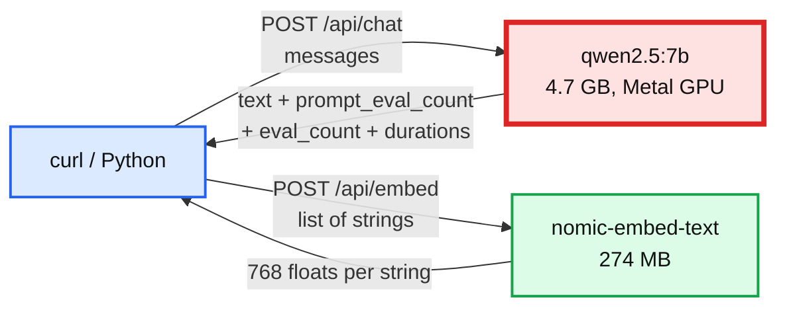

# 01. Hello Ollama: chat, tokens, embeddings

> Goal: after this I can call a local model and an embedding model over HTTP, read the token counts and timings off the response, and explain what a cosine similarity score does and does not mean.

**Concept link:** [`concepts/rag-and-react.md`](../../../concepts/rag-and-react.md) §1, [`concepts/vector-index.md`](../../../concepts/vector-index.md) §1
**Time:** 15 min. Hard stop.
**Status:** todo

## Setup

Ollama running (`ollama serve` in Terminal B). Models pulled. Terminal A in `tool-practise/rag-react/scripts` with the venv active.



## Steps

### 1. One chat call, read the meter (4 min)

Why: every RAG and agent cost question reduces to "how many tokens in, how many out, how long each took".

```
$ curl -s localhost:11434/api/chat -d '{"model":"qwen2.5:7b","stream":false,"options":{"temperature":0},
    "messages":[{"role":"user","content":"In one sentence, what is Raft?"}]}' \
  | python3 -c "import sys,json; r=json.load(sys.stdin); print(r['message']['content']); \
    print({k:r[k] for k in ('prompt_eval_count','prompt_eval_duration','eval_count','eval_duration','load_duration','total_duration')})"
Raft is a consensus algorithm used to achieve agreement in a distributed system, similar to how Paxos works, but with a simpler and more intuitive design.
{'prompt_eval_count': 38, 'prompt_eval_duration': 100358625, 'eval_count': 32, 'eval_duration': 615931125, 'load_duration': 45276000, 'total_duration': 773514542}
```

Read it:
- `prompt_eval_count` 38 = input tokens. Their processing is **prefill**: 100 ms.
- `eval_count` 32 = output tokens, generated one at a time. That is **decode**: 616 ms, so ~52 tokens/s.
- Durations are nanoseconds. `load_duration` is 45 ms because the model was already in memory. The first call after `ollama serve` paid ~3.7 s to load 4.7 GB.

```
$ ollama ps
NAME                       ID              SIZE      PROCESSOR    CONTEXT    UNTIL
qwen2.5:7b                 845dbda0ea48    4.9 GB    100% GPU     4096       4 minutes from now
```

`CONTEXT 4096` is Ollama's default on this 24 GB Mac, because the curl call did not ask for more. Remember that number for exercise 03. The scripts ask for 8,192 explicitly, which reloads the model once.

### 2. One embedding (3 min)

Why: retrieval works on these vectors, so see one.

```
$ curl -s localhost:11434/api/embed -d '{"model":"nomic-embed-text","input":["search_query: how does raft elect a leader"]}' \
  | python3 -c "import sys,json; v=json.load(sys.stdin)['embeddings'][0]; print(len(v), [round(x,4) for x in v[:4]])"
768 [-0.0504, 0.0727, -0.1859, -0.0409]
```

768 floats, 4 bytes each, so ~3 KB per chunk before any index. The `search_query: ` prefix is part of how nomic-embed-text was trained. Documents get `search_document: `. Exercise 04 measures what happens without it.

### 3. Cosine similarity by hand (5 min)

Why: "closest vector" is the only thing a vector index knows. See what the scores look like.

```
$ python - <<'EOF'
from llm import embed
q = embed(["how does raft elect a leader"], "query")[0]
docs = ["A follower that hears no heartbeat for one election timeout becomes a candidate and requests votes.",
        "Paxos: a proposer reserves a majority with a ballot number, then asks it to accept a value.",
        "A Bloom filter needs about 10 bits per key for a 1% false-positive rate.",
        "My cat likes to sleep on the keyboard."]
for d, v in zip(docs, embed(docs, "document")):
    cos = sum(a * b for a, b in zip(q, v)) / (sum(a * a for a in q) ** 0.5 * sum(b * b for b in v) ** 0.5)
    print(f"{cos:.3f}  {d[:70]}")
EOF
0.625  A follower that hears no heartbeat for one election timeout becomes a
0.589  Paxos: a proposer reserves a majority with a ballot number, then asks
0.419  A Bloom filter needs about 10 bits per key for a 1% false-positive rat
0.408  My cat likes to sleep on the keyboard.
```

The ranking is right: Raft, then Paxos, then nonsense. Look at the absolute numbers, though. The right answer is 0.625, and a sentence about a cat is 0.408. With this model nothing scores near 0. A cosine score is a **ranking signal, not a confidence**. "Only answer if similarity > 0.5" is a threshold you have to calibrate per model, on your data.

## Break it (3 min)

Ask the model something it should not know without your notes, and something it thinks it knows.

```
$ python rag.py "In my notes, which numbered design problems use etcd as their coordination store?" --closed-book
To accurately answer your question about which numbered design problems in your notes use etcd as their
coordination store, I would need to see the specific content of your notes ...
```

Good: it admits it cannot see your notes. Now a fact it half-knows:

```
$ python rag.py "What is Kafka's default message.max.bytes on the broker?" --closed-book
... The default value for `message.max.bytes` on the broker configuration (`broker.config`) is **1048576** bytes,
which is equivalent to 1 MB.
```

Wrong, and confident. Kafka's source says `MAX_MESSAGE_BYTES_DEFAULT = 1024 * 1024 + Records.LOG_OVERHEAD`, which is 1,048,588 (`server-common/.../ServerLogConfigs.java`, line 177 on trunk). The model also describes it as a request size limit. It is the largest record batch the broker accepts. Small models are fluent and plausible. RAG exists to replace this with a lookup.

What I saw:

```
<paste>
```

## What I learned

- One call = prefill (input tokens, parallel) + decode (output tokens, one by one). Mine: ___ ms prefill for ___ tokens, ___ tokens/s decode.
- An embedding is ___ floats = ___ bytes per chunk.
- Cosine scores for unrelated text were still ~___. So a fixed threshold ...
- ...

## Interview soundbite

> "A model call has two costs: prefill, which scales with how much context I stuff in, and decode, which scales with how much it writes. On a laptop 7B model that was about 52 tokens a second to decode. And embedding similarity is a ranking, not a probability: with nomic-embed-text a sentence about a cat still scored 0.41 against a Raft question, so any relevance threshold has to be calibrated per model."

## Cleanup

Nothing. Leave Ollama and Postgres running for exercise 02.
