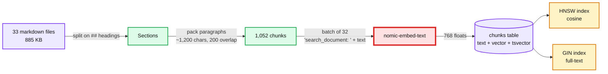

# 02. Chunk and index into pgvector

> Goal: after this I can load a corpus into pgvector, say what one chunk and the HNSW index cost in bytes, run a nearest-neighbour query in plain SQL, and explain why chunk size is a design decision.

**Concept link:** [`concepts/rag-and-react.md`](../../../concepts/rag-and-react.md) §2, [`concepts/vector-index.md`](../../../concepts/vector-index.md) §2
**Time:** 25 min. Hard stop.
**Status:** todo

## Setup

`docker compose up -d` done. Terminal A in `scripts/` with the venv active. Terminal B: `docker exec -it rag-pg psql -U postgres -d rag`.



Read `scripts/ingest.py` first (about 100 lines). Two functions matter: `sections()` splits on headings, `chunks()` packs paragraphs up to `--size` characters and carries `--overlap` characters into the next chunk.

## Steps

### 1. Ingest (4 min)

Why: this is the whole offline half of RAG in one command.

```
$ python ingest.py
  embedded 1052/1052
chunks: 1052 chunks from 33 files, avg 886 chars, embedded in 17.6s (60 chunks/s)
```

~60 chunks/s on one laptop GPU. Back-of-envelope for an interview: 10 million chunks at that rate is ~46 hours on one box. Embedding is the slow, parallel, re-runnable part of ingestion.

### 2. Look at what you stored (5 min)

Why: know the per-row and per-index cost before anyone asks.

```
> \d chunks
  Column   |    Type     | ...
 embedding | vector(768) | ...
 tsv       | tsvector    | generated always as (to_tsvector('english'::regconfig, (heading || ' '::text) || body)) stored
Indexes:
    "chunks_pkey" PRIMARY KEY, btree (id)
    "chunks_hnsw" hnsw (embedding vector_cosine_ops)
    "chunks_tsv" gin (tsv)

> SELECT vector_dims(embedding) AS dims, pg_column_size(embedding) AS bytes_per_vector FROM chunks LIMIT 1;
 dims | bytes_per_vector
------+------------------
  768 |             3076

> SELECT pg_size_pretty(pg_relation_size('chunks')) AS heap, pg_size_pretty(pg_relation_size('chunks_hnsw')) AS hnsw,
         pg_size_pretty(pg_relation_size('chunks_tsv')) AS gin, pg_size_pretty(pg_total_relation_size('chunks')) AS total;
  heap   |  hnsw   |  gin   | total
---------+---------+--------+-------
 1480 kB | 4216 kB | 720 kB | 11 MB

> SHOW hnsw.ef_search;
 40
```

- 3,076 bytes per vector = 768 x 4 bytes + header. The text is ~886 bytes. **The vector is 3.5x bigger than the text it describes.**
- The heap is only 1.5 MB because rows over ~2 KB move their big column to TOAST (Postgres's out-of-line storage). Total is 11 MB.
- HNSW is 4.2 MB for 1,052 vectors, ~4 KB per vector: the vector copy plus graph links. Scale it: 10M chunks is ~40 GB of HNSW that wants to live in RAM.

### 3. Nearest neighbours in pure SQL (6 min)

Why: retrieval is just `ORDER BY distance LIMIT k`. Use an existing chunk as the query so you need no Python.

```
> \set seed 'SELECT embedding FROM chunks WHERE file = ''raft.md'' AND heading ILIKE ''%leader election%'' ORDER BY id LIMIT 1'
> SELECT id, file, left(heading, 45) AS heading, round((1 - (embedding <=> (:seed)))::numeric, 3) AS cos
  FROM chunks ORDER BY embedding <=> (:seed) LIMIT 6;
  id  |     file     |               heading                |  cos
------+--------------+--------------------------------------+-------
  548 | raft.md      | 4. Leader election                   | 1.000
  549 | raft.md      | 4. Leader election                   | 0.911
  241 | etcd.md      | 10. Failure modes and what pages you | 0.863
  562 | raft.md      | 11. Failure modes and what happens   | 0.854
 1032 | zookeeper.md | 7.1 Leader activation                | 0.846
  530 | paxos.md     | 6. Multi-Paxos: a log of decisions   | 0.843

> EXPLAIN (ANALYZE, COSTS OFF, TIMING OFF, SUMMARY ON) SELECT id FROM chunks ORDER BY embedding <=> (:seed) LIMIT 5;
 Limit (actual rows=5.00 loops=1)
   ...
   ->  Index Scan using chunks_hnsw on chunks (actual rows=5.00 loops=1)
         Order By: (embedding <=> (InitPlan 1).col1)
 Execution Time: 0.761 ms
```

`<=>` is cosine distance (`1 - cosine similarity`). The plan says `Index Scan using chunks_hnsw`: an approximate graph walk, 0.76 ms. Your ids may differ. The neighbours (etcd failures, ZooKeeper leader activation, Multi-Paxos) are the semantic cousins you would expect.

### 4. Same question, two wordings (5 min)

Why: dense retrieval is sensitive to vocabulary, and chunks hold whatever text the file had.

```
$ python search.py "how does raft elect a leader" --k 3
 #   vec  txt    cos     rrf  file :: heading
 1     1    -  0.727  0.0164  raft.md :: 10. Practical additions every real implementation has
 2     2    -  0.706  0.0161  paxos.md :: Concept: Paxos Consensus
 3     3    -  0.698  0.0159  raft.md :: 4. Leader election

$ python search.py "how does raft pick a leader" --k 3
 1     1    -  0.691  0.0164  zookeeper.md :: 7.1 Leader activation
 2     2    -  0.688  0.0161  paxos.md :: Concept: Paxos Consensus
 3     3    -  0.684  0.0159  paxos.md :: 1. Mental model
```

"pick" instead of "elect" drops `raft.md :: 4. Leader election` from rank 3 to rank 12. Now look at what that chunk is:

```
> SELECT left(replace(body, E'\n', ' '), 200) FROM chunks
  WHERE file = 'raft.md' AND heading ILIKE '%leader election%' ORDER BY id LIMIT 1;
 **Trigger.** A follower hears nothing from a leader for one *election timeout* (randomized, typically 150 to
 300 ms). It assumes the leader is dead.  ```mermaid %% Election: S2 times out, wins 3 of 5 votes ...
```

812 of its 988 characters (82%) are Mermaid `sequenceDiagram` code. The embedding averages over all of it. Chunk content is a quality decision: strip markup, or embed the diagram's labels instead of its code.

## Break it (5 min)

**No chunking: one row per file.**

```
$ python ingest.py --table chunks_file --by-file
RuntimeError: HTTP 400 from http://localhost:11434/api/embed: {"error":"the input length exceeds the context length"}
```

The smallest note is 14,161 characters; nomic-embed-text in Ollama takes 2,048 tokens (~7,500 characters of this markdown, measured: 7,000 chars = 1,818 tokens). Ollama 0.18 refuses rather than truncating. Many other embedding stacks truncate silently instead, so the second half of every long document is invisible to search with no error at all. Check which one yours does.

**Tiny chunks.**

```
$ python ingest.py --table chunks_tiny --size 200 --overlap 0
chunks_tiny: 4791 chunks from 33 files, avg 170 chars, embedded in 37.1s (129 chunks/s)

$ python search.py "How do I prevent a process that was paused by GC from writing after its lock already expired?" --k 3 --table chunks_tiny
 1     1    -  0.781  0.0164  leases-fencing-clocks.md :: Concept: Leases, Fencing Tokens, and Clocks
      expired without it noticing (GC pause, network partition) cannot write after a new holder has taken over. Cloc...
```

4.6x the rows, 2x the embedding time, and the top hit starts mid-sentence ("expired without it noticing"). It looks fine on this one question. Exercise 04 measures it on 18: recall@5 falls from 0.78 to 0.56.

What I saw:

```
<paste>
```

## What I learned

- One chunk costs ___ bytes of vector vs ___ bytes of text. HNSW adds ___ per vector.
- Embedding throughput on my laptop: ___ chunks/s, so 10M chunks would take ___.
- The embedding model's input limit is ___ tokens, so chunk size has a hard ceiling of ___.
- ...

## Interview soundbite

> "On 885 KB of notes I got about a thousand 1,200-character chunks. Each vector was 3 KB, three and a half times the text, and HNSW roughly doubled that again, so at 10 million chunks you are budgeting tens of gigabytes of RAM for the index. Chunk size is bounded above by the embedding model's input limit (Ollama rejected anything over 2,048 tokens) and below by context: 200-character chunks cut my recall@5 from 0.78 to 0.56."

## Cleanup

```
> DROP TABLE chunks_file;
```

Keep `chunks` and `chunks_tiny`; exercise 04 uses both.
