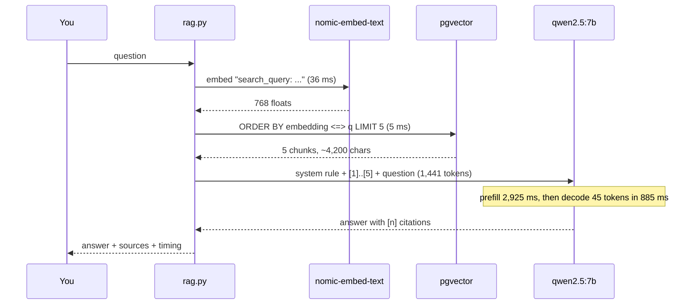

# 03. Naive RAG with citations

> Goal: after this I can build a one-shot RAG answer (retrieve, stuff, generate, cite), say where its latency goes, and show two ways it fails silently.

**Concept link:** [`concepts/rag-and-react.md`](../../../concepts/rag-and-react.md) §1 to §3
**Time:** 30 min. Hard stop.
**Status:** todo

## Setup

`chunks` loaded (exercise 02). Read `scripts/rag.py` (65 lines). The whole technique is `build_prompt()`: a system rule, the numbered chunks, the question.



## Steps

### 1. First RAG answer (5 min)

Why: see the full loop work once, with the meter running.

```
$ python rag.py "How does a Raft follower decide to start an election?"
A Raft follower decides to start an election when it hears nothing from the leader for one *election timeout* [1].
This timeout is randomized, typically ranging from 150 to 300 ms.

  [1] raft.md :: 4. Leader election
  [2] zookeeper.md :: 7.1 Leader activation
  [3] raft.md :: 4. Leader election
  [4] raft.md :: 5. Log replication
  [5] paxos.md :: 6. Multi-Paxos: a log of decisions

model qwen2.5:7b, context 8192, prompt 5074 chars -> 1441 tokens seen, 45 generated
embed 43 ms | search 6 ms | prefill 2925 ms | decode 885 ms (51 tok/s) | total 3927 ms
```

Where the 3.9 s went: retrieval 49 ms (1%), prefill 2.9 s (75%), decode 0.9 s (23%). **On a laptop, RAG latency is prefill, and prefill grows with k.** The first call after a model load also pays ~17 s to load the weights. Ignore that one.

### 2. Look at the prompt (4 min)

Why: the prompt is the only interface. Read it once.

```
$ python rag.py "How many bits per key does a Bloom filter need for a 1% false positive rate?" --show-prompt
----- prompt -----
You answer questions about the user's system-design notes. Use ONLY the numbered notes below. Cite every claim
like [2]. If the notes do not contain the answer, reply exactly: I don't know based on the notes.

Notes:
[1] bloom-filter.md :: 2. The math (memorise three numbers, derive the rest)
ilter is a pre-check only.<br/>Confirm every MAYBE<br/>against the real store."]
    B --> E["k = 0.69 * bits per key,<br/>round to integer"]
    C --> E
    D --> E
...
According to the notes, a Bloom filter needs **10 bits per key** for a 1% false positive rate [2] [3].
```

Two things to notice in note [1]. It starts mid-word ("ilter"): that is the 200-character overlap, cut by character count, not at a sentence. And it is Mermaid code. The model is reading your diagrams' source.

Open `concepts/bloom-filter.md`. It says 10 bits in the rule of thumb and 9.6 in the derivation. The answer is grounded, and the citation points at the right section. **Check citations by opening them.** A citation is a claim, not a proof.

### 3. Private facts and missing facts (6 min)

Why: RAG's job is facts the model cannot know, and refusing when the notes are silent.

```
$ python rag.py "In my notes, which numbered design problems use etcd as their coordination store?"
[3] mentions that etcd is used in the partition leases for the #6 scheduler, ring ownership for the #20 cache,
file system management for #3, and lock service for #33.
```

Exercise 01 asked this closed-book and got "I would need to see your notes". Now it is right. (Check `etcd.md` line 5.)

```
$ python rag.py "What is Kafka's default message.max.bytes?"
I don't know based on the notes.

model qwen2.5:7b, context 8192, prompt 4764 chars -> 1468 tokens seen, 10 generated

$ python rag.py "What is Kafka's default message.max.bytes?" --no-grounding
The notes provided do not contain information about Kafka's default `message.max.bytes`. However, based on common
configurations and typical settings for Apache Kafka, the default value for `message.max.bytes` is often set to
1,048,576 bytes (1 MB).
```

Same retrieval, different system rule. With the "ONLY the notes" rule it refuses. Without it, it notices the gap and fills it from memory, with the same wrong number as exercise 01 (the real default is 1,048,588). The grounding rule is doing real work.

### 4. Bigger k (5 min)

Why: "just retrieve more" is the first instinct. Price it.

```
$ python rag.py "How does a Raft follower decide to start an election?" --k 20
model qwen2.5:7b, context 8192, prompt 18560 chars -> 4931 tokens seen, 75 generated
embed 35 ms | search 4 ms | prefill 11785 ms | decode 1707 ms (44 tok/s) | total 13629 ms
```

| k | prompt tokens | prefill | total |
|---|---|---|---|
| 5 | 1,441 | 2.9 s | 3.9 s |
| 20 | 4,931 | 11.8 s | 13.6 s |

3.4x the tokens, 4x the prefill, 3.5x the total. On a hosted API it is 3.4x the input bill too. Decode slowed from 51 to 44 tokens/s because every new token attends over a longer context. More context is not free, and "Lost in the Middle" (Liu et al., 2023, TACL) found that models use facts in the middle of a long context worst. Fewer, better chunks beat more chunks. That is what exercises 04 and 05 are for.

## Break it (8 min)

**The context window is smaller than the prompt.**

```
$ python rag.py "How does a Raft follower decide to start an election?" --k 20 --num-ctx 2048
According to the document, a Raft follower will start an election if it hasn't heard from the leader in its
configured "election timeout" period. Specifically:

"A follower starts an election when it has not heard from the leader for longer than its election timeout."
...
3. When this condition is met, the follower decides to start a new term as the leader itself.
...
model qwen2.5:7b, context 2048, prompt 18560 chars -> 2048 tokens seen, 169 generated
```

No error. Ollama kept 2,048 of 4,931 tokens and dropped the rest from the **start** of the prompt. The start is where the system rule lives. Result:

- No `[n]` citations: the "cite every claim" rule was cut.
- A quotation that is not in your notes.
- A wrong fact: the follower becomes a *candidate*, not "the leader itself".

Where this bites in real life: Ollama's OpenAI-compatible `/v1` endpoint cannot set the context, so it uses the default, which was 4,096 on this Mac. `LLM_BASE_URL=http://localhost:11434/v1 python rag.py "..." --k 20` truncates without you passing any flag. The guard belongs in code: count tokens before the call and drop chunks, not instructions.

What I saw:

```
<paste>
```

## What I learned

- My latency split at k=5: retrieval ___ ms, prefill ___ ms, decode ___ ms.
- k=20 cost ___x the prompt tokens and ___x the latency.
- With a too-small context the model lost ___ first, and nothing raised an error.
- ...

## Interview soundbite

> "In my RAG prototype retrieval was 50 ms and the model was 3.9 seconds, three quarters of it prefill on the stuffed chunks. Going from k=5 to k=20 tripled the tokens and the latency, so I'd rather improve ranking than retrieve more. And I'd count tokens before the call: when the context overflowed, Ollama silently dropped the start of the prompt, the system rule went first, and the model started inventing quotes with no error anywhere."

## Cleanup

Nothing. `chunks` stays for exercise 04.
