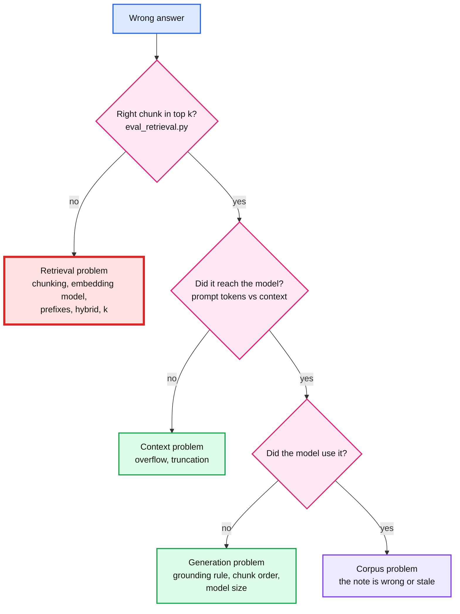

# 04. Measure retrieval: recall@k and MRR

> Goal: after this I can score retrieval with a golden set, compare chunking and query choices with numbers instead of vibes, and explain why changing the embedding model is a migration.

**Concept link:** [`concepts/rag-and-react.md`](../../../concepts/rag-and-react.md) §4
**Time:** 30 min. Hard stop.
**Status:** todo

## Setup

`chunks` and `chunks_tiny` loaded (exercise 02). Open `scripts/golden.jsonl`: 18 questions, each with the file and a **needle** (a phrase the right chunk must contain).

- 10 are `semantic`: paraphrases with few shared words ("paused by GC ... lock already expired" for fencing tokens).
- 8 are `keyword`: identifiers a user would actually type (`zxid`, `code_verifier`, `HLC`, `ef_search`).

A chunk is a hit if it comes from the expected file (`*` = any) and contains the needle.

- **recall@k**: the share of questions with a hit in the top k.
- **MRR** (mean reciprocal rank): the average of 1 / rank of the first hit, 0 for a miss. 1.0 means the hit is always first.



## Steps

### 1. Baseline: vector search, 1,200-char chunks (6 min)

Why: you cannot improve what you have not measured. This is the number every later change is compared against.

```
$ python eval_retrieval.py
   1  How do I stop thousands of requests from all hitting the d  top1: caching-patterns.md :: 4. Stampede: hot key expiry and sin
   1  How do I prevent a process that was paused by GC from writ  top1: leases-fencing-clocks.md :: 1. Mental model
   1  How many bits per key does a probabilistic set membership   top1: bloom-filter.md :: 11. Numbers worth memorizing
MISS  How do two replicas find which blocks of data differ witho  top1: replication-and-quorums.md :: Concept: Replication and Quorums
   5  How many rounds does it take for a rumor-style update to r  top1: gossip-protocol.md :: 7. Convergence and consistency
   ...
   1  what is zxid                                                top1: zookeeper.md :: 7. Under the hood: the request pipe
MISS  ReadIndex vs lease read                                     top1: chubby.md :: 3. Sessions, KeepAlives, and the ma
MISS  HLC                                                         top1: raft.md :: 5. Log replication
   7  G-Counter merge                                             top1: crdt.md :: 1. Mental model
   ...

chunks / vector / prefix=on
semantic  n=10  recall@1 0.70  recall@5 0.90  recall@10 0.90  MRR 0.75
keyword   n=8   recall@1 0.50  recall@5 0.62  recall@10 0.75  MRR 0.56
all       n=18  recall@1 0.61  recall@5 0.78  recall@10 0.83  MRR 0.67
latency p50 15 ms, max 37 ms per query
```

Paraphrases do well (recall@5 0.90). Identifiers do badly (0.62): `HLC` returned Raft log replication, a `ReadIndex` question returned Chubby. Exercise 05 fixes that. With 18 questions, one question moves a number by 0.056. This set catches broken pipelines, not 2% tuning wins.

### 2. Chunk size, measured (8 min)

Why: exercise 02 guessed. Now measure.

```
$ python ingest.py --table chunks_800 --size 800 --overlap 150
chunks_800: 1545 chunks from 33 files, avg 633 chars, embedded in 19.4s (80 chunks/s)
$ python ingest.py --table chunks_big --size 4000 --overlap 0
chunks_big: 485 chunks from 33 files, avg 1690 chars, embedded in 13.6s (36 chunks/s)
$ for t in chunks_tiny chunks_800 chunks chunks_big; do python eval_retrieval.py --table $t --quiet | grep all; done
```

My run:

| Table | Chunk size | Rows | recall@1 | recall@5 | recall@10 | MRR |
|---|---|---|---|---|---|---|
| `chunks_tiny` | 200, no overlap | 4,791 | 0.33 | 0.56 | 0.56 | 0.41 |
| `chunks_800` | 800, 150 overlap | 1,545 | 0.56 | 0.78 | 0.78 | 0.64 |
| `chunks` | 1,200, 200 overlap | 1,052 | 0.61 | 0.78 | 0.83 | 0.67 |
| `chunks_big` | 4,000 (= one section) | 485 | 0.56 | 0.78 | 0.89 | 0.67 |

- 200 characters is clearly too small: a fragment has too little meaning to embed.
- 800, 1,200 and whole sections tie on recall@5. Most sections are under 4,000 characters, so `--size 4000` is in effect "one chunk per heading".
- So the tie-breaker is cost: 5 big chunks are ~8,500 characters of prompt, 5 default chunks ~4,400. Same recall, half the prefill. Pick 1,200.

### 3. Query prefix off (4 min)

Why: nomic-embed-text was trained with `search_query:` / `search_document:` prefixes. Forgetting one is a classic silent bug.

```
$ python eval_retrieval.py --no-prefix --quiet
chunks / vector / prefix=off
semantic  n=10  recall@1 0.60  recall@5 0.80  recall@10 0.90  MRR 0.68
keyword   n=8   recall@1 0.62  recall@5 0.62  recall@10 0.62  MRR 0.62
all       n=18  recall@1 0.61  recall@5 0.72  recall@10 0.78  MRR 0.66
```

recall@5 0.78 to 0.72: one question lost, no error. Small here, but this is the shape of every embedding bug. Nothing fails, the numbers just sag.

## Break it (10 min)

**A. Same-dimension model swap: silent.** Someone changes `EMBED_MODEL` in config to another 768-dim model. Queries now embed with `embeddinggemma`, and the index still holds nomic vectors.

```
$ ollama pull embeddinggemma
$ EMBED_MODEL=embeddinggemma python eval_retrieval.py
MISS  ReadIndex vs lease read                                     top1: signed-url.md :: 4. The upload pattern in an HLD
MISS  HLC                                                         top1: signed-url.md :: 2. How the signature is built and c
MISS  G-Counter merge                                             top1: oauth.md :: 2. The one flow to know: authorizat
...
chunks / vector / prefix=on
all       n=18  recall@1 0.06  recall@5 0.06  recall@10 0.06  MRR 0.06
```

recall@5 0.78 to **0.06**. No exception, no log line. Both models output 768 floats, so pgvector happily compares vectors from two different spaces. The RAG layer then answers "I don't know" to everything, or worse.

**B. Re-ingest in place with a new model: loud, and an outage.** `ingest.py` does `TRUNCATE` before it embeds. On purpose.

```
$ ollama pull all-minilm
> SELECT count(*) FROM chunks;
 1052
$ python ingest.py --model all-minilm
RuntimeError: HTTP 400 from http://localhost:11434/api/embed: {"error":"the input length exceeds the context length"}
> SELECT count(*) FROM chunks;
 0
```

`all-minilm` takes 512 tokens and produces 384 dims. It died on the first long chunk, after the truncate. (Had it got further, the insert would have failed on `expected 768 dimensions, not 384`.) The live index is empty. Now ask the RAG:

```
$ python rag.py "How does a Raft follower decide to start an election?" --show-prompt
...
Notes:


Question: How does a Raft follower decide to start an election?
----- end prompt (first 3000 chars) -----

[3] A Raft follower starts an election if it has not heard from the leader for more than its timeout period.
```

Zero notes, and the model still answered and **cited a note `[3]` that does not exist**. The "say I don't know" rule did not survive an empty context. The fix is in code: if retrieval returns nothing (or nothing above a calibrated score), answer "no sources" without calling the model, and reject answers that cite numbers outside `1..k`.

Restore, then do it the right way: build alongside, measure, swap atomically, keep the old table for rollback.

```
$ python ingest.py                                  # restore the live table (18 s)
$ python ingest.py --table chunks_800 --size 800 --overlap 150    # the "new index"
$ python eval_retrieval.py --table chunks_800 --quiet             # gate: no worse than live
> BEGIN; ALTER TABLE chunks RENAME TO chunks_old; ALTER TABLE chunks_800 RENAME TO chunks; COMMIT;
> -- rollback is the same two renames in reverse
```

What I saw:

```
<paste>
```

## What I learned

- Baseline recall@5 ___, MRR ___. Identifiers did worse than paraphrases: ___ vs ___.
- Chunk size: ___ was too small; ___ and ___ tied, so I chose by prompt cost.
- A same-dimension embedding swap took recall from ___ to ___ with no error.
- The in-place re-ingest left the live index at ___ rows, and the model then ...

## Interview soundbite

> "Before touching prompts I'd build a small golden set and track recall@5 and MRR on every index change. On my notes vector search got 0.78, and the misses were all exact identifiers. The embedding model is part of the schema: swapping to another 768-dim model gave no error and dropped recall to 0.06. So a model change is a migration: build a new table alongside, gate on the eval, swap with a rename in one transaction, and keep the old table for rollback."

## Cleanup

```
> DROP TABLE chunks_big;
```

Keep `chunks` and `chunks_800`. Exercise 05 uses `chunks`.
