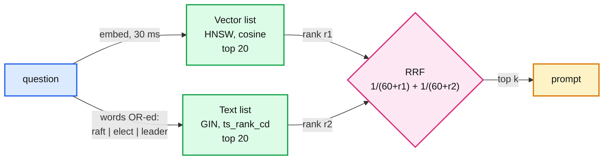

# 05. Hybrid search and filtered search

> Goal: after this I can explain why vector search misses exact identifiers, fuse it with full-text search using Reciprocal Rank Fusion in one SQL statement, and show why a `WHERE` filter on an HNSW query can return zero rows.

**Concept link:** [`concepts/rag-and-react.md`](../../../concepts/rag-and-react.md) §3, [`concepts/vector-index.md`](../../../concepts/vector-index.md) §4 (filtering)
**Time:** 30 min. Hard stop.
**Status:** todo

## Setup

`chunks` loaded. Read the three SQL strings at the top of `scripts/search.py` (`VECTOR`, `TEXT`, `FUSE`). Hybrid is one query: two ranked lists of 20, a `FULL JOIN`, and a score of `1 / (60 + rank)` summed across lists.



Why rank and not score: cosine sits around 0.4 to 0.8 (exercise 01) and `ts_rank_cd` around 0 to 1 with a different shape. Adding them is meaningless. Ranks are comparable. The constant 60 is from the original RRF paper (Cormack, Clarke and Buettcher, SIGIR 2009: "k = 60 was fixed during a pilot investigation").

## Steps

### 1. Watch vector search miss an acronym (5 min)

Why: exercise 04's keyword misses, up close.

```
$ python search.py "HLC" --k 5
 #   vec  txt    cos     rrf  file :: heading
 1     1    -  0.677  0.0164  raft.md :: 5. Log replication
 2     2    -  0.673  0.0161  zookeeper.md :: 2. Data model: a tree of small versioned nodes
 3     3    -  0.665  0.0159  rate-limiting-and-load-shedding.md :: 6. Backpressure
 4     4    -  0.663  0.0156  merkle-tree.md :: Concept: Merkle Tree
 5     5    -  0.663  0.0154  realtime-client-server-communication.md :: LLM chat streaming (Claude / ChatGPT shape) ...

$ python search.py "HLC" --k 5 --mode text
 1     -    1      -  0.0164  crdt.md :: 7. Failure modes and what happens
 2     -    2      -  0.0161  crdt.md :: 9. CRDT vs the alternatives
 3     -    3      -  0.0159  leases-fencing-clocks.md :: 7. Practical additions every real implementation has
 4     -    4      -  0.0156  leases-fencing-clocks.md :: 4. Clocks: why none of this is simple
 5     -    5      -  0.0154  leases-fencing-clocks.md :: 6. Where you meet it
```

Vector: five confident-looking wrong answers (cosine 0.66 to 0.68, the same band as real hits). A 3-letter acronym has almost no meaning for the embedding model to latch onto. Text search: all five contain "HLC" (hybrid logical clock). Exact identifiers (error codes, config keys, ticket ids, product SKUs) are what users paste, and what dense retrieval is worst at.

### 2. Score all three modes (6 min)

Why: decide with the golden set, not one example.

```
$ for m in vector text hybrid; do python eval_retrieval.py --mode $m --quiet; done
```

| Mode | semantic recall@5 | keyword recall@5 | all recall@1 | all recall@5 | all recall@10 | MRR |
|---|---|---|---|---|---|---|
| vector | 0.90 | 0.62 | 0.61 | 0.78 | 0.83 | 0.67 |
| text | 0.80 | **1.00** | 0.44 | **0.89** | **1.00** | 0.63 |
| hybrid | 0.90 | 0.88 | 0.56 | **0.89** | **1.00** | 0.66 |

- Text alone beats vector on recall here. My notes are full of exact terms. On paraphrases it ranks the hit lower (recall@1 0.44).
- Hybrid keeps vector's semantic recall and most of text's keyword recall. recall@10 is 1.00: every answer is somewhere in the top 10.
- recall@1 went *down* (0.61 to 0.56). RRF averages two rankers, so it is a recall tool, not a precision tool. Production stacks put a **reranker** (a cross-encoder that reads question and chunk together) after hybrid to fix the order. Anthropic's Contextual Retrieval post measured this stack: contextual embeddings plus contextual BM25 cut top-20 retrieval failures by 49%, and adding reranking by 67%.
- `ts_rank_cd` is **not BM25**. The Postgres docs: "the ranking functions do not use any global information". No IDF, so a rare word counts no more than a common one. Real BM25 in Postgres needs an extension (for example ParadeDB's `pg_search`).

### 3. One question, both rankers (4 min)

Why: see the fusion columns do their job.

```
$ python search.py "how does raft pick a leader" --k 5 --mode hybrid
 #   vec  txt    cos     rrf  file :: heading
 1     1    6  0.691  0.0315  zookeeper.md :: 7.1 Leader activation
 2     6    4  0.676  0.0308  raft.md :: 10. Practical additions every real implementation has
 3     8    9  0.670  0.0292  raft.md :: 2. The three roles
 4     9   10  0.669  0.0288  leases-fencing-clocks.md :: 2. Leases
 5    16    5  0.655  0.0285  raft.md :: 15. Interview soundbite
```

Chunks that are decent in both lists (vec 6 + txt 4) beat a chunk that is great in one. Raft now holds 3 of the top 5, up from 0 in vector-only. The "4. Leader election" chunk is still at vector rank 12, though: hybrid cannot rescue a chunk that both rankers place low. That is a chunk-content problem (exercise 02: 82% of it is Mermaid code).

## Break it (12 min)

**Filter + approximate index = too few rows.** Multi-tenant RAG always filters (`WHERE tenant_id = ...`). Simulate it: find the chunks of `webrtc.md` closest to a Raft chunk. webrtc.md has 36 chunks, so 5 exist.

In psql:

```
> \set seed 'SELECT embedding FROM chunks WHERE file = ''raft.md'' AND heading ILIKE ''%leader election%'' ORDER BY id LIMIT 1'
> SELECT id, left(heading, 40) FROM chunks WHERE file = 'webrtc.md' ORDER BY embedding <=> (:seed) LIMIT 5;
  id  |                 left
------+------------------------------------------
 1000 | 8. Scaling an SFU: the Zoom / Meet shape
  982 | 3. Call setup, end to end
  ...
(5 rows)
```

Fine, because on 1,052 rows the planner chose `Seq Scan` + sort: exact, and cheap at this size. At a million rows it would pick the HNSW index. Force that:

```
> SET enable_seqscan = off;
> EXPLAIN (COSTS OFF) SELECT id FROM chunks WHERE file = 'webrtc.md' ORDER BY embedding <=> (:seed) LIMIT 5;
   ->  Index Scan using chunks_hnsw on chunks
         Order By: (embedding <=> (InitPlan 1).col1)
         Filter: (file = 'webrtc.md'::text)
> SELECT id, left(heading, 40) FROM chunks WHERE file = 'webrtc.md' ORDER BY embedding <=> (:seed) LIMIT 5;
 id | left
----+------
(0 rows)
```

**Zero rows, no error.** HNSW walks the graph toward the Raft chunk and collects `hnsw.ef_search` = 40 candidates, all near Raft. Then the filter runs and none of the 40 is a WebRTC chunk. The pgvector README: "If a condition matches 10% of rows, with HNSW and the default `hnsw.ef_search` of 40, only 4 rows will match on average." A tenant with 3% of the data gets almost nothing.

Fix (pgvector 0.8.0+): keep walking until enough rows pass the filter.

```
> SET hnsw.iterative_scan = relaxed_order;
> SELECT id, left(heading, 40) FROM chunks WHERE file = 'webrtc.md' ORDER BY embedding <=> (:seed) LIMIT 5;
(5 rows)
> EXPLAIN (ANALYZE, COSTS OFF, TIMING OFF) SELECT id FROM chunks WHERE file = 'webrtc.md' ORDER BY embedding <=> (:seed) LIMIT 5;
   ->  Index Scan using chunks_hnsw on chunks (actual rows=5.00 loops=1)
         Filter: (file = 'webrtc.md'::text)
         Rows Removed by Filter: 166
 Execution Time: 0.727 ms
```

It visited 171 tuples to return 5. The cost now scales with how rare the tenant is, capped by `hnsw.max_scan_tuples` (default 20,000). `relaxed_order` may return results slightly out of distance order; `strict_order` does not. Other fixes: a partial index per big tenant, partitioning by tenant, or a store with filter-aware HNSW.

```
> RESET ALL;
```

What I saw:

```
<paste>
```

## What I learned

- Vector search on `HLC` returned ___; text search returned ___.
- Hybrid recall@5 ___ vs vector ___; but recall@1 went ___, so the next component is ___.
- HNSW + filter returned ___ of 5 rows. Iterative scan removed ___ rows to find 5.
- ...

## Interview soundbite

> "Dense retrieval missed every acronym in my golden set. On 'HLC' all five vector hits were wrong at the same cosine as real hits, so I'd always run hybrid: Postgres full-text plus vector, fused with RRF in one SQL query. That took recall@5 from 0.78 to 0.89, and a reranker fixes the order. For multi-tenant, filtered HNSW is a trap: with ef_search 40, a tenant filter returned zero rows. pgvector's iterative scan fixes it, at a cost that grows as the tenant gets smaller."

## Cleanup

```
> RESET ALL;
```
