# Redis: 2-hour Staff-level practice session

> One-line answer: Redis is a single-threaded, in-memory data structure server. Everything interesting about it in an interview follows from those three words: single-threaded, in-memory, data structures.

This folder is a guided session, not a reference. Follow it top to bottom. Total time is about 110 minutes. Every exercise has a hard time box. If you run over, stop, write what you learned, and move on.

**Concept links:** `concepts/caching.md`, `concepts/sharding.md`, `hld/` problems that use a rate limiter, leaderboard, or lock.

---

## What this session covers, and what it skips

Covered, because interviewers probe it:

| # | Topic | Interview question it answers | Time |
|---|---|---|---|
| 01 | Data types and leaderboard | "Which Redis type would you use for X, and what does it cost?" | 15 min |
| 02 | TTL and eviction | "What happens when Redis fills up?" | 15 min |
| 03 | Rate limiter | "Design a rate limiter" (the most common Staff HLD warm-up) | 25 min |
| 04 | Distributed lock | "How do you take a lock in Redis, and when is it unsafe?" | 20 min |
| 05 | Replication and failover | "What happens when the primary dies? Do you lose writes?" | 30 min |

Skipped on purpose: Redis Cluster hash slots, modules, ACLs, RDB vs AOF tuning, client-side caching, Redis Streams internals. Read `concepts/` for those if an HLD needs them.

```mermaid
%% What the session builds, in order. Each box is one exercise.
flowchart LR
    E1[01 Data types<br/>15 min] --> E2[02 TTL + eviction<br/>15 min]
    E2 --> E3[03 Rate limiter<br/>25 min]
    E3 --> E4[04 Distributed lock<br/>20 min]
    E4 --> E5[05 Replication + failover<br/>30 min]
    E5 --> S[Soundbites into<br/>notes.md]

    class E1,E2 service
    class E3,E4 decision
    class E5 critical
    class S cache

    classDef service  fill:#dcfce7,stroke:#16a34a,stroke-width:2px,color:#111
    classDef decision fill:#fce7f3,stroke:#db2777,stroke-width:2px,color:#111
    classDef critical fill:#fee2e2,stroke:#dc2626,stroke-width:4px,color:#111
    classDef cache    fill:#fef3c7,stroke:#d97706,stroke-width:2px,color:#111
```

Exercise 05 is red because it is where writes get lost. That is the part of the session that produces the best interview answers.

---

## Instructions

### Before you start (5 min)

1. Docker Desktop (or Colima) is running: `docker ps` prints a header, not an error.
2. Open two terminals side by side. Terminal A is for `redis-cli`. Terminal B is for `docker` commands and load generation.
3. In both: `cd tool-practise/redis`.
4. Terminal B: `docker compose up -d`. Then `docker exec -it redis redis-cli PING` should print `PONG`.
5. Terminal A: `docker exec -it redis redis-cli`. You now have a `127.0.0.1:6379>` prompt. Every line in the exercises that starts with `>` goes here.

### While you work

- Lines starting with `>` are typed into `redis-cli` (Terminal A).
- Lines starting with `$` are typed into a shell (Terminal B).
- Each step shows the output Redis should produce. If yours differs, that is interesting. Write it down.
- Each exercise ends with **Break it**. Do not skip it. The interview answers come from there.
- Fill in **What I learned** and **Interview soundbite** before moving on. Two minutes, in your own words. If you cannot write the soundbite, you did not learn it yet.

### When you finish

1. Copy every soundbite into `notes.md`.
2. Flip the status column below and in `tool-practise/README.md`.
3. `docker compose --profile ha down -v` to clean up.

---

## Exercises

| # | File | Status |
|---|---|---|
| 01 | [`exercises/01-data-types.md`](exercises/01-data-types.md) | todo |
| 02 | [`exercises/02-ttl-and-eviction.md`](exercises/02-ttl-and-eviction.md) | todo |
| 03 | [`exercises/03-rate-limiter.md`](exercises/03-rate-limiter.md) | todo |
| 04 | [`exercises/04-distributed-lock.md`](exercises/04-distributed-lock.md) | todo |
| 05 | [`exercises/05-replication-failover.md`](exercises/05-replication-failover.md) | todo |

---

## CLI cheat-sheet (only what the session uses)

| Command | What it does |
|---|---|
| `SET k v EX 60` | set with 60s TTL |
| `SET k v NX PX 5000` | set only if absent, 5s TTL (lock acquire) |
| `GET k` / `DEL k` / `TTL k` | read / delete / seconds left |
| `INCR k` | atomic counter |
| `HSET h f v` / `HGETALL h` | hash (object) |
| `ZADD z score m` / `ZREVRANGE z 0 9 WITHSCORES` | sorted set (leaderboard) |
| `ZADD z ts m` / `ZREMRANGEBYSCORE z -inf ts` / `ZCARD z` | sorted set as sliding window |
| `EVAL "lua" nkeys key... arg...` | run a script atomically |
| `INFO memory` / `INFO stats` / `INFO replication` | stats sections |
| `CONFIG SET maxmemory 1mb` | change config live |
| `DEBUG SLEEP 5` | block the server (for break-it steps) |
| `redis-cli --pipe` | bulk load from stdin |

---

## Staff-level takeaways (read after the session, check you can say each one)

1. Single-threaded means one slow command (`KEYS *`, a huge `ZRANGE`, `DEBUG SLEEP`) blocks every client. p99 latency is about the slowest command, not the average.
2. In-memory means `maxmemory` is a hard wall. Pick an eviction policy on purpose. `noeviction` turns a cache into an outage.
3. Every "atomic" pattern (rate limiter, lock) is only atomic because of single-threading plus Lua or `MULTI`. Two round trips are never atomic.
4. Replication is async. Primary acknowledges the write before the replica has it. Failover can lose the last few milliseconds of writes. Say this out loud in any HLD that puts money or locks in Redis.
5. A lock in Redis is a lease, not a lock. Without a fencing token checked by the resource, a paused client can act after its lease expired.
