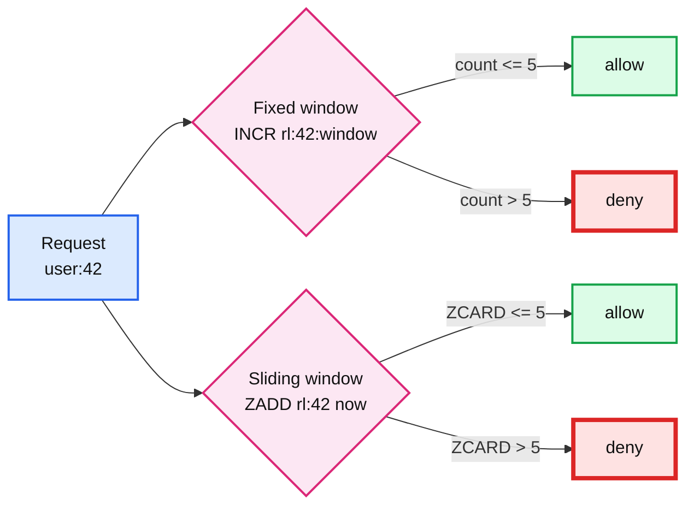

# 03. Rate limiter

> Goal: after this I can build a fixed window and a sliding window limiter in Redis, and explain why each needs to be atomic.

**Concept link:** `hld/` rate limiter problem, `concepts/caching.md`
**Time:** 25 min. Hard stop.
**Status:** todo

## Setup

Fresh server. Terminal A in `redis-cli`. Limit for all steps: **5 requests per 10 seconds per user**.



## Steps

### 1. Fixed window: INCR + EXPIRE (5 min)

Why: simplest possible limiter. One counter per user per window. Key is `rl:<user>:<window_start>`.

```
> INCR rl:42:1700000000
(integer) 1
> EXPIRE rl:42:1700000000 10
(integer) 1
> INCR rl:42:1700000000
(integer) 2
> INCR rl:42:1700000000
(integer) 3
> INCR rl:42:1700000000
(integer) 4
> INCR rl:42:1700000000
(integer) 5
> INCR rl:42:1700000000
(integer) 6            <- 6 > 5, deny
> TTL rl:42:1700000000
(integer) 7
```

The bug: `INCR` then `EXPIRE` is two round trips. If the client dies between them, the key never expires and that user is rate-limited forever. Fix it with one atomic call:

```
> SET rl:43:1700000000 0 EX 10 NX
OK
> INCR rl:43:1700000000
(integer) 1
```

Or, Redis 7+, in a single command:

```
> INCR rl:44:w
(integer) 1
> EXPIRE rl:44:w 10 NX
(integer) 1            <- NX: only set expiry if there is none. Safe to call every time.
```

The other flaw: a user can send 5 requests at 0:09 and 5 more at 0:10. Ten requests in one second, all allowed. That is the fixed window burst problem.

### 2. Sliding window log: sorted set of timestamps (8 min)

Why: fixes the burst. Store each request's timestamp as a member. Count how many fall inside the last 10 seconds.

Run these as one user making requests. Use the current time in ms; `TIME` gives seconds and microseconds.

```
> TIME
1) "1700000000"
2) "123456"
> ZADD rl:42 1700000000123 req1
> ZADD rl:42 1700000001000 req2
> ZADD rl:42 1700000002000 req3
> ZADD rl:42 1700000003000 req4
> ZADD rl:42 1700000004000 req5
> ZREMRANGEBYSCORE rl:42 -inf 1699999994000     <- drop anything older than now - 10s
(integer) 0
> ZCARD rl:42
(integer) 5            <- 5 in window. Next one is denied.
> ZADD rl:42 1700000005000 req6
> ZCARD rl:42
(integer) 6            <- deny, and ideally ZREM req6 so a denied request does not count
```

Cost: one member per request. For 5 req / 10s that is nothing. For 10k req/s per user it is 100k members per user. Say this trade-off out loud in the interview.

### 3. Make it atomic with Lua (7 min)

Why: steps 2's four commands are four round trips. Two app servers can both see `ZCARD = 4`, both add, and both allow. Redis runs a Lua script as one uninterruptible unit, so it is the standard fix.

```
> EVAL "local key = KEYS[1]; local now = tonumber(ARGV[1]); local window = tonumber(ARGV[2]); local limit = tonumber(ARGV[3]); redis.call('ZREMRANGEBYSCORE', key, '-inf', now - window); local n = redis.call('ZCARD', key); if n < limit then redis.call('ZADD', key, now, now .. '-' .. math.random()); redis.call('PEXPIRE', key, window); return 1 else return 0 end" 1 rl:99 1700000000000 10000 5
(integer) 1
```

Run it 5 more times with a slightly larger `now` each time (1700000001000, 1700000002000, ...). The 6th call returns `0`.

```
> EVAL "..." 1 rl:99 1700000006000 10000 5
(integer) 0
```

Notes:
- `PEXPIRE` on every call keeps the key from living forever for a user who never returns.
- Member is `now .. '-' .. random` so two requests in the same millisecond do not collapse into one member.
- `SCRIPT LOAD` + `EVALSHA` avoids sending the script body every call. Same semantics.

## Break it (5 min)

Show the race that Lua prevents. Open a second `redis-cli` in Terminal B and run the non-atomic version from both terminals at the same time. Pre-fill to 4:

```
> DEL rl:race
> ZADD rl:race 1 a 2 b 3 c 4 d
```

In both terminals, type the check but do not press enter:

```
> ZCARD rl:race
```

Press enter in A, then B. Both see `4`. Both decide "allow" and both `ZADD`. Now:

```
> ZCARD rl:race
(integer) 6            <- limit was 5. Two servers each let one through.
```

This is exactly the interleaving that happens under load with the non-atomic version. With the Lua script it cannot happen because Redis runs the whole script before touching the next client's command.

What I saw:

```
<paste>
```

## What I learned

- Fixed window is one `INCR`, sliding window is one sorted set per user. Sliding costs ___ bytes per request stored.
- Any check-then-act across two commands races. Lua or `MULTI` closes it.
- ...

## Interview soundbite

> "I'd start with a fixed-window counter, INCR plus EXPIRE NX, one round trip. If the burst at the window edge matters I'd move to a sorted-set sliding window wrapped in a Lua script so the check and the insert are atomic. The Lua script is the important part: two app servers doing check-then-add without it will both allow the same request."

## Cleanup

```
> FLUSHALL
```
