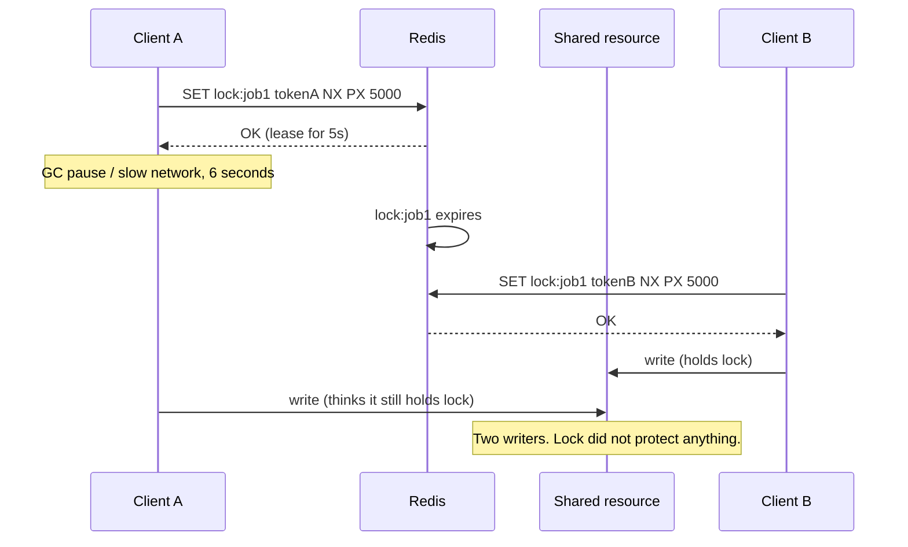

# 04. Distributed lock

> Goal: after this I can take and release a lock in Redis correctly, and explain why it is still unsafe without a fencing token.

**Concept link:** `concepts/consensus.md` (leases and fencing tokens), `hld/` job scheduler problem
**Time:** 20 min. Hard stop.
**Status:** todo

## Setup

Fresh server. Terminal A and Terminal B both in `redis-cli` (two clients competing for the lock).



## Steps

### 1. Acquire with SET NX PX (4 min)

Why: `NX` makes it a compare-and-set. `PX` makes it a lease so a crashed holder does not hold it forever. The value must be unique per holder so we can prove ownership on release.

Terminal A:

```
> SET lock:job1 tokenA NX PX 30000
OK                     <- A holds the lock
```

Terminal B:

```
> SET lock:job1 tokenB NX PX 30000
(nil)                  <- B fails. NX means "only if absent".
> GET lock:job1
"tokenA"
> PTTL lock:job1
(integer) 24000
```

### 2. Release safely (5 min)

Why: a plain `DEL` is wrong. If A's lease expired and B now holds it, A's `DEL` would delete B's lock. Release must check "is the value still mine" and delete in one atomic step. That is a Lua script.

Terminal B tries to release A's lock the wrong way:

```
> DEL lock:job1
(integer) 1            <- B just deleted a lock it does not own. This is the bug.
```

Re-acquire in A, then release the right way:

Terminal A:

```
> SET lock:job1 tokenA NX PX 30000
OK
> EVAL "if redis.call('GET', KEYS[1]) == ARGV[1] then return redis.call('DEL', KEYS[1]) else return 0 end" 1 lock:job1 tokenB
(integer) 0            <- wrong token, nothing deleted
> EVAL "if redis.call('GET', KEYS[1]) == ARGV[1] then return redis.call('DEL', KEYS[1]) else return 0 end" 1 lock:job1 tokenA
(integer) 1            <- right token, released
```

### 3. Watch the lease expire out from under a holder (4 min)

Terminal A, take a 3-second lease:

```
> SET lock:job1 tokenA NX PX 3000
OK
```

Pretend A is paused (GC, network, whatever). Wait 4 seconds. Terminal B:

```
> SET lock:job1 tokenB NX PX 30000
OK                     <- B now holds it
```

Terminal A "wakes up" and still believes it holds the lock:

```
> GET lock:job1
"tokenB"               <- A's lease is gone. If A had already sent a write to the DB, that write raced B's.
```

Redis did nothing wrong. The lock did exactly what a lease does. The problem is that A cannot know it was paused.

## Break it (5 min)

Simulate the pause with the server itself. Terminal A:

```
> SET lock:job1 tokenA NX PX 2000
OK
> DEBUG SLEEP 3        <- blocks Redis for 3s. Every client waits. The lease expires during the sleep.
OK
> GET lock:job1
(nil)                  <- gone
```

Now the fix. A **fencing token** is a number that only goes up, handed out with each lock grant, and checked by the resource being protected (the DB, the file store). A stale holder presents an old token and is rejected.

```
> INCR lock:job1:fence
(integer) 1            <- A's token is 1
> INCR lock:job1:fence
(integer) 2            <- B's token is 2
```

The resource stores "last token seen = 2". When A shows up late with token 1, the resource refuses. Redis cannot do this part for you. The thing you are protecting has to check the token.

If the interviewer says "Redlock": it runs the same `SET NX PX` against 5 independent Redis nodes and needs a majority. It reduces the "Redis node died" risk. It does not fix the paused-client problem above. Say that, then say "fencing token".

What I saw:

```
<paste>
```

## What I learned

- Acquire: `SET key <random> NX PX <ttl>`. Release: Lua compare-and-delete. Never a bare `DEL`.
- The lease can expire while the holder is paused. Redis cannot detect that.
- ...

## Interview soundbite

> "A Redis lock is a lease: SET NX PX with a random value, released by a Lua script that checks the value first. It's fine for efficiency, like making sure two workers don't both run the same job. If correctness depends on it, I add a monotonically increasing fencing token and have the downstream resource reject stale tokens, because a client can be paused past its lease and Redis has no way to know."

## Cleanup

```
> FLUSHALL
```
