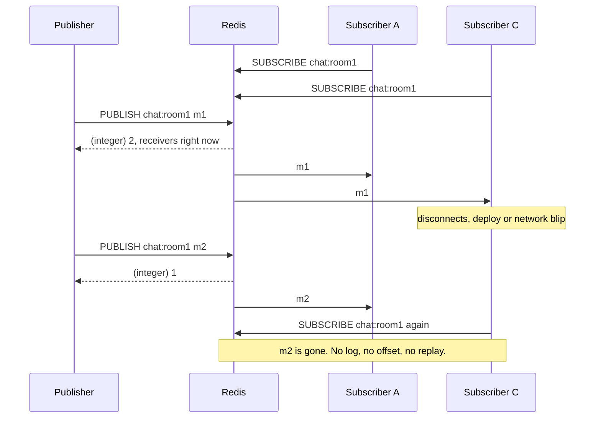
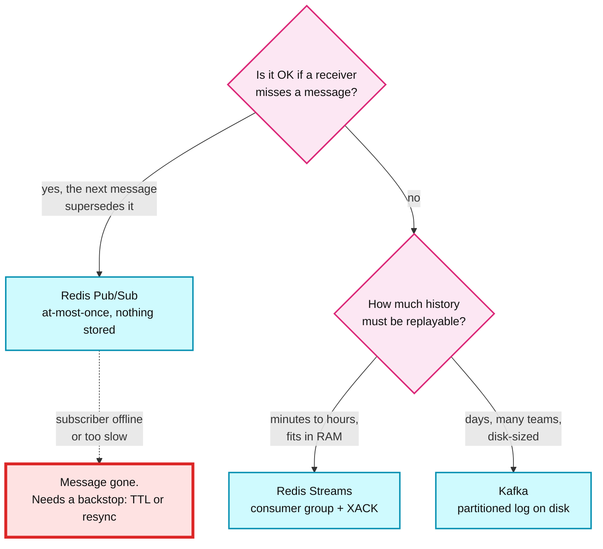

# 05. Pub/Sub, and when not to use it

> Goal: after this I can show Redis Pub/Sub losing messages in two different ways, and say when I would use Streams or Kafka instead.

**Concept link:** `concepts/caching-patterns.md` (pub/sub invalidation broadcast), `concepts/realtime-client-server-communication.md` (routing a message to the WebSocket node that holds the user), `../../kafka/exercises/02-consumer-groups.md` (the durable alternative)
**Time:** 25 min. Hard stop.
**Status:** todo

## Setup

Fresh single-node server. This exercise needs three terminals.

```
$ cd tool-practise/redis
$ docker compose up -d
```

- Terminal A: `docker exec -it redis redis-cli` (subscriber)
- Terminal B: `docker exec -it redis redis-cli` (publisher)
- Terminal C: a shell. It becomes a second subscriber in step 2 and runs `docker` commands in Break it.



## Steps

### 1. Subscribe and publish (4 min)

Why: a subscribed connection becomes a push channel. It can no longer run normal commands, so real clients keep one dedicated connection for subscriptions.

Terminal A:

```
> SUBSCRIBE chat:room1
1) "subscribe"
2) "chat:room1"
3) (integer) 1          <- channels THIS connection is subscribed to. Not the number of subscribers.
Reading messages...
```

Terminal B:

```
> PUBLISH chat:room1 "hello"
(integer) 1             <- clients that received it, at this instant
```

Terminal A prints:

```
1) "message"
2) "chat:room1"
3) "hello"
```

### 2. Fan-out, patterns, and introspection (5 min)

Why: `PUBLISH` costs O(N + M). N is the subscribers on that channel. M is every pattern subscribed by anyone. Each receiver gets its own copy in its own output buffer, so 10k subscribers means 10k copies.

Terminal C:

```
$ docker exec -it redis redis-cli
> PSUBSCRIBE chat:*
1) "psubscribe"
2) "chat:*"
3) (integer) 1
```

Terminal B:

```
> PUBLISH chat:room1 "hi both"
(integer) 2             <- A (exact channel) + C (pattern)
> PUBLISH chat:room2 "only C"
(integer) 1             <- nobody is on chat:room2 exactly. The pattern catches it.
```

Terminal C prints a 4-line `pmessage`: pattern, real channel, payload.

```
1) "pmessage"
2) "chat:*"
3) "chat:room1"
4) "hi both"
```

Back in Terminal B, look at what Redis is tracking:

```
> PUBSUB CHANNELS
1) "chat:room1"         <- exact subscriptions only. The pattern is not listed.
> PUBSUB NUMSUB chat:room1
1) "chat:room1"
2) (integer) 1
> PUBSUB NUMPAT
(integer) 1
> DBSIZE
(integer) 0             <- channels are not keys. Nothing was stored anywhere.
```

### 3. Keyspace notifications are Pub/Sub too (4 min)

Why: "tell me when this key expires" sounds like a scheduler. It is a Pub/Sub message, so the same delivery rules apply. It also fires when Redis actually deletes the key, which can be later than the moment the TTL hits zero.

Terminal B, turn on expired-key events (`E` = keyevent channel, `x` = expired):

```
> CONFIG SET notify-keyspace-events Ex
OK
```

Terminal C: Ctrl-C out of `PSUBSCRIBE`. If that drops you to the shell, run `docker exec -it redis redis-cli` again. Then:

```
> SUBSCRIBE __keyevent@0__:expired
1) "subscribe"
2) "__keyevent@0__:expired"
3) (integer) 1
```

Terminal B:

```
> SET job:42 "run me" EX 3
OK
```

Terminal C, about 3 seconds later:

```
1) "message"
2) "__keyevent@0__:expired"
3) "job:42"             <- you get the key name. The value is already deleted.
```

On an idle server this is close to on time, because the background expiry sampler runs about 10 times a second (exercise 02). With millions of TTL keys it can lag. If Terminal C had been disconnected at that moment, the event is gone and `job:42` never runs.

## Break it (7 min)

### A. Subscriber offline, message gone (2 min)

Ctrl-C in Terminal A and Terminal C, so nobody is subscribed.

Terminal B:

```
> PUBLISH chat:room1 "m1"
(integer) 0             <- nobody listening. Redis drops it and tells you 0.
> PUBLISH chat:room1 "m2"
(integer) 0
```

Terminal A, come back:

```
$ docker exec -it redis redis-cli
> SUBSCRIBE chat:room1
1) "subscribe"
2) "chat:room1"
3) (integer) 1
Reading messages...     <- m1 and m2 never arrive. There is no catch-up.
```

The publisher's only signal was that `0`. Most client code ignores it.

### B. Slow subscriber gets cut off (5 min)

Why: Redis queues outgoing messages for each client in its own memory. If a subscriber stops reading, that queue grows. To protect itself, Redis disconnects the subscriber once the queue passes `client-output-buffer-limit pubsub`. The default is 32 MB hard, or 8 MB sustained for 60 seconds. We shrink it so it trips in seconds.

Terminal C (shell). Start a subscriber that never reads. `redis-cli` writes into a pipe, and `sleep` never drains the pipe.

```
$ docker exec -d redis sh -c 'redis-cli SUBSCRIBE firehose | sleep 600'
$ docker exec redis redis-cli PUBSUB NUMSUB firehose
1) "firehose"
2) (integer) 1          <- the stuck subscriber is connected
```

Shrink the limit, then push 50,000 messages of 1 KB each (about 50 MB):

```
$ docker exec redis redis-cli CONFIG SET client-output-buffer-limit "pubsub 1mb 256kb 10"
OK
$ docker exec redis sh -c 'P=$(head -c 1024 /dev/zero | tr "\0" x); for i in $(seq 1 50000); do echo "PUBLISH firehose $P"; done | redis-cli --pipe'
All data transferred. Waiting for the last reply...
Last reply received from server.
errors: 0, replies: 50000
```

Why 50 MB for a 1 MB limit: the kernel socket buffers soak up a few MB before Redis's own buffer starts to grow. If `NUMSUB` below still says 1, rerun with `seq 1 200000`.

```
$ docker exec redis redis-cli PUBSUB NUMSUB firehose
1) "firehose"
2) (integer) 0          <- Redis cut it off
$ docker exec redis redis-cli INFO stats | grep output_buffer
client_output_buffer_limit_disconnections:1     <- counter added in Redis 7.4. Alert on it in production.
$ docker logs redis 2>&1 | grep -i "output buffer"
... Client id=... scheduled to be closed ASAP for overcoming of output buffer limits.
```

Terminal A (still on `chat:room1`) was not touched. The blast radius is one connection. In production that connection is a WebSocket node in a GC pause, or a consumer on a slow network. Its client library reconnects quietly, and everything published during the gap is lost with no error anywhere.

What I saw:

```
<paste>
```

Restore:

```
$ docker exec redis redis-cli CONFIG SET client-output-buffer-limit "pubsub 32mb 8mb 60"
$ docker exec redis redis-cli CONFIG SET notify-keyspace-events ""
```

## The fix: Streams when a message must not be lost (5 min)

Why: a Stream is an append-only log stored in a key. A consumer group tracks what each consumer has read. Every delivered entry stays "pending" until the consumer sends `XACK`. So a consumer that was offline or crashed can catch up later. That is at-least-once delivery.

Terminal B:

```
> XADD orders * item book
"1727180000000-0"       <- ID is <ms timestamp>-<sequence>. Yours will differ.
> XADD orders * item pen
"1727180000001-0"
> XGROUP CREATE orders workers 0
OK                      <- 0 = start from the beginning. Entries added before any consumer existed are still there.
> XREADGROUP GROUP workers c1 COUNT 10 STREAMS orders >
1) 1) "orders"
   2) 1) 1) "1727180000000-0"
         2) 1) "item"
            2) "book"
      2) 1) "1727180000001-0"
         2) 1) "item"
            2) "pen"
```

Pretend `c1` crashed here. It never sends `XACK`.

```
> XPENDING orders workers
1) (integer) 2          <- delivered, not acked
2) "1727180000000-0"
3) "1727180000001-0"
4) 1) 1) "c1"
      2) "2"
```

Consumer `c2` takes over everything idle for at least 0 ms. In production use 30000 or more, so you do not steal from a consumer that is merely slow.

```
> XAUTOCLAIM orders workers c2 0 0-0
1) "0-0"                <- cursor. 0-0 means the scan is complete.
2) 1) 1) "1727180000000-0"
      2) 1) "item"
         2) "book"
   2) 1) "1727180000001-0"
      2) 1) "item"
         2) "pen"
3) (empty array)
> XACK orders workers 1727180000000-0 1727180000001-0
(integer) 2             <- paste your own IDs
> XPENDING orders workers
1) (integer) 0
```

Nothing was lost, even though the first consumer died mid-work. The cost: the log lives in RAM, so cap it (`XADD orders MAXLEN ~ 100000 * ...`), and the consumer must be idempotent because `c2` may redo work `c1` half finished.



| | Pub/Sub | Streams | Kafka |
|---|---|---|---|
| Stored | No | Yes, in RAM. Trim with `MAXLEN` | Yes, on disk. Retention by time or size |
| Delivery | At-most-once | At-least-once (`XACK`) | At-least-once. Exactly-once with transactions |
| Offline consumer | Misses everything | Resumes from its group's position | Resumes from its committed offset |
| Slow consumer | Disconnected at the buffer limit | Falls behind. Pending list grows | Lag grows. Broker unaffected |
| Good for | Presence, typing indicators, cache invalidation with a TTL backstop, routing to WebSocket nodes | Job queues, small event logs that fit in memory | Cross-team event backbone, replay of days of history |

If the interviewer says "Redis Cluster": classic `PUBLISH` is broadcast to every node over the cluster bus, so adding nodes does not add Pub/Sub throughput. Redis 7.0 added sharded Pub/Sub (`SPUBLISH` / `SSUBSCRIBE`). A channel then lives only on the shard that owns its hash slot.

## What I learned

- `PUBLISH` returns the number of receivers at that instant. With nobody subscribed it returned `0` and the message was gone.
- A subscriber that stopped reading was cut off after ___ messages with a 1 MB hard limit. The other subscriber was unaffected.
- The expired event arrived about ___ s after the TTL hit zero on an idle server.
- An un-acked stream entry stayed in `XPENDING` until `c2` claimed it with `XAUTOCLAIM`.
- ...

## Interview soundbite

> "Redis Pub/Sub is a live broadcast with at-most-once delivery. Nothing is stored, so a subscriber that is offline or reconnecting misses messages, and one that reads too slowly gets disconnected when its output buffer passes the pubsub limit. I use it where the next message supersedes the last one, like presence or cache invalidation with a short TTL as the backstop. If a message must not be lost I use Streams with a consumer group and XACK, or Kafka if I need days of replay across teams."

## Cleanup

Ctrl-C any subscribers, then in Terminal B:

```
> FLUSHALL
```
