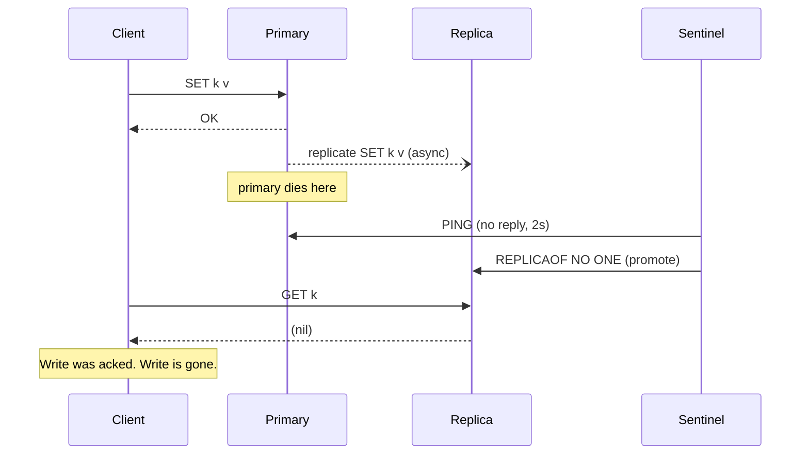

# 05. Replication and failover

> Goal: after this I have killed a Redis primary, timed how long Sentinel took to promote the replica, and shown a write that was lost.

**Concept link:** `concepts/replication.md`, `concepts/consensus.md`
**Time:** 30 min. Hard stop.
**Status:** todo

## Setup

This exercise needs the `ha` profile: primary, one replica, one Sentinel.

```
$ cd tool-practise/redis
$ docker compose down -v
$ docker compose --profile ha up -d
$ docker ps --format '{{.Names}}'
redis-sentinel
redis-replica
redis
```

Terminal A: `docker exec -it redis redis-cli` (primary, port 6379)
Terminal B: shell, for `docker` and the replica/sentinel CLIs.



## Steps

### 1. Confirm replication is working (3 min)

Terminal A (primary):

```
> INFO replication
# Replication
role:master
connected_slaves:1
slave0:ip=...,port=6379,state=online,offset=...,lag=0
master_repl_offset:...
> SET color blue
OK
```

Terminal B (replica):

```
$ docker exec redis-replica redis-cli GET color
"blue"
$ docker exec redis-replica redis-cli SET color red
(error) READONLY You can't write against a read only replica.
$ docker exec redis-replica redis-cli INFO replication | grep -E "role|master_link_status"
role:slave
master_link_status:up
```

### 2. Measure replication lag under load (4 min)

Why: async replication means the replica is always slightly behind. Under a write burst the gap is visible.

Terminal B, push 200k writes and immediately compare offsets:

```
$ docker exec -i redis sh -c 'for i in $(seq 1 200000); do echo "SET w:$i $i"; done | redis-cli --pipe' \
  && docker exec redis redis-cli INFO replication | grep -E "master_repl_offset|slave0"
```

`offset=` on the `slave0` line vs `master_repl_offset`. The difference in bytes is how far behind the replica is at that instant. It should close within a second.

### 3. Ask Sentinel what it sees (3 min)

```
$ docker exec redis-sentinel redis-cli -p 26379 SENTINEL master mymaster | head -20
 1) "name"
 2) "mymaster"
 3) "ip"
 4) "..."
 5) "port"
 6) "6379"
 ...
 9) "flags"
10) "master"
$ docker exec redis-sentinel redis-cli -p 26379 SENTINEL get-master-addr-by-name mymaster
1) "172.x.x.x"
2) "6379"
```

Sentinel is configured with `down-after-milliseconds 2000`: two seconds without a PING reply and the primary is declared down. Quorum is 1 because there is one Sentinel. In production it is 3 Sentinels, quorum 2.

## Break it: kill the primary (12 min)

This is the whole exercise. Do it carefully.

Terminal B, start a clock and a watcher that prints the current primary every 500ms:

```
$ while true; do date +%T.%N | cut -c1-12; docker exec redis-sentinel redis-cli -p 26379 SENTINEL get-master-addr-by-name mymaster; sleep 0.5; done
```

Terminal A, write a value and then kill the primary immediately. Doing it in one line keeps the gap tiny:

```
$ docker exec redis redis-cli SET last-write "acked-before-death" && docker kill redis
OK
redis
```

Watch Terminal B. Note the time the address changes from the old primary's IP to the replica's IP. Expected: 2s down detection + about 1 to 3s election and promotion, so 3 to 5 seconds total.

```
<paste the timestamps: last line with old IP, first line with new IP>
```

Stop the loop with Ctrl-C. Confirm the replica is now the primary:

```
$ docker exec redis-replica redis-cli INFO replication | grep role
role:master
```

Now the question that matters. Did the acked write survive?

```
$ docker exec redis-replica redis-cli GET last-write
```

Either answer is fine. If you see `(nil)`, replication had not delivered it before the kill. If you see the value, the write made it across in the few milliseconds between `OK` and `docker kill`. Run it 3 to 5 times (`docker compose --profile ha up -d` brings the old primary back as a replica; kill whichever is currently master) and count how many times the write is lost.

```
Attempt 1: lost / survived
Attempt 2: lost / survived
Attempt 3: lost / survived
```

Redis has `WAIT numreplicas timeout` which blocks the client until N replicas have the write:

```
> SET important "x"
OK
> WAIT 1 1000
(integer) 1            <- 1 replica acknowledged within 1000 ms
```

Try `WAIT` before the kill and see if the write survives every time. Note that `WAIT` does not make it a synchronous system: the primary already applied the write, and the replica can still lose it if it is promoted then crashes before writing to disk. It shrinks the window. It does not close it.

### Bring the old primary back (2 min)

```
$ docker compose --profile ha up -d
$ docker exec redis redis-cli INFO replication | grep -E "role|master_host"
role:slave             <- Sentinel reconfigured it as a replica of the new primary
```

## What I learned

- Failover took about ___ seconds with `down-after-milliseconds 2000`.
- The acked write was lost ___ out of ___ attempts.
- `WAIT 1` made it survive ___ out of ___ attempts, at a cost of ___ ms per write.
- ...

## Interview soundbite

> "Redis replication is async. The primary acks the client before the replica has the write, so when I killed the primary on my laptop Sentinel promoted the replica in about 4 seconds and the last acked write was gone. WAIT narrows that window but doesn't close it. So I'd keep money and locks out of Redis unless the design can tolerate losing the last few milliseconds of writes, and I'd say that trade-off out loud."

## Cleanup

```
$ docker compose --profile ha down -v
```

Then copy all five soundbites into `../notes.md` and flip the status in `../README.md` and `../../README.md`.
