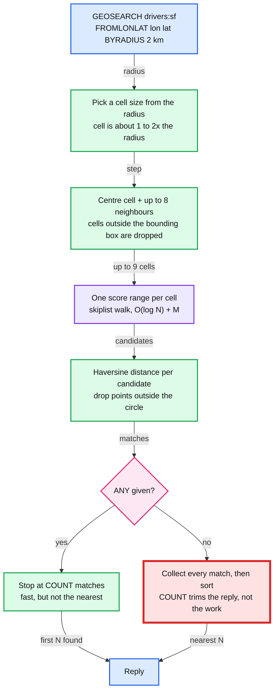
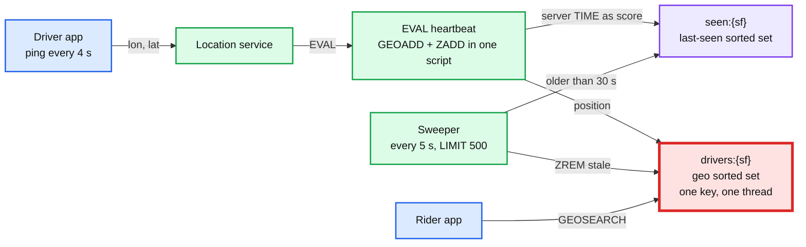

# 07. Geo search: nearest drivers, and what breaks at a million

> Goal: after this I can store live driver locations in Redis GEO, find the nearest ones, and say with numbers what makes the search slow, stale, or silently empty.

**Concept link:** `concepts/geospatial-index.md` (geohash cells, the 8-neighbour fix, precision table), `concepts/skip-list.md` (the structure under the sorted set), `hld/uber-ride-hailing/my-attempt.md` (the design this makes concrete: in-memory geo index, sharded by region, with a TTL), `05-pubsub.md` (why expiry events are the wrong way to remove stale drivers)
**Time:** 40 min. Hard stop.
**Status:** todo

## Setup

Fresh single node. Two terminals, as in the README.

A million drivers take about 90 MB. The lab caps Redis at 64 MB, so raise the cap for this exercise. Break it B puts it back on purpose.

```
$ cd tool-practise/redis
$ docker compose up -d
$ docker exec redis redis-cli FLUSHALL
$ docker exec redis redis-cli CONFIG SET maxmemory 256mb
```

The cast. Rider is at Moscone Center (`-122.4011 37.7842`).

| Member | Where | Lon | Lat |
|---|---|---|---|
| d1 | Ferry Building | -122.3937 | 37.7955 |
| d2 | Union Square | -122.4075 | 37.7880 |
| d3 | Coit Tower | -122.4058 | 37.8024 |
| d4 | Oracle Park | -122.3893 | 37.7786 |
| d5 | Golden Gate Bridge | -122.4783 | 37.8199 |
| d6 | SFO airport | -122.3790 | 37.6213 |



The red box is the hot path. Step 5 puts a number on it, and Break it A shows it stalling every other client.

## Steps

### 1. Add drivers, and the argument-order trap (3 min)

Why: `GEOADD` takes **longitude first**. Maps, humans and most APIs say latitude first.

```
> GEOADD drivers:sf 37.7955 -122.3937 d1
(error) ERR invalid longitude,latitude pair 37.795500,-122.393700
> GEOADD drivers:sf -122.3937 37.7955 d1 -122.4075 37.7880 d2 -122.4058 37.8024 d3 -122.3893 37.7786 d4 -122.4783 37.8199 d5 -122.3790 37.6213 d6
(integer) 6
> GEOADD drivers:sf 0 86 north
(error) ERR invalid longitude,latitude pair 0.000000,86.000000
```

- The swap only errored because -122 is not a valid latitude. Swap Bengaluru (lat 12.97, lon 77.59) and both numbers are valid. The driver is stored near Svalbard with no error.
- Latitude is capped at ±85.05°, the Web Mercator limit. The poles cannot be indexed.

### 2. It is just a sorted set (4 min)

Why: there is no geo data structure. The score is a 52-bit interleaved geohash. Everything from exercise 01 applies: O(log N) writes, listpack while small, skiplist when big.

```
> TYPE drivers:sf
zset
> OBJECT ENCODING drivers:sf
"listpack"              <- becomes "skiplist" past 128 members (zset-max-listpack-entries)
> ZRANGE drivers:sf 0 -1 WITHSCORES
 1) "d6"
 2) "1367855772476020"
 3) "d4"
 4) "1367859959215968"
 5) "d2"
 6) "1367859964335920"
 7) "d5"                <- Golden Gate, 8 km away, sorts BETWEEN d2 and d1
 8) "1367860227604857"
 9) "d1"
10) "1367860691519493"
11) "d3"
12) "1367860698523155"
```

d2 and d1 are 1.5 km apart, yet a point 8 km away sits between them in score order. That is the Z-order curve jumping. Close in space does not mean close in score.

```
> GEOHASH drivers:sf d1 d2 d6
1) "9q8znb7wsp0"
2) "9q8yyx1e490"        <- shares only "9q8" (a ~156 km cell) with d1, 1.5 km away
3) "9q8yp0wrfw0"
> GEOPOS drivers:sf d1 nobody
1) 1) "-122.39370077848434448"      <- stored -122.3937. 52 bits keep it to well under a metre
   2) "37.79549968942772864"
2) (nil)
> GEODIST drivers:sf d1 d6 km
"19.4186"
> GEODIST drivers:sf d1 d2 m
"1471.9471"
```

- This is the boundary problem from the concept note, in real data. A prefix scan of d2's cell would miss d1. So the search always scans the neighbouring cells too.
- The 11th geohash character is always `0`. Eleven base32 characters hold 55 bits, and Redis only stores 52.
- `GEOHASH` re-encodes to the standard latitude range of ±90 so other tools can read it. The score uses ±85.05. They are not the same bits.
- Distances assume a perfect sphere (haversine). Expect up to about 0.5% error.

### 3. Search (5 min)

Why: `GEOSEARCH` (Redis 6.2+) replaces `GEORADIUS` and `GEORADIUSBYMEMBER`, which are deprecated.

```
> GEOSEARCH drivers:sf FROMLONLAT -122.4011 37.7842 BYRADIUS 2 km ASC WITHDIST
1) 1) "d2"
   2) "0.7035"
2) 1) "d4"
   2) "1.2098"
3) 1) "d1"
   2) "1.4151"
> GEOSEARCH drivers:sf FROMLONLAT -122.4011 37.7842 BYRADIUS 2 km ASC COUNT 2 WITHDIST WITHCOORD
1) 1) "d2"
   2) "0.7035"
   3) 1) "-122.4074980616569519"
      2) "37.78799944951724399"
2) 1) "d4"
   2) "1.2098"
   3) 1) "-122.38930195569992065"
      2) "37.77860070345841592"
```

Search around a member instead of a point, and by box (a map viewport) instead of a circle:

```
> GEOSEARCH drivers:sf FROMMEMBER d1 BYRADIUS 1.5 km ASC WITHDIST
1) 1) "d1"
   2) "0.0000"          <- the member itself comes back. Filter it out in the client
2) 1) "d3"
   2) "1.3112"
3) 1) "d2"
   2) "1.4719"
> GEOSEARCH drivers:sf FROMLONLAT -122.4011 37.7842 BYBOX 4 5 km ASC WITHDIST
1) 1) "d2"
   2) "0.7035"
2) 1) "d4"
   2) "1.2098"
3) 1) "d1"
   2) "1.4151"
4) 1) "d3"
   2) "2.0659"          <- outside the 2 km circle, inside the box's taller corner
```

Now the trap. `ANY` returns as soon as it has `COUNT` matches:

```
> GEOSEARCH drivers:sf FROMLONLAT -122.4011 37.7842 BYRADIUS 50 km COUNT 2 ANY WITHDIST
1) 1) "d6"
   2) "18.2227"         <- SFO, 18 km away, while d2 is 0.7 km away
2) 1) "d4"
   2) "1.2098"
```

`ANY` means "any N inside the area", not "the nearest N". Adding `ASC` only sorts the N it happened to find.

### 4. Drivers move (2 min)

Why: a location update is a `ZADD` that changes the score. The member is removed from the skiplist and inserted again.

```
> GEOADD drivers:sf -122.4000 37.7850 d6
(integer) 0             <- 0 new members. d6 moved from SFO to 130 m from the rider
> GEOADD drivers:sf CH -122.4001 37.7851 d6
(integer) 1             <- CH counts changed members, not just added ones
> GEOADD drivers:sf XX CH -122.4 37.7 ghost
(integer) 0             <- XX = update only. A late ping from a removed driver cannot re-create them
> ZREM drivers:sf d5
(integer) 1             <- there is no GEODEL. It is a sorted set, so ZREM
```

### 5. A million drivers: what a search costs (7 min)

Why: search cost follows how many points sit in the scanned cells. This step measures it.

Terminal B. Load 1M drivers spread over a 61 x 61 km box around San Francisco. That is ~270 drivers per km², denser than any real city, on purpose.

```
$ awk 'BEGIN { srand(42); for (i = 0; i < 1000000; i++) printf "GEOADD drivers:city %.6f %.6f d%d\n", -122.75 + rand()*0.70, 37.45 + rand()*0.55, i }' | docker exec -i redis redis-cli --pipe
All data transferred. Waiting for the last reply...
Last reply received from server.
errors: 0, replies: 1000000
```

Terminal A:

```
> ZCARD drivers:city
(integer) 1000000
> OBJECT ENCODING drivers:city
"skiplist"
> MEMORY USAGE drivers:city
(integer) 88389408      <- ~90 bytes per driver. Varies by a few MB per run, because skiplist node heights are random
```

Time searches on the server with `SLOWLOG`. It records execution time only, not network. Threshold 0 logs every command.

```
> CONFIG SET slowlog-log-slower-than 0
OK
> SLOWLOG RESET
OK
> GEOSEARCH drivers:city FROMLONLAT -122.4011 37.7842 BYRADIUS 2 km ASC COUNT 10
 1) "d..."
 ...
> SLOWLOG GET 1
1) 1) (integer) ...
   2) (integer) ...
   3) (integer) 1857    <- microseconds on the server
   ...
```

Repeat for each cell of the table. `SLOWLOG RESET` before each one. Do **not** run the no-`COUNT` 10 km and 30 km rows in `redis-cli`, because they print 83k and 712k lines. My numbers for those came from piping to `wc -l`. The load used macOS `awk`. Another `awk` makes different random points, so counts shift by a few percent.

| Radius | Matches in circle | No COUNT | COUNT 10 | COUNT 10 ANY | Yours (COUNT 10) |
|---|---|---|---|---|---|
| 0.5 km | 203 | 0.18 ms | 0.18 ms | 0.035 ms | |
| 2 km | 3,261 | 2.1 ms | 1.9 ms | 0.07 ms | |
| 10 km | 83,482 | 65 ms | 61 ms | 9.1 ms | |
| 30 km | 712,249 | 232 ms | 141 ms | 2.1 ms | |

My run: Redis 7.4.11 in Colima on an Apple silicon Mac, median of 3. What to notice:

- Cost tracks matches, and matches grow with area (radius²). 0.5 km to 2 km is 16x the area, 16x the matches, and about 10x the time. At 30 km the circle is bigger than the data, so matches stop growing.
- `COUNT 10` barely helps. At 30 km it still scanned and sorted 712k matches to return 10.
- `ANY` is cheap but not bounded. At 10 km it cost 9 ms, more than at 30 km. The cells are wider than the circle, so it walked many candidates inside a cell but outside the circle before finding 10.

Throughput, Terminal B, 50 concurrent clients:

```
$ docker exec redis redis-benchmark -n 100000 -c 50 -q GEOSEARCH drivers:city FROMLONLAT -122.4011 37.7842 BYRADIUS 0.5 km ASC COUNT 10
...: 34698.12 requests per second, p50=1.367 msec
$ docker exec redis redis-benchmark -n 20000 -c 50 -q GEOSEARCH drivers:city FROMLONLAT -122.4011 37.7842 BYRADIUS 2 km ASC COUNT 10
...: 1577.54 requests per second, p50=31.359 msec
```

At this density one node serves ~35k searches/s at 0.5 km and ~1.6k at 2 km. For comparison, plain `GET` did ~245k/s on the same box.

### 6. A million drivers: what a move costs (3 min)

Why: 5M drivers pinging every 4 s is ~1.25M moves/s. You need the per-move cost to size the fleet.

Terminal A: `CONFIG RESETSTAT`. Then Terminal B moves every driver once, and does 200k plain `SET`s for comparison:

```
$ awk 'BEGIN { srand(7); for (i = 0; i < 1000000; i++) printf "GEOADD drivers:city %.6f %.6f d%d\n", -122.75 + rand()*0.70, 37.45 + rand()*0.55, i }' | docker exec -i redis redis-cli --pipe
errors: 0, replies: 1000000
$ awk 'BEGIN { srand(7); for (i = 0; i < 200000; i++) printf "SET k%d %.6f\n", i, rand() }' | docker exec -i redis redis-cli --pipe
errors: 0, replies: 200000
$ docker exec redis redis-cli INFO commandstats | grep -E "cmdstat_(geoadd|set):"
```

```
cmdstat_set:calls=200000,usec=33059,usec_per_call=0.17,rejected_calls=0,failed_calls=0
cmdstat_geoadd:calls=1000000,usec=2842317,usec_per_call=2.84,rejected_calls=0,failed_calls=0
```

Across two runs, a move cost 2.8 to 3.3 µs and a `SET` 0.17 to 0.33 µs. **A move costs 10 to 17x a `SET`.** It is a skiplist delete plus insert on a 1M-node structure, with cache misses at every level.

Yours: geoadd `____` µs, set `____` µs.

## Break it (8 min)

### A. One big search stalls every client (4 min)

Why: Redis runs commands one at a time. A 140 ms search is 140 ms during which nothing else runs, on any key.

Terminal B. Baseline latency for a trivial `GET`:

```
$ docker exec redis redis-benchmark -t get -n 20000 -c 10 2>/dev/null | grep -A3 "latency summary"
  latency summary (msec):
          avg       min       p50       p95       p99       max
        0.021     0.008     0.023     0.031     0.055     0.183
```

Now start 200 wide searches in the background (about 30 s of work) and measure again:

```
$ docker exec -d redis sh -c 'redis-cli -r 200 GEOSEARCH drivers:city FROMLONLAT -122.4011 37.7842 BYRADIUS 30 km ASC COUNT 10 > /dev/null'
$ docker exec redis redis-benchmark -t get -n 20000 -c 10 2>/dev/null | grep -A3 "latency summary"
  latency summary (msec):
          avg       min       p50       p95       p99       max
       14.318     0.008     0.023   145.535   154.239   285.183
```

p50 did not move. Most `GET`s landed between searches. p99 went from 0.055 ms to 154 ms, about 2,800x. The `GET` was on a different key, and it did not matter. Wait ~30 s for the loop to finish before part B.

What I saw:

```
<paste>
```

### B. The memory cap deletes a whole city (4 min)

Why: the lab runs `allkeys-lru` with a 64 MB cap (`docker-compose.yml`). Eviction removes whole keys. A city in one key is one eviction unit.

Terminal A, back to the lab defaults:

```
> FLUSHALL
OK
> CONFIG SET maxmemory 64mb
OK
> CONFIG RESETSTAT
OK
> GEOADD drivers:sf -122.3937 37.7955 d1 -122.4075 37.7880 d2 -122.4058 37.8024 d3 -122.3893 37.7786 d4 -122.4783 37.8199 d5 -122.3790 37.6213 d6
(integer) 6
```

Terminal B, load the 1M city again (same `awk` line as step 5, `srand(42)`):

```
$ awk 'BEGIN { srand(42); for (i = 0; i < 1000000; i++) printf "GEOADD drivers:city %.6f %.6f d%d\n", -122.75 + rand()*0.70, 37.45 + rand()*0.55, i }' | docker exec -i redis redis-cli --pipe
errors: 0, replies: 1000000     <- the writer saw no error at all
$ docker exec redis redis-cli INFO stats | grep evicted_keys
evicted_keys:2
```

Terminal A:

```
> DBSIZE
(integer) 1
> EXISTS drivers:sf
(integer) 0             <- a different, small city was evicted first
> ZCARD drivers:city
(integer) 367726        <- the city key itself was evicted mid-load, then re-created by later writes
```

About 632k drivers disappeared without one error (the survivor count varies a little per run). Riders in San Francisco would see "no cars nearby" until every driver pinged again. A location index is not a cache. Put it on an instance with `noeviction`, where a full node rejects writes loudly (`OOM command not allowed`) and pages someone.

What I saw:

```
<paste>
```

## The fix: stale drivers need a last-seen index (6 min)

Why: a member cannot have its own TTL. `EXPIRE drivers:sf 30` would expire the whole city. A driver whose phone dies stays in the index forever, and keeps being the nearest match.



`drivers:{sf}` is red because every write and every search for the city lands on it, on one thread. The sizing section below says when that breaks.

Heartbeat: position and last-seen in one atomic script, timed by the server's clock rather than each app server's.

```
> EVAL "local now = redis.call('TIME')[1]; redis.call('GEOADD', KEYS[1], ARGV[1], ARGV[2], ARGV[3]); return redis.call('ZADD', KEYS[2], now, ARGV[3])" 2 drivers:{sf} seen:{sf} -122.4075 37.7880 d2
(integer) 1
> EVAL "local now = redis.call('TIME')[1]; redis.call('GEOADD', KEYS[1], ARGV[1], ARGV[2], ARGV[3]); return redis.call('ZADD', KEYS[2], now, ARGV[3])" 2 drivers:{sf} seen:{sf} -122.4000 37.7850 d6
(integer) 1
> ZRANGE seen:{sf} 0 -1 WITHSCORES
1) "d2"
2) "1790505927"         <- server unix time. Yours will differ
3) "d6"
4) "1790505927"
```

d6's phone dies now. Wait about 10 s, then send a ping from d2 only (up-arrow and edit the first `EVAL`):

```
> EVAL "local now = redis.call('TIME')[1]; redis.call('GEOADD', KEYS[1], ARGV[1], ARGV[2], ARGV[3]); return redis.call('ZADD', KEYS[2], now, ARGV[3])" 2 drivers:{sf} seen:{sf} -122.4076 37.7881 d2
(integer) 0             <- d2 already existed. Its last-seen moved forward
> GEOSEARCH drivers:{sf} FROMLONLAT -122.4011 37.7842 BYRADIUS 2 km ASC WITHDIST
1) 1) "d6"
   2) "0.1316"          <- the dead driver is still the best match
2) 1) "d2"
   2) "0.7174"
```

Sweep anything silent for more than 5 s (production: 30 s, so about 7 missed pings):

```
> EVAL "local cutoff = redis.call('TIME')[1] - ARGV[1]; local stale = redis.call('ZRANGEBYSCORE', KEYS[2], '-inf', cutoff, 'LIMIT', 0, 500); if #stale > 0 then redis.call('ZREM', KEYS[1], unpack(stale)); redis.call('ZREM', KEYS[2], unpack(stale)) end; return stale" 2 drivers:{sf} seen:{sf} 5
1) "d6"
> GEOSEARCH drivers:{sf} FROMLONLAT -122.4011 37.7842 BYRADIUS 2 km ASC WITHDIST
1) 1) "d2"
   2) "0.7174"
```

- **Why `{sf}` in the key names.** In Redis Cluster, every key a script touches must live in the same slot. Only the part in braces is hashed, so both keys land together. On one node it changes nothing. It is here so the script runs unchanged on a cluster.
- **Why `LIMIT 500`.** It bounds one sweep to a few hundred µs. Part A showed what an unbounded command does to everyone else.
- **Why not a per-driver key with `EX 30` plus an expired event.** Exercise 05 showed expired events are at-most-once and can arrive late. One missed event leaves a ghost driver forever. The sweep is idempotent and heals itself on the next run.
- **Production:** load the scripts once (`SCRIPT LOAD` + `EVALSHA`, or `FUNCTION LOAD` on 7.0+) instead of sending the source on every ping.

## Sizing from these numbers (2 min)

Laptop numbers. Trust the order of magnitude, not the digits.

| Pressure | Number from this exercise | What it forces |
|---|---|---|
| Writes | ~3 µs per move, so one thread tops out near 300k moves/s | 1.25M moves/s globally needs at least 4 shards at 100% CPU, about 8 at a 50% target. Shard by city with a hash tag, so a search hits one shard |
| Reads | Cost grows with density x radius². 0.5 km: ~35k/s. 2 km: ~1.6k/s | Start at a small radius and widen only if fewer than k drivers came back. Never let a client choose the radius |
| Fairness | One 140 ms search pushed every client's p99 to 154 ms | Cap the radius on the server, or use `ANY` for "is anyone nearby?" questions |
| Memory | ~90 B per driver. 5M drivers is about 450 MB | Memory is not the limit, CPU on the hot key is. Use `noeviction`, because eviction deletes a whole city |
| Staleness | No per-member TTL | Last-seen sorted set + sweeper, both keys in one slot |

If one city outgrows one thread, split it into one key per coarse cell (for example a 5-character geohash, ~4.9 km). The price: a search can span up to 9 keys that may sit on different shards, and a driver crossing a cell edge is a `ZREM` from one key plus a `GEOADD` to another.

## What I learned

- Swapping lon and lat errored for San Francisco but would not for ___.
- d1 and d2 are 1.5 km apart and share only a ___-character geohash prefix.
- A 30 km search with `COUNT 10` took ___ ms. With `COUNT 10 ANY` it took ___ ms.
- While wide searches ran, a `GET` on an unrelated key had p99 ___ ms, up from ___ ms.
- Under the 64 MB `allkeys-lru` cap, ___ of 1,000,000 drivers survived, and the writer saw ___ errors.
- ...

## Interview soundbite

> "Redis GEO is a sorted set whose score is a 52-bit geohash, so a radius search is up to nine range scans plus a distance filter. Its cost follows how many points sit in those cells, not how many I return. On a million points, a 30 km search with COUNT 10 still took 140 ms and pushed every other client's p99 to 150 ms, so I cap the radius, start small and widen. A move costs 10 to 17 times a SET, about 3 µs, which puts one shard near 300k moves a second. Members have no TTL, so I pair the index with a last-seen sorted set and a sweeper. I run it with noeviction, because under LRU the eviction unit is a whole city."

## Cleanup

Terminal A:

```
> FLUSHALL
> CONFIG SET maxmemory 64mb
> CONFIG SET slowlog-log-slower-than 10000
```
